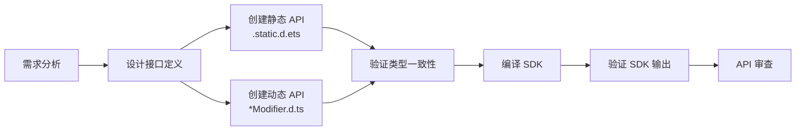

# ArkUI API 设计 Skill

> **版本**: v2.0.0
> **最后更新**: 2026-02-11
> **用途**: ArkUI 组件 API 设计、审查、SDK 编译和验证

---

## 📖 概述

`arkui-api-design` 是一个专门为 **ArkUI 组件 API 设计** 开发的 Claude Code Skill。它遵循 **OpenHarmony 应用 TypeScript/JavaScript 编码规范**，提供全面的 API 设计指导，包括静态/动态接口同步、SDK 编译和验证。

### 适用场景

当你需要执行以下任务时，应使用此 Skill：

- 🔧 **设计 ArkUI API** - 新增组件属性和方法
- ➕ **添加组件属性** - 为现有组件添加新属性
- 🎨 **创建 Modifier 方法** - 实现属性修饰器方法
- 🔗 **同步静态/动态接口** - 同时更新 `.static.d.ets` 和 `*Modifier.d.ts`
- 🔍 **审查 ArkUI API** - 检查 API 设计是否符合规范
- 🗑️ **废弃 API** - 标记废弃 API 并提供迁移指南
- 📝 **编写 JSDOC** - 为 ArkUI API 编写完整的文档注释
- 🏗️ **编译 SDK** - 验证 API 设计并生成 SDK
- ✅ **验证 SDK 输出** - 确认 API 正确导出

---

## 🚀 快速开始

### 使用方法

在 Claude Code 中，通过以下方式触发此 Skill：

```
# 直接指令方式
"帮我设计一个Button的fontIcon属性，需要同时生成静态和动态接口"
"如何正确废弃一个API方法？"
"帮我编译SDK并验证新增的API"
"检查SDK输出中是否包含新增的属性"

# 技能调用方式
/ask arkui-api-design [问题]
```

### 典型工作流



---

## 📁 目录结构

```
arkui-api-design/
├── SKILL.md                                    # Skill 核心定义和指导文档
├── README.md                                   # 本文档
├── examples/                                   # 代码示例目录
│   ├── interface-definition.ts                 # 接口定义完整示例
│   ├── modifier-implementation.ts              # Modifier 方法实现示例
│   ├── deprecation-pattern.ts                  # API 废弃模式示例
│   └── static-dynamic-sync.ts               # 静态/动态接口同步示例
└── references/                                 # 参考文档目录
    └── OpenHarmony-Application-Typescript-JavaScript-coding-guide.md
```

---

## 🎯 核心功能

### 1. 静态和动态接口同步

**新增功能！** 现在支持同时生成静态和动态接口：

| 接口类型 | 文件名 | 用途 | 使用方式 |
|---------|-------|------|---------|
| **静态 API** | `*.static.d.ets` | 声明式 UI API | `Text({ content: 'Hello' })` |
| **动态 API** | `*Modifier.d.ts` | 命令式修饰器 API | `Text().content('Hello')` |

**关键原则：**
- ✅ 添加属性时必须同时更新两个文件
- ✅ 类型签名必须保持一致
- ✅ JSDOC 文档需要同步

### 2. SDK 编译支持

**新增功能！** 完整的 SDK 编译流程：

```bash
# 编译命令
./build.sh --export-para PYCACHE_ENABLE:true --product-name ohos-sdk --ccache
```

**编译参数说明：**
- `--export-para PYCACHE_ENABLE:true` - 启用 Python 缓存加速编译
- `--product-name ohos-sdk` - 编译 SDK 目标
- `--ccache` - 使用编译器缓存支持增量编译

### 3. SDK 输出验证

**新增功能！** 验证 API 是否正确生成：

```bash
# 验证静态 API
grep -n "yourNewProperty" out/ohos-sdk/interfaces/sdk-js/api/arkui/component/<yourcomponent>.static.d.ets

# 验证动态 API
grep -n "yourNewMethod" out/ohos-sdk/interfaces/sdk-js/api/arkui/<YourComponent>Modifier.d.ts
```

### 4. 编码规范遵循

基于 OpenHarmony 官方编码指南：

| 规范类别 | 内容 |
|---------|------|
| **命名规范** | camelCase (属性/方法), PascalCase (类型/接口) |
| **类型安全** | 完整的 TypeScript 类型定义 |
| **代码风格** | 4 空格缩进，统一格式化 |
| **文档注释** | 完整的 JSDOC 注释 |
| **标签要求** | @since, @syscap, @unit, @deprecated |

### 5. API 审查清单

自动化检查 API 设计是否符合规范：

- [ ] 静态 API (`.static.d.ets`) 存在且完整
- [ ] 动态 API (`*Modifier.d.ts`) 存在且已同步
- [ ] 命名符合 camelCase/PascalCase 规范
- [ ] Modifier 方法与接口属性同步
- [ ] 主题相关属性支持 Resource 类型
- [ ] JSDOC 包含参数说明、约束、默认值
- [ ] 明确 undefined/null 行为
- [ ] 指定单位（长度值默认 vp）
- [ ] 跨组件一致性检查
- [ ] @since 和 @syscap 标签存在

### 6. 废弃 API 管理

**重要：** 废弃 API 时，**必须同时**标记静态 API 属性/方法和对应的动态 API 方法为 `@deprecated`。

提供标准化的 API 废弃流程：

```typescript
// 静态 API 废弃
/**
 * 旧的属性设置方法。
 * @deprecated 自 API 12 起废弃，使用 newProperty() 替代
 * @see newProperty
 * @since 10 static
 * @obsoleted 12
 * @stagemodelonly
 */
oldProperty(): void;

// 动态 API 也要同步废弃
/**
 * 旧的属性设置方法。
 * @deprecated 自 API 12 起废弃，使用 newProperty() 替代
 * @see newProperty
 * @since 10 dynamic
 * @obsoleted 12
 * @stagemodelonly
 */
oldProperty(): void;
```

**同步废弃要求：**
- 如果废弃静态 API 中的属性 → 必须同步废弃动态 API 中的对应方法
- 如果废弃静态 API 中的方法 → 必须同步废弃动态 API 中的对应方法
- 两者必须包含匹配的 `@deprecated`、`@obsoleted`、`@see` 和 `@migration` 标签

---

## 📚 设计原则

### 原则 1: 静态与动态接口同步

添加组件属性时，必须同步创建静态和动态接口：

#### 静态 API (`*.static.d.ets`)

**JSDOC 标签格式：**
- `@since [version] static` - 必须在版本后添加 `static`
- `@stagemodelonly` - 必须添加此标签

```typescript
// 位置: OpenHarmony/interface/sdk-js/api/arkui/component/text.static.d.ets
/**
 * 提供文本组件。
 *
 * @syscap SystemCapability.ArkUI.ArkUI.Full
 * @since 7 static
 * @stagemodelonly
 */
declare class Text {
  /**
   * 文本内容。
   *
   * @type { string | Resource }
   * @syscap SystemCapability.ArkUI.ArkUI.Full
   * @since 7 static
   * @stagemodelonly
   */
  content: string | Resource;

  /**
   * 创建文本组件。
   *
   * @param content - 文本内容。
   * @syscap SystemCapability.ArkUI.ArkUI.Full
   * @since 7 static
   * @stagemodelonly
   */
  constructor(content: string | Resource);
}
```

#### 动态 API (`*Modifier.d.ts`)

**JSDOC 标签格式：**
- `@since [version] dynamic` - 必须在版本后添加 `dynamic`
- `@stagemodelonly` - 必须添加此标签

```typescript
// 位置: OpenHarmony/interface/sdk-js/api/arkui/TextModifier.d.ts
/**
 * Text Modifier 接口。
 *
 * @syscap SystemCapability.ArkUI.ArkUI.Full
 * @since 7 dynamic
 * @stagemodelonly
 */
declare interface TextAttribute extends CommonMethod<TextAttribute> {
  /**
   * 设置文本内容。
   *
   * @param value - 要显示的文本内容。
   * @syscap SystemCapability.ArkUI.ArkUI.Full
   * @since 7 dynamic
   * @stagemodelonly
   */
  content(value: string | Resource): TextAttribute;
}
```

**同步规则：**

| 场景 | 静态 API | 动态 API |
|------|----------|----------|
| 添加属性 | 添加到 class/interface | 添加到 Modifier 接口 |
| 废弃属性 | 标记为 `@deprecated` | 标记为 `@deprecated` |
| 修改签名 | 更新 class 定义 | 更新 Modifier 方法 |
| 文件位置 | `component/*.static.d.ets` | `*Modifier.d.ts` |

### 原则 2: 支持 Resource 类型（可配置属性）

**重要说明：** 不是所有属性都需要 Resource 类型支持。只有当属性**可能通过资源配置**（主题化、国际化等）时才需要添加 ResourceStr 类型支持。

**应该支持 Resource 类型的属性：**
- ✅ **是**：颜色、字体、尺寸、字符串、图片 - 任何开发者可能通过资源文件配置以支持主题或国际化的内容
- ❌ **否**：状态标志、模式选择器、事件回调 - 这些是仅运行时配置

**应该支持 Resource 的属性示例：**
```typescript
// 主题相关 - 是，支持 Resource
fontSize(value: number | string | Length | Resource): TextAttribute
// 使用示例
Text().fontSize(16)                               // 数字
Text().fontSize('"16vp"')                           // 字符串
Text().fontSize($r('"app.float.font_size_large"')) // Resource（从资源配置）

backgroundColor(value: ResourceColor | string): CommonMethod
// 使用示例
Button().backgroundColor('"#FF0000"')              // 十六进制颜色
Button().backgroundColor($r('"app.color.primary"'))  // Resource 颜色

icon(value: string | Resource): ButtonAttribute
// 使用示例
Button().icon('"icon.svg"')                      // 字符串
Button().icon($r('"app.media.icon"'))              // Resource（从资源配置）
```

**不应该支持 Resource 的属性示例：**
```typescript
// 状态标志 - 否，这些是仅运行时的
stateEffect(value: boolean): ButtonAttribute
enabled(value: boolean): CommonMethod

// 事件回调 - 否，这些是仅运行时的
onClick(callback: () => void): CommonMethod
```


cat /tmp/new_section.txt
### 原则 3: 明确 undefined/null 行为

JSDOC 必须明确说明特殊值的处理方式：

```typescript
/**

### 原则 4: 使用 vp 作为默认长度单位

```typescript
// ✅ 推荐：默认使用 vp
width(value: number | string): ButtonAttribute  // 100 表示 100vp

// ✅ 明确：指定 vp
width(value: Length): ButtonAttribute  // Length.type 默认为 vp

// ⚠️ 避免：使用 px 单位
width(value: number): ButtonAttribute  // 100px - 除非必要否则避免
```

### 原则 5: 在 JSDOC 中指定约束条件

```typescript
/**
 * 设置组件的圆角半径。
 * @param value 圆角半径值。有效范围：0-1000vp。
 *              超过 1000vp 的值将被限制为 1000vp。
 *              负值将被视为 0。
 * @unit vp
 * @since 10 dynamic
 * @stagemodelonly
 * @syscap SystemCapability.ArkUI.ArkUI.Full
 */
borderRadius(value: number | string | Length): CommonMethod;
```

**重要：** 所有 JSDOC 必须包含 `@stagemodelonly` 标签。

---

## 🏗️ SDK 编译和验证

### 编译 SDK

完成 API 设计更改后，编译 SDK 以验证编译并生成输出：

```bash
# 从 OpenHarmony 根目录执行
./build.sh --export-para PYCACHE_ENABLE:true --product-name ohos-sdk --ccache
```

**编译参数：**
- `--export-para PYCACHE_ENABLE:true` - 启用 Python 缓存以加快编译
- `--product-name ohos-sdk` - 编译 SDK 目标
- `--ccache` - 使用编译器缓存进行增量编译

**编译输出位置：**
```
out/ohos-sdk/
├── interfaces/
│   └── sdk-js/
│       └── api/
│           └── arkui/
│               ├── component/           # 生成的 .static.d.ets 文件
│               │   ├── button.static.d.ets
│               │   ├── text.static.d.ets
│               │   └── ...
│               ├── ButtonModifier.d.ts  # 生成的 .d.ts 文件
│               ├── TextModifier.d.ts
│               └── ...
```

### 验证步骤

SDK 编译成功完成后：

#### 1. 验证静态 API

```bash
# 检查 .static.d.ets 文件是否包含您的更改
grep -n "yourNewProperty" out/ohos-sdk/interfaces/sdk-js/api/arkui/component/<yourcomponent>.static.d.ets
```

#### 2. 验证动态 API

```bash
# 检查 *Modifier.d.ts 文件是否包含您的更改
grep -n "yourNewMethod" out/ohos-sdk/interfaces/sdk-js/api/arkui/<YourComponent>Modifier.d.ts
```

#### 3. 验证清单

- [ ] 编译成功完成，无错误
- [ ] 静态 API 文件 (`.static.d.ets`) 包含新增/修改的属性
- [ ] 动态 API 文件 (`*Modifier.d.ts`) 包含对应的方法
- [ ] JSDOC 注释完整且正确
- [ ] 静态和动态 API 之间的类型签名匹配
- [ ] 接口文件中无编译警告或错误

#### 4. 常见编译问题

| 问题 | 症状 | 解决方案 |
|------|--------|---------|
| 类型不匹配 | 编译失败，类型错误 | 检查静态/动态 API 之间的签名是否匹配 |
| 缺少导入 | 找不到类型 | 添加正确的导入语句 |
| JSDOC 错误 | 文档警告 | 修复 JSDOC 语法，确保所有标签有效 |
| 同步错误 | API 仅存在于一个文件中 | 同时添加到静态和动态文件 |

---

## 📝 代码示例

### 示例 1: 添加新属性

#### 为 Button 添加 `iconSize`

**静态 API 更新:**
```typescript
// File: button.static.d.ets
declare class Button {
  // 现有属性...
  /**
   * 图标大小。
   *
   * @type { number | string }
   * @unit vp
   * @default 24vp
   * @syscap SystemCapability.ArkUI.ArkUI.Full
   * @since 12 static
   * @stagemodelonly
   */
  iconSize: number | string;
}
```

**动态 API 更新:**
```typescript
// File: ButtonModifier.d.ts
declare interface ButtonAttribute extends CommonMethod<ButtonAttribute> {
  // 现有方法...

  /**
   * 设置图标大小。
   *
   * @param value - 图标大小，单位 vp。有效范围：0-100vp。
   *              如果为 undefined，恢复默认大小（24vp）。
   * @unit vp
   * @syscap SystemCapability.ArkUI.ArkUI.Full
   * @since 12 dynamic
   * @stagemodelonly
   */
  iconSize(value: number | string | Length | undefined): ButtonAttribute;
}
```

### 示例 2: API 废弃

#### 废弃 `setFontSize`，改用 `fontSize`

**静态 API:**
```typescript
declare class Text {
  /**
   * 字体大小。
   *
   * @type { number | string | Resource }
   * @unit fp
   * @syscap SystemCapability.ArkUI.ArkUI.Full
   * @since 7 static
   * @stagemodelonly
   */
  fontSize: number | string | Resource;

  /**
   * 设置字体大小（旧方法）。
   *
   * @param value - 字体大小值。
   * @deprecated 自 API 10 起废弃，使用 fontSize 属性替代
   * @see fontSize
   * @migration Text({ content: 'Hello', fontSize: 16 })
   * @syscap SystemCapability.ArkUI.ArkUI.Full
   * @since 7 static
   * @obsoleted 10
   * @stagemodelonly
   */
  setFontSize(value: number | string | Resource): void;
}
```

**动态 API:**
```typescript
declare interface TextAttribute extends CommonMethod<TextAttribute> {
  /**
   * 设置字体大小（新方法）。
   *
   * @param value - 字体大小，单位 fp。有效范围：0-1000fp。
   * @unit fp
   * @syscap SystemCapability.ArkUI.ArkUI.Full
   * @since 10 dynamic
   * @stagemodelonly
   */
  fontSize(value: number | string | Length | Resource | undefined | null): TextAttribute;

  /**
   * 设置字体大小（旧方法 - 已废弃）。
   *
   * @param value - 字体大小值。
   * @deprecated 自 API 10 起废弃，使用 fontSize() 替代
   * @see fontSize
   * @migration Text().fontSize(16)
   * @syscap SystemCapability.ArkUI.ArkUI.Full
   * @since 7 dynamic
   * @obsoleted 10
   * @stagemodelonly
   */
  setFontSize(value: number | string | Resource): TextAttribute;
}
```

---

## 🔍 常见错误

### 错误 1: 缺少静态/动态同步

```typescript
// ❌ 错误：只定义了静态 API
// File: text.static.d.ets
declare class Text {
  content: string | Resource;
}

// 缺失: TextModifier.d.ts 中没有 content() 方法

// ✅ 正确：静态和动态 API 同步
// File: text.static.d.ets
declare class Text {
  content: string | Resource;
}

// File: TextModifier.d.ts
declare interface TextAttribute extends CommonMethod<TextAttribute> {
  content(value: string | Resource): TextAttribute;
}
```

### 错误 2: 类型签名不一致

```typescript
// ❌ 错误：签名不匹配
// 静态: .static.d.ets
iconSize: number;

// 动态: *Modifier.d.ts
iconSize(value: number | string | Resource): TextAttribute; // 类型不同！

// ✅ 正确：类型一致
// 静态: .static.d.ets
iconSize: number | string;

// 动态: *Modifier.d.ts
iconSize(value: number | string): TextAttribute; // 匹配
```

### 错误 3: JSDOC 不完整

```typescript
// ❌ 错误：缺少 null/undefined 处理、约束说明
/**
 * 设置宽度。
 */
width(value: number): CommonMethod;

// ✅ 正确：完整的文档
/**
 * 设置组件宽度。
 * @param value 宽度值，单位 vp。有效范围：0-10000vp。
 *              如果为 undefined，恢复默认宽度。
 * @unit vp
 * @since 8
 * @syscap SystemCapability.ArkUI.ArkUI.Full
 */
width(value: number | string | Length | undefined): CommonMethod;
```

### 错误 4: 忘记 Resource 类型

```typescript
// ⚠️ 次优：只接受 number/string
fontSize(value: number | string): TextAttribute;

// ✅ 更好：支持资源主题化
fontSize(value: number | string | Length | Resource): TextAttribute;
```

---

## 📖 参考资料

### 官方编码规范

- **`references/OpenHarmony-Application-Typescript-JavaScript-coding-guide.md`**
  - OpenHarmony TypeScript/JavaScript 编码指南（官方完整版）
  - 包含命名规范、类型定义、代码格式化和所有编码标准
  - 本 Skill 中的所有设计原则均基于此文档

### 代码示例

- **`examples/interface-definition.ts`** - 完整的接口定义示例
- **`examples/modifier-implementation.ts`** - Modifier 方法实现示例
- **`examples/deprecation-pattern.ts`** - API 废弃与迁移示例
- **`examples/static-dynamic-sync.ts`** - 静态/动态接口同步示例

### 知识库参考

- **`docs/sdk/Component_API_Knowledge_Base_CN.md`** - ArkUI 组件 API 知识库
  - 解释静态和动态 API 的区别
  - 文件结构和组织方式
  - 组件 API 分类

- **`docs/sdk/ArkUI_SDK_API_Knowledge_Base.md`** - ArkUI SDK API 结构化分析文档
  - SDK API 与 ace_engine 实现的映射关系
  - 静态 API 与动态 API 的对比
  - FrameNode/BuilderNode/Modifier 模式

---

## 🎯 快速参考

### 必需的 JSDOC 标签

```typescript
/**
 * 简短描述。
 * @param paramName 参数说明，包括 undefined/null 行为和约束条件。
 * @unit vp | fp | px （长度值需要）
 * @throws {ErrorType} 说明 （可能抛出错误时）
 * @since version static （静态 API - 在版本后添加 static）
 * @since version dynamic （动态 API - 在版本后添加 dynamic）
 * @syscap SystemCapability.ArkUI.ArkUI.Full （系统能力）
 * @stagemodelonly （所有 API 必须包含此标签）
 * @deprecated 使用 alternativeMethod() 替代 （废弃 API）
 * @obsoleted version （API 移除版本）
 * @see relatedAPI （相关 API 引用）
 * @migration 迁移示例 （迁移建议）
 */
```

**重要标签规则：**
- **静态 API (`.static.d.ets`)**: 使用 `@since X static` 格式（例如：`@since 26 static`）
- **动态 API (`*Modifier.d.ts`)**: 使用 `@since X dynamic` 格式（例如：`@since 26 dynamic`）
- **所有 API**: 必须添加 `@stagemodelonly` 标签

### 类型支持决策树

```
参数是否接受长度值？
├─ 是 → 添加 Length 和 Resource 类型
└─ 否 → 是否支持主题化（颜色、尺寸、字符串）？
    ├─ 是 → 添加 Resource 类型
    └─ 否 → 使用基本类型（number | string | undefined | null）
```

### 默认值文档格式

```typescript
// 在 JSDOC 中记录默认值：
"undefined: 恢复默认值 [数值] ([单位])"
"null: 移除设置，使用继承值"
```

### 静态 vs 动态 API 快速参考

| 方面 | 静态 API (`.static.d.ets`) | 动态 API (`*Modifier.d.ts`) |
|------|----------------------------|-------------------------------|
| **文件位置** | `arkui/component/` | `arkui/` |
| **使用方式** | `Text({ content: 'Hello' })` | `Text().content('Hello')` |
| **类型** | 类声明 | 接口扩展 |
| **模式** | 基于构造函数 | 方法链式调用 |
| **@since 标签** | `@since X static` | `@since X dynamic` |
| **必需标签** | `@stagemodelonly` | `@stagemodelonly` |
| **两者都需要** | ✅ 是 | ✅ 是 |

---

## 🛠️ 使用技巧

### 1. 设计新 API 时的工作流

```
需求分析
    ↓
设计 API 接口
    ↓
创建 TypeScript 静态接口 (.static.d.ets)
    ↓
创建 TypeScript 动态接口 (*Modifier.d.ts)
    ↓
验证类型一致性
    ↓
编写完整的 JSDOC 注释
    ↓
添加 Resource 类型支持（如适用）
    ↓
指定单位和约束条件
    ↓
检查跨组件影响
    ↓
编译 SDK
    ↓
验证 SDK 输出
```

### 2. API 审查时检查

- ✅ 静态和动态 API 都存在且完整
- ✅ 符合编码规范（命名、类型、格式）
- ✅ Modifier 方法与接口属性同步
- ✅ 主题属性支持 Resource 类型
- ✅ JSDOC 文档完整
- ✅ 约束条件明确
- ✅ 跨组件一致性
- ✅ @since 和 @syscap 标签存在

### 3. SDK 编译验证范围

**允许修改**：
- `interfaces/sdk-js/api/arkui/component/*.static.d.ets` - 静态 API 定义
- `interfaces/sdk-js/api/arkui/*Modifier.d.ts` - 动态 API 定义
- TypeScript 类型定义文件 (*.d.ts, *.static.d.ets)

**不应修改**：
- 框架实现代码（在 `ace_engine/` 中）
- 组件 Pattern 文件
- 布局或渲染实现

---

## 📮 版本历史

| 版本 | 日期 | 变更说明 |
|------|------|---------|
| v2.0.0 | 2026-02-11 | 新增静态/动态接口同步、SDK 编译和验证功能 |
| v1.0.0 | 2026-02-11 | 初始版本，包含核心 API 设计指导 |

---

## 📮 贡献与反馈

如果在使用过程中发现任何问题或有改进建议：

1. 检查 Skill 定义是否需要更新
2. 参考官方编码规范验证
3. 提供具体的代码示例说明问题

---

## 相关技能

- **`build-error-analyzer`** - 分析构建错误，包括 SDK 编译问题
- **`openharmony-build`** - 执行 OpenHarmony 完整编译流程
- **`compile-analysis`** - 分析编译效率和依赖关系
