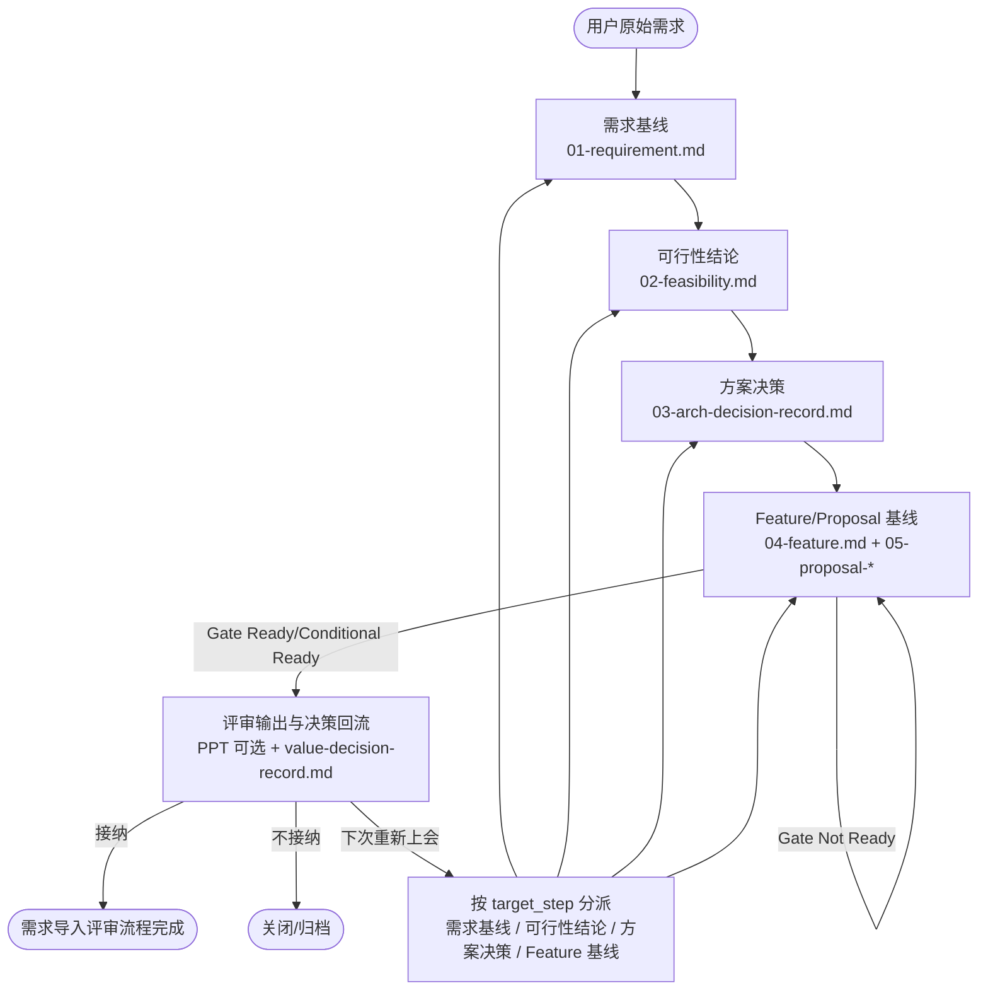

# OHOS SDD 需求导入评审工作流指南

> 本指南描述 OHOS SDD 需求导入评审流程，适用于任何子系统/领域。
> skill 规范位于 `skills/common/requirements/ohos-req-xxx/SKILL.md`。

## Skill 目录

| Skill | 作用 | 输入 | 输出 |
|------|------|------|------|
| [ohos-req-intake-orchestration](ohos-req-intake-orchestration/SKILL.md) | 需求导入评审全流程编排入口 | 用户原始需求、可选 Issue/PRD/会议纪要 | 5 个产物阶段的流程状态 |
| [ohos-req-requirement-intake](ohos-req-requirement-intake/SKILL.md) | 原始需求归一化与澄清 | 原始诉求、RR 单号、版本/场景/范围信息 | `01-requirement.md`、`_draft/clarification-questions.md` |
| [ohos-req-feasibility-analysis](ohos-req-feasibility-analysis/SKILL.md) | 需求可行性分析 | `01-requirement.md`、资料输入记录、轻量代码预检证据包 | `02-feasibility.md`、可行性澄清问题 |
| [ohos-req-arch-decision](ohos-req-arch-decision/SKILL.md) | 候选方案分析与用户决策定稿 | `01-requirement.md`、`02-feasibility.md`、用户决策结论 | `03-arch-decision-record.md` |
| [ohos-req-feature-proposal-baseline](ohos-req-feature-proposal-baseline/SKILL.md) | Feature/Proposal 基线、拆分与内建 Review Ready Gate | `01-requirement.md`、`02-feasibility.md`、`03-arch-decision-record.md` | `04-feature.md`、`proposals/05-proposal-<slug>.md` |
| [ohos-req-value-decision](ohos-req-value-decision/SKILL.md) | 评审决策纪要回流与流程路由 | 评审会议纪要、`01-04` 产物、Gate 结论 | `value-decision-record.md`、路由动作 |
| [ohos-req-value-ppt-gen](ohos-req-value-ppt-gen/SKILL.md) | 需求评审 PPT 生成，可选依赖 | `04-feature.md` 或评审材料 spec、可选图/模板资源 | OpenHarmony 需求评审 PPTX |

## 流程总览



## 产物

| 对外阶段 | 产物 | 内部 checkpoint | 关键规则 |
|------|------|------|---------|
| 需求基线 | `01-requirement.md` | Step 1-2 | 原始诉求归一化为事实基线，RR 单号写入 frontmatter |
| 可行性结论 | `02-feasibility.md` | Step 3-6 | 各方案独立工作量估算，禁止替用户做选型 |
| 方案决策 | `03-arch-decision-record.md` | Step 7-9 | 阶段 A 候选分析，阶段 B 根据用户决策定稿 |
| Feature/Proposal 基线 | `04-feature.md` | Step 10-12 | Feature/Proposal 基线、拆分策略、影响性分析和内建 Gate 结论 |
| Feature/Proposal 基线 | `proposals/05-proposal-<slug>.md` | Step 10-12 | requirements 阶段 proposal 索引产物，进入 ODK 前转换为 `.codespec/changes/<change-id>/proposal.md` |
| 评审闭环 | `value-decision-record.md` | Step 14 | 评审接纳/不接纳/下次重新上会的决策记录 |

## 核心原则

1. 决策由用户提供，AI 不代行。Step 8 为强制交互点。
2. 拆分结果由用户确认，AI 不自行定稿。Step 11 为强制交互点。
3. Review Ready Gate 已融合进 `ohos-req-feature-proposal-baseline`，不再维护独立 Gate skill。
4. requirements 流程不再生成下游 IR、SR 或 handoff 交接契约，相关转换 skill 已移除；历史同名产物只读保留、非前置，不自动改名/删除/覆盖。
5. 对用户只呈现 5 个产物阶段；Step 1-14 仅作为内部 checkpoint 和机器路由编号，不在普通提示中反复暴露。
6. `proposals/05-proposal-<slug>.md` 是需求评审索引产物；进入 ODK 交付阶段时必须建立 change-id 并转换/复制到 `.codespec/changes/<change-id>/proposal.md`，补齐 ODK required sections（含 `Agent Scope Guard`）。

## 预检

```bash
bash skills/common/requirements/ohos-req-intake-orchestration/scripts/install_related_skills.sh --check
```

预期结果：

```text
Bundle: ohos-requirements-intake
Installed: 7/7
Required missing: 0
Version mismatch: 0
Result: READY
```

## 评测与评分

本目录按 `skill-judge` 8 维度完成质量评分，并按 Anthropic skill-creator 风格为每个 skill 保留结构化 eval 用例。顶层评测 runner 和评分明细不随 release skill 包发布，详细评分记录保留在 PR 描述中。当前评分结论：

| 指标 | 结果 |
|------|------|
| Skill Judge 总分 | `110/120` |
| 等级 | `A` |
| Eval cases | `48` |
| Assertions | `155` |
| Programmatic assertions | `111` |
| Manual assertions | `44` |
| Unsupported assertions | `0` |

验证命令：

```bash
bash skills/common/requirements/ohos-req-intake-orchestration/scripts/install_related_skills.sh --check-probes
bash skills/common/requirements/ohos-req-intake-orchestration/scripts/test_related_skills_consistency.sh
python3 -m unittest skills/common/requirements/ohos-req-value-ppt-gen/tests/test_deckbuilder_smoke.py
```
