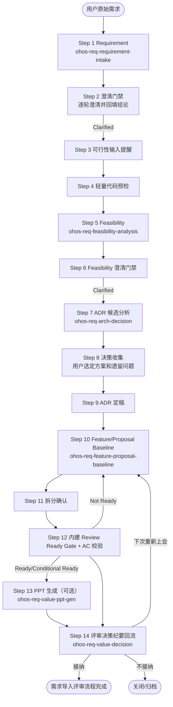

# OHOS SDD 需求导入评审工作流指南

> 本指南描述 OHOS SDD 需求导入评审流程，适用于任何子系统/领域。
> skill 规范位于 `platform_issues/user_guide/ohos-req-xxx/SKILL.md`。

## Skill 目录

| Skill | 说明 |
|------|------|
| [ohos-req-intake-orchestration](ohos-req-intake-orchestration/SKILL.md) | 需求导入评审全流程编排入口 |
| [ohos-req-requirement-intake](ohos-req-requirement-intake/SKILL.md) | 原始需求归一化与 `01-requirement.md` 生成 |
| [ohos-req-feasibility-analysis](ohos-req-feasibility-analysis/SKILL.md) | 需求可行性分析与 `02-feasibility.md` 生成 |
| [ohos-req-arch-decision](ohos-req-arch-decision/SKILL.md) | 候选方案分析与 `03-arch-decision-record.md` 定稿 |
| [ohos-req-feature-proposal-baseline](ohos-req-feature-proposal-baseline/SKILL.md) | Feature/Proposal 评审基线、拆分与内建 Review Ready Gate |
| [ohos-req-value-decision](ohos-req-value-decision/SKILL.md) | 评审决策纪要回流与流程路由 |
| [ohos-req-value-ppt-gen](ohos-req-value-ppt-gen/SKILL.md) | 需求评审 PPT 生成，可选依赖 |

## 流程总览



## 产物

| Step | 产物 | 关键规则 |
|------|------|---------|
| Step 1 | `01-requirement.md` | 原始诉求归一化为事实基线，RR 单号写入 frontmatter |
| Step 5 | `02-feasibility.md` | 各方案独立工作量估算，禁止替用户做选型 |
| Step 7/9 | `03-arch-decision-record.md` | 阶段 A 候选分析，阶段 B 根据用户决策定稿 |
| Step 10-12 | `04-feature.md` | Feature/Proposal 基线、拆分策略、影响性分析和内建 Gate 结论 |
| Step 14 | `value-decision-record.md` | 评审接纳/不接纳/下次重新上会的决策记录 |

## 核心原则

1. 决策由用户提供，AI 不代行。Step 8 为强制交互点。
2. 拆分结果由用户确认，AI 不自行定稿。Step 11 为强制交互点。
3. Review Ready Gate 已融合进 `ohos-req-feature-proposal-baseline`，不再维护独立 Gate skill。
4. requirements 流程不再生成下游 IR、SR 或 handoff 交接契约，相关转换 skill 已移除；历史同名产物只读保留、非前置，不自动改名/删除/覆盖。
5. 步骤按自然顺序编号为 Step 1 到 Step 14，不再使用小数步骤编号。

## 预检

```bash
bash platform_issues/user_guide/ohos-req-intake-orchestration/scripts/install_related_skills.sh --check
```

预期结果：

```text
Bundle: ohos-requirements-intake
Installed: 7/7
Required missing: 0
Version mismatch: 0
Result: READY
```
