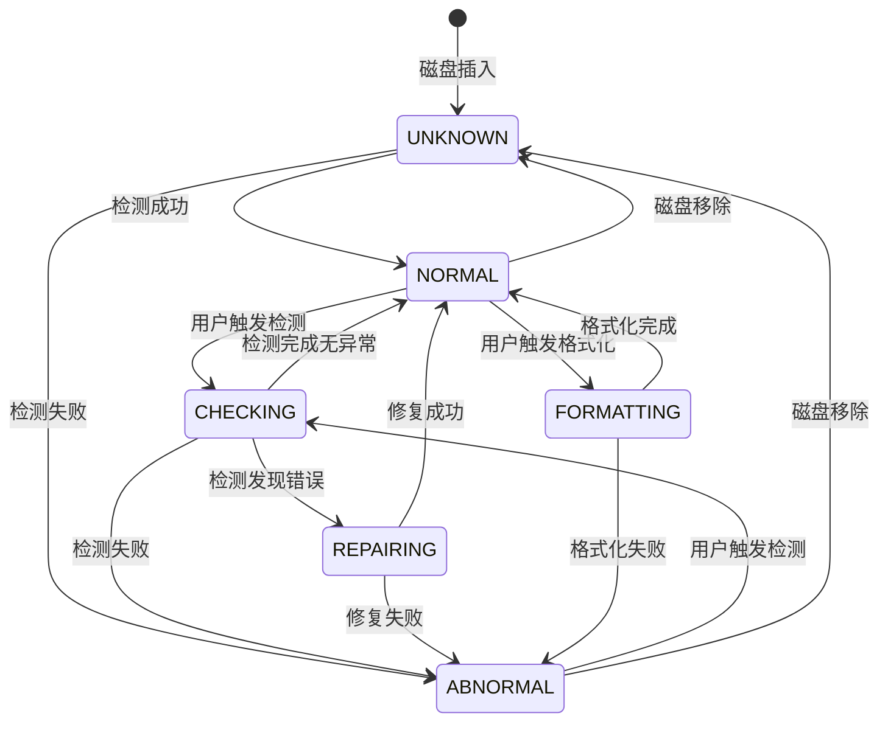
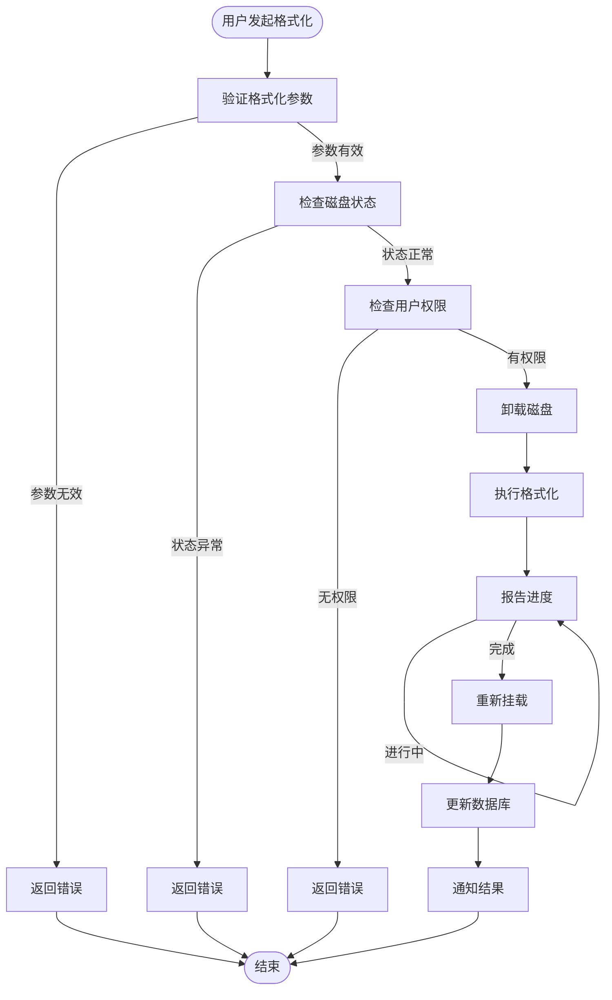
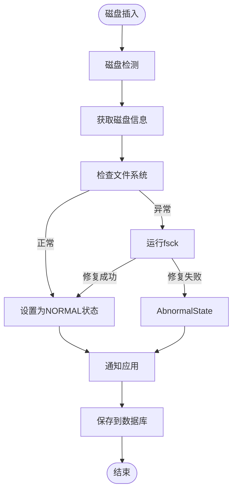

# 功能设计文档模板

本文档定义 HM Desktop 功能设计文档的标准格式和内容要求。

## 文档头部

```markdown
# {{产品名称}}功能设计文档

| 文档版本 | {{版本号}} |
|---------|----------|
| 创建日期 | {{日期}} |
| 文档作者 | {{作者}} |
```

## 必需章节

### 1. 概述

#### 1.1 文档目的
说明本文档的编写目的

#### 1.2 模块清单

| 模块名 | SA ID | 说明 |
|--------|-------|------|
| DiskInfoService | 5001 | 磁盘信息服务 |
| FormatManagerService | 5001 | 格式化管理服务 |
| RepairManagerService | 5001 | 修复管理服务 |
| StatusManagerService | 5001 | 状态管理服务 |
| RenameService | 5001 | 重命名服务 |

#### 1.3 设计原则

- **高内聚低耦合**：模块职责单一，模块间依赖清晰
- **接口稳定**：IDL 接口版本化管理
- **异步优先**：耗时操作采用异步模式
- **可测试性**：支持单元测试和集成测试

---

### 2. 模块定义

对每个模块进行详细定义：

#### 2.X DiskInfoService

**职责**：
- 获取系统中所有磁盘的列表
- 获取指定磁盘的详细信息
- 监听磁盘插拔事件
- 磁盘信息缓存管理

**输入**：
- 无参数（获取列表）
- diskId：string（获取详情）

**输出**：
- DiskInfo[]：磁盘信息数组
- DiskInfo：单个磁盘详细信息

**依赖**：
- sysfs：读取磁盘信息
- StorageDaemon：获取存储挂载信息
- StatusManagerService：状态同步

**相关KEP**：
- KEP1-01：查看磁盘信息
- KEP1-02：查看磁盘详情

#### 2.Y FormatManagerService

**职责**：
- 执行磁盘格式化操作
- 管理格式化任务生命周期
- 格式化进度通知
- 格式化参数验证

**输入**：
- FormatOptions：格式化参数（磁盘ID、文件系统类型、卷标等）

**输出**：
- taskId：格式化任务ID
- 格式化结果（成功/失败）

**依赖**：
- DiskInfoService：获取磁盘信息验证
- FormatTool：执行具体格式化
- StatusManagerService：更新磁盘状态

**相关KEP**：
- KEP1-03：格式化磁盘
- KEP1-04：格式化进度通知

---

### 3. 接口定义

#### 3.1 IDL 接口

##### IDiskInfoService.idl

```idl
/* Copyright (c) 2026 Huawei Device Co., Ltd. */
package OHOS.DiskManagement;

import "DiskInfoTypes.idl";

interface IDiskInfoService {
    /// 获取系统中所有磁盘的列表
    GetDiskList(): DiskInfo[];

    /// 获取指定磁盘的详细信息
    /// @param diskId 磁盘唯一标识
    /// @return 磁盘详细信息
    GetDiskInfo([in] string diskId): DiskInfo;

    /// 刷新磁盘信息
    /// @param force 是否强制刷新缓存
    Refresh([in] boolean force): void;

    /// 注册磁盘变化监听器
    /// @param listener 监听器对象
    RegisterChangeListener([in] IDiskChangeListener listener): void;

    /// 注销磁盘变化监听器
    /// @param listener 要注销的监听器对象
    UnregisterChangeListener([in] IDiskChangeListener listener): void;
};
```

##### IFormatManagerService.idl

```idl
/* Copyright (c) 2026 Huawei Device Co., Ltd. */
package OHOS.DiskManagement;

import "DiskInfoTypes.idl";

interface IFormatManagerService {
    /// 格式化磁盘
    /// @param options 格式化参数
    /// @return 格式化任务ID
    Format([in] FormatOptions options): string;

    /// 取消格式化
    /// @param taskId 任务ID
    /// @return 是否成功取消
    CancelFormat([in] string taskId): boolean;

    /// 查询格式化进度
    /// @param taskId 任务ID
    /// @return 进度百分比 0-100
    GetFormatProgress([in] string taskId): int;

    /// 注册格式化进度监听器
    /// @param listener 监听器对象
    RegisterProgressListener([in] IFormatProgressListener listener): void;

    /// 注销进度监听器
    /// @param listener 监听器对象
    UnregisterProgressListener([in] IFormatProgressListener listener): void;
};
```

##### IRepairManagerService.idl

```idl
/* Copyright (c) 2026 Huawei Device Co., Ltd. */
package OHOS.DiskManagement;

interface IRepairManagerService {
    /// 检测磁盘
    /// @param diskId 磁盘ID
    /// @param options 检测选项
    /// @return 检测任务ID
    Check([in] string diskId, [in] CheckOptions options): string;

    /// 修复磁盘
    /// @param diskId 磁盘ID
    /// @param options 修复选项
    /// @return 修复任务ID
    Repair([in] string diskId, [in] RepairOptions options): string;

    /// 取消检测或修复
    /// @param taskId 任务ID
    /// @return 是否成功取消
    CancelTask([in] string taskId): boolean;

    /// 查询任务状态
    /// @param taskId 任务ID
    /// @return 任务状态
    GetTaskStatus([in] string taskId): TaskStatus;
};
```

#### 3.2 回调接口

##### IDiskChangeListener.idl

```idl
/* Copyright (c) 2026 Huawei Device Co., Ltd. */
package OHOS.DiskManagement;

interface IDiskChangeListener {
    /// 磁盘添加事件
    /// @param diskInfo 新增的磁盘信息
    OnDiskAdded([in] DiskInfo diskInfo): void;

    /// 磁盘移除事件
    /// @param diskId 被移除的磁盘ID
    OnDiskRemoved([in] string diskId): void;

    /// 磁盘变化事件
    /// @param diskInfo 变化后的磁盘信息
    OnDiskChanged([in] DiskInfo diskInfo): void;
};
```

##### IFormatProgressListener.idl

```idl
/* Copyright (c) 2026 Huawei Device Co., Ltd. */
package OHOS.DiskManagement;

interface IFormatProgressListener {
    /// 格式化进度更新
    /// @param taskId 任务ID
    /// @param progress 进度百分比 0-100
    OnProgress([in] string taskId, [in] int progress): void;

    /// 格式化完成
    /// @param taskId 任务ID
    /// @param result 格式化结果
    OnCompleted([in] string taskId, [in] FormatResult result): void;
};
```

---

### 4. 数据库设计

#### 4.1 表结构设计

##### 磁盘信息表 (disk_info_table)

| 字段名 | 类型 | 说明 | 约束 |
|--------|------|------|------|
| disk_id | TEXT | 磁盘唯一标识 | PRIMARY KEY |
| disk_name | TEXT | 磁盘名称 | NOT NULL |
| total_capacity | INTEGER | 总容量(字节) | NOT NULL |
| used_capacity | INTEGER | 已用容量(字节) | DEFAULT 0 |
| fs_type | TEXT | 文件系统类型 | |
| disk_state | INTEGER | 磁盘状态 | NOT NULL |
| is_removable | INTEGER | 是否可移除(0/1) | DEFAULT 0 |
| is_mounted | INTEGER | 是否已挂载(0/1) | DEFAULT 0 |
| mount_path | TEXT | 挂载路径 | |
| update_time | INTEGER | 更新时间戳 | |

##### 磁盘状态表 (disk_status_table)

| 字段名 | 类型 | 说明 | 约束 |
|--------|------|------|------|
| id | INTEGER | 自增主键 | PRIMARY KEY |
| disk_id | TEXT | 磁盘ID | NOT NULL |
| old_state | INTEGER | 原状态 | |
| new_state | INTEGER | 新状态 | |
| reason | TEXT | 状态变更原因 | |
| timestamp | INTEGER | 变更时间戳 | NOT NULL |

##### 格式化任务表 (format_task_table)

| 字段名 | 类型 | 说明 | 约束 |
|--------|------|------|------|
| task_id | TEXT | 任务唯一标识 | PRIMARY KEY |
| disk_id | TEXT | 磁盘ID | NOT NULL |
| fs_type | TEXT | 文件系统类型 | NOT NULL |
| label | TEXT | 卷标名称 | |
| quick_format | INTEGER | 是否快速格式化(0/1) | DEFAULT 1 |
| status | INTEGER | 任务状态 | 0:pending, 1:running, 2:completed, 3:failed, 4:cancelled |
| progress | INTEGER | 进度百分比(0-100) | DEFAULT 0 |
| error_code | INTEGER | 错误码 | |
| error_msg | TEXT | 错误消息 | |
| create_time | INTEGER | 创建时间戳 | NOT NULL |
| start_time | INTEGER | 开始时间戳 | |
| complete_time | INTEGER | 完成时间戳 | |

##### 修复任务表 (repair_task_table)

| 字段名 | 类型 | 说明 | 约束 |
|--------|------|------|------|
| task_id | TEXT | 任务唯一标识 | PRIMARY KEY |
| disk_id | TEXT | 磁盘ID | NOT NULL |
| operation_type | TEXT | 操作类型(check/repair) | NOT NULL |
| status | INTEGER | 任务状态 | 0:pending, 1:running, 2:completed, 3:failed, 4:cancelled |
| error_count | INTEGER | 发现的错误数量 | DEFAULT 0 |
| error_code | INTEGER | 错误码 | |
| create_time | INTEGER | 创建时间戳 | NOT NULL |
| start_time | INTEGER | 开始时间戳 | |
| complete_time | INTEGER | 完成时间戳 | |

##### 操作日志表 (operation_log_table)

| 字段名 | 类型 | 说明 | 约束 |
|--------|------|------|------|
| id | INTEGER | 自增主键 | PRIMARY KEY |
| operation | TEXT | 操作类型 | NOT NULL |
| disk_id | TEXT | 磁盘ID | |
| user_id | TEXT | 用户ID | |
| result | INTEGER | 操作结果 | 0:success, 1:failed |
| error_code | INTEGER | 错误码 | |
| cost_time | INTEGER | 耗时(毫秒) | |
| timestamp | INTEGER | 时间戳 | NOT NULL |

#### 4.2 索引设计

```sql
-- 磁盘信息表索引
CREATE INDEX idx_disk_state ON disk_info_table(disk_state);
CREATE INDEX idx_mount_path ON disk_info_table(mount_path);

-- 任务表索引
CREATE INDEX idx_task_status ON format_task_table(status);
CREATE INDEX idx_task_disk ON format_task_table(disk_id);
CREATE INDEX idx_task_time ON format_task_table(create_time);

-- 状态表索引
CREATE INDEX idx_status_disk ON disk_status_table(disk_id, timestamp);
```

---

### 5. 状态机设计

#### 5.1 状态枚举

```cpp
enum class DiskState : int32_t {
    UNKNOWN = 0,      // 未知状态
    NORMAL = 1,       // 正常
    CHECKING = 2,     // 检测中
    FORMATTING = 3,    // 格式化中
    REPAIRING = 4,     // 修复中
    ABNORMAL = 5       // 异常
};
```

#### 5.2 状态转换表

| 当前状态 | 事件 | 目标状态 | 条件 | 副置操作 |
|----------|------|----------|------|----------|
| UNKNOWN | 检测成功 | NORMAL | 磁盘可访问 | 读取磁盘信息 |
| UNKNOWN | 检测失败 | ABNORMAL | 磁盘错误 | 记录错误 |
| NORMAL | 用户触发检测 | CHECKING | 状态为NORMAL | 检测磁盘状态 |
| NORMAL | 用户触发格式化 | FORMATTING | 状态为NORMAL | 验证参数，卸载磁盘 |
| NORMAL | 磁盘移除 | UNKNOWN | 拔出磁盘 | 清理缓存 |
| CHECKING | 检测完成无异常 | NORMAL | 无错误 | 更新磁盘信息 |
| CHECKING | 检测发现错误 | REPAIRING | 可修复错误 | 创建修复任务 |
| CHECKING | 检测失败 | ABNORMAL | 不可修复 | 上报故障 |
| REPAIRING | 修复成功 | NORMAL | 修复完成 | 更新磁盘信息 |
| REPAIRING | 修复失败 | ABNORMAL | 修复失败 | 上报故障 |
| ABNORMAL | 用户触发检测 | CHECKING | 用户请求 | 检测磁盘状态 |
| ABNORMAL | 磁盘移除 | UNKNOWN | 拔出磁盘 | 清理缓存 |
| FORMATTING | 格式化完成 | NORMAL | 成功 | 更新磁盘信息 |
| FORMATTING | 格式化失败 | ABNORMAL | 失败 | 上报故障 |

#### 5.3 状态转换图



---

### 6. 流程设计

#### 6.1 格式化流程



#### 6.2 磁盘检测流程



---

### 7. DFX 设计

#### 7.1 可靠性设计

**超时处理**：
- 所有API调用设置超时时间
- 超时后取消操作并返回超时错误

| 操作 | 超时时间 | 超时后处理 |
|------|----------|------------|
| 获取磁盘列表 | 5秒 | 返回缓存数据 |
| 获取磁盘详情 | 3秒 | 返回默认值 |
| 格式化操作 | 2小时 | 取消任务，返回超时 |
| 检测操作 | 30分钟 | 取消任务，返回超时 |

**重试机制**：
| 操作 | 重试次数 | 重试间隔 |
|------|----------|----------|
| 获取磁盘信息 | 2 | 1秒 |
| 检查权限 | 2 | 500ms |
| 调用工具 | 0 | - |

#### 7.2 性能设计

**缓存策略**：
- 磁盘信息缓存30秒
- 缓存更新机制：磁盘变化时刷新

**并发控制**：
- 格式化任务串行执行（同一磁盘）
- 不同磁盘可并发格式化
- 最大并发数：3

#### 7.3 可维护性设计

**日志记录**：
- 所有关键操作记录日志
- 日志级别：Debug（开发）、Info（生产）

**配置管理**：
- 支持动态配置更新
- 配置项包括：超时时间、并发数、缓存时间

---

### 8. 安全与隐私设计

#### 8.1 安全设计

**权限校验**：

| 操作 | 所需权限 | 校验时机 |
|------|----------|----------|
| 查看磁盘信息 | 无需特殊权限 | - |
| 格式化磁盘 | ohos.permission.WRITE_USER_STORAGE | 格式化前校验 |
| 修复磁盘 | ohos.permission.WRITE_USER_STORAGE | 修复前校验 |
| 重命名 | ohos.permission.WRITE_USER_STORAGE | 重命名前校验 |

**参数验证**：
```cpp
// 验证磁盘ID
bool IsValidDiskId(const std::string& diskId) {
    if (diskId.empty() || diskId.length() > 256) {
        return false;
    }
    // 只允许字母、数字、下划线、中划线
    return std::all_of(diskId.begin(), diskId.end(),
        [](char c) { return isalnum(c) || c == '_' || c == '-'; });
}

// 验证文件系统类型
bool IsSupportedFsType(const std::string& fsType) {
    static const std::set<std::string> supported = {
        "ext4", "f2fs", "ntfs", "exfat", "vfat"
    };
    return supported.find(fsType) != supported.end();
}
```

#### 8.2 隐私设计

**敏感数据处理**：
- 日志中脱敏磁盘路径
- 错误消息中不包含用户信息

**数据删除**：
```cpp
// 删除用户数据
void WipeUserData(const std::string& diskId) {
    // 清除与该磁盘相关的所有记录
    database->DeleteRecords(diskId);
    // 清除缓存
    cache->Invalidate(diskId);
}
```

---

### 9. 运营打点设计

#### 9.1 打点场景

| 功能 | 打点事件 | 参数 |
|------|----------|------|
| 格式化功能 | FORMAT_START | diskId, fsType |
| 格式化功能 | FORMAT_COMPLETE | diskId, result, duration |
| 格式化功能 | FORMAT_FAIL | diskId, errorCode |
| 格式化功能 | FORMAT_PROGRESS | taskId, progress |
| 修复功能 | REPAIR_START | diskId, repairType |
| 修复功能 | REPAIR_COMPLETE | diskId, errorCount |
| 修复功能 | REPAIR_FAIL | diskId, errorCode |
| 信息查询 | DISK_INFO_QUERY | queryType, resultCount |

#### 9.2 打点上报

```cpp
// 上报运营打点
void ReportOperationEvent(const std::string& event,
                             const std::map<std::string, std::string>& params) {
    HiSysEventWrite(event.c_str(), params);
}

// 使用示例
ReportOperationEvent("FORMAT_COMPLETE", {
    {"diskId", diskId},
    {"fsType", fsType},
    {"duration", std::to_string(duration)},
    {"result", "success"}
});
```

---

### 10. 故障打点设计

#### 10.1 故障打点场景

| 故障类型 | 打点事件 | 参数 |
|----------|----------|------|
| 参数验证失败 | INVALID_PARAM | paramName, reason |
| 磁盘不存在 | DISK_NOT_FOUND | diskId |
| 权限不足 | PERMISSION_DENIED | userId, operation |
| 工具调用失败 | TOOL_CALL_FAILED | toolName, errorCode |
| 操作超时 | OPERATION_TIMEOUT | operation, timeout |
| 状态机异常 | STATE_MACHINE_ERROR | currentState, invalidEvent |
| 数据库错误 | DATABASE_ERROR | operation, errorCode |

#### 10.2 故障等级上报

```cpp
enum class FaultLevel : int32_t {
    MINOR = 0,    // 轻微故障
    MAJOR = 1,    // 主要故障
    CRITICAL = 2   // 严重故障
};

void ReportFault(const std::string& faultType,
                 FaultLevel level,
                 const std::map<std::string, std::string>& context) {
    std::string levelStr = level == CRITICAL ? "CRITICAL" :
                        level == MAJOR ? "MAJOR" : "MINOR";

    HiSysEventWrite("FAULT_OCCURRED", {
        {"faultType", faultType},
        {"level", levelStr},
        {"context", FormatContext(context)}
    });
}
```

---

### 11. 错误处理

#### 11.1 错误码定义

```cpp
enum class DiskManagementErrorCode : int32_t {
    // 通用错误 (2000000-2000999)
    OK = 0,
    ERROR_UNKNOWN = 2000001,
    ERROR_NOT_SUPPORTED = 2000002,
    ERROR_INVALID_PARAMETER = 2000003,

    // 磁盘相关错误 (2010000-2010999)
    ERROR_DISK_NOT_FOUND = 2010001,
    ERROR_DISK_STATE_INVALID = 2010002,
    ERROR_DISK_IN_USE = 2010003,
    ERROR_DISK_READ_FAILED = 2010004,
    ERROR_DISK_WRITE_FAILED = 2010005,

    // 权限错误 (2020000-2020999)
    ERROR_PERMISSION_DENIED = 2020001,
    ERROR_INSUFFICIENT_PRIVILEGE = 2020002,

    // 格式化相关错误 (2030000-2030999)
    ERROR_FORMAT_FAILED = 2030001,
    ERROR_FORMAT_UNSUPPORTED_FS = 2030002,
    ERROR_FORMAT_CANCELLED = 2030003,

    // 修复相关错误 (2040000-2040999)
    ERROR_REPAIR_FAILED = 2040001,
    ERROR_REPAIR_UNFIXABLE = 2040002,
    ERROR_REPAIR_CANCELLED = 2040003,
};
```

#### 11.2 错误处理策略

| 错误类型 | 处理策略 | 用户提示 |
|----------|----------|----------|
| 磁盘不存在 | 立即返回错误，不重试 | "磁盘不存在，请检查连接" |
| 权限不足 | 记录日志，返回错误 | "权限不足，请在设置中开启相应权限" |
| 格式化失败 | 判断是否可重试 | "格式化失败，是否尝试修复磁盘？" |
| 操作超时 | 取消操作，返回超时 | "操作超时，请重试" |
| 状态异常 | 触发自动检测 | "磁盘状态异常，正在尝试修复..." |

---

## PRD 到设计文档的映射

| PRD 内容 | 设计文档章节 |
|----------|--------------|
| KEP 定义 | 模块定义 + 接口定义 |
| 用户故事 | 流程设计 |
| 验收标准 | 接口返回值定义 |
| 非功能需求 | 错误处理 + 性能指标 + DFX设计 |
