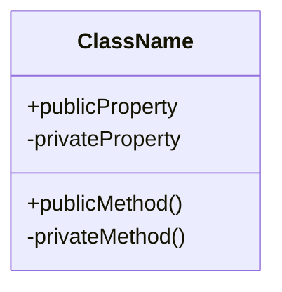
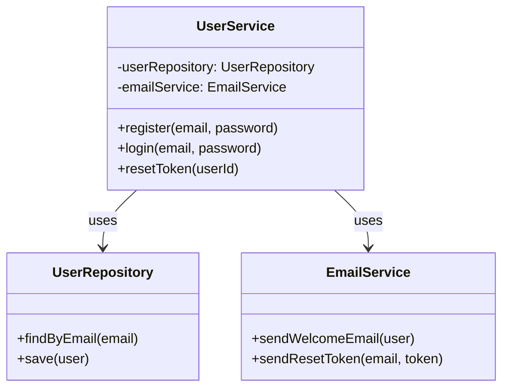
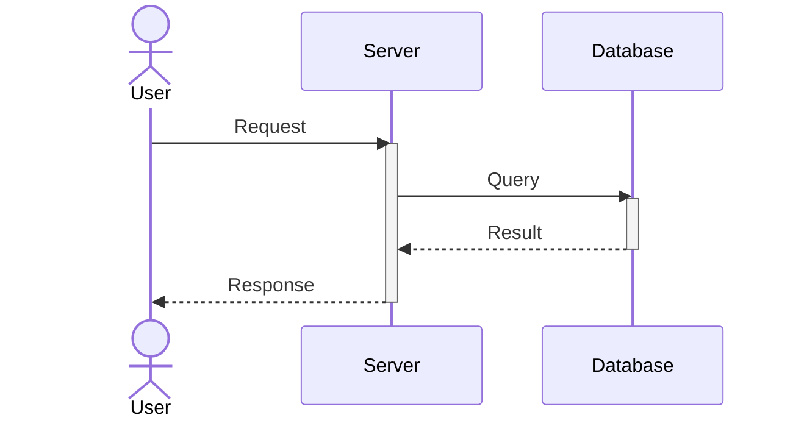
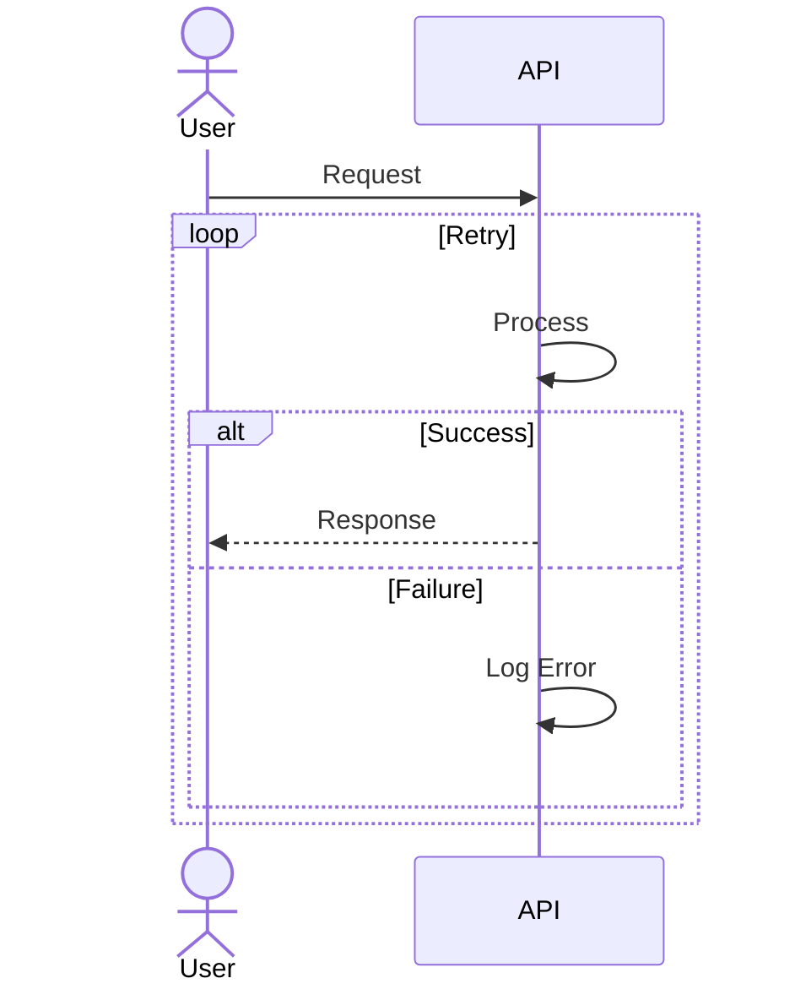
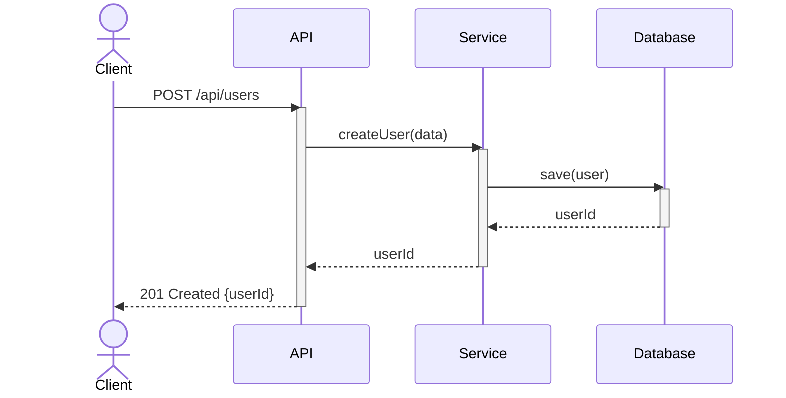
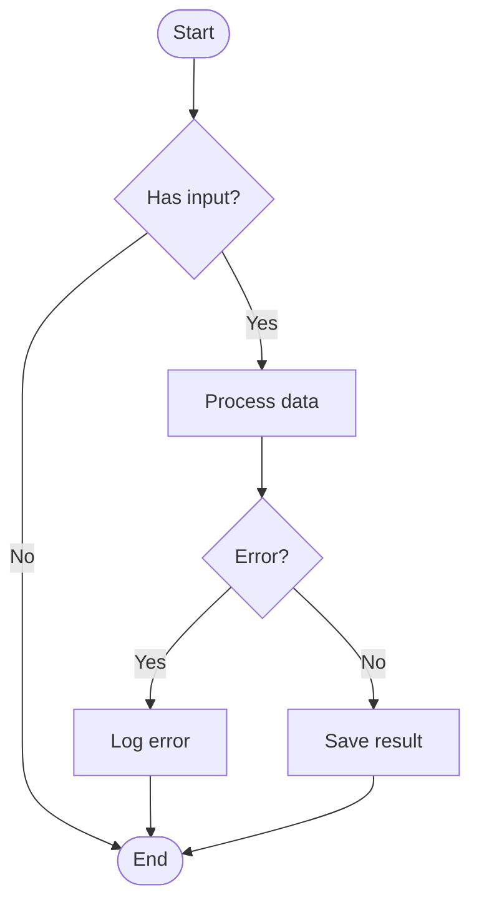

# Mermaid Diagram Reference

Quick reference for creating mermaid diagrams in code documentation.

## Class Diagram

Shows the structure of the code with classes, interfaces, and their relationships.

### Basic Syntax



### Relationships

- `-->` : Association (uses)
- `--|>` : Inheritance (extends)
- `..|>` : Implementation (implements)
- `-->` : Composition
- `..>` : Dependency

### Example



## Sequence Diagram

Shows the interaction between components over time.

### Basic Syntax

```mermaid
sequenceDiagram
    actor Actor
    participant Participant
    Actor->>Participant: Message
    Participant-->>Actor: Response
```

### Activation Boxes



### Loops and Alt Blocks



### Example



## Flowchart

Shows logic flow and decision trees.

### Example



## Tips for Code Documentation

1. **Class diagrams**: Focus on the main classes and their relationships. Don't include every method - include only important ones that show the architecture.

2. **Sequence diagrams**: Show the happy path first. Use alt/loop blocks for error handling or repeated operations.

3. **Keep it readable**: Don't create overly complex diagrams with 20+ components. Break into multiple diagrams if needed.

4. **Use meaningful names**: Component names should match the actual code names (class names, service names, etc.).
