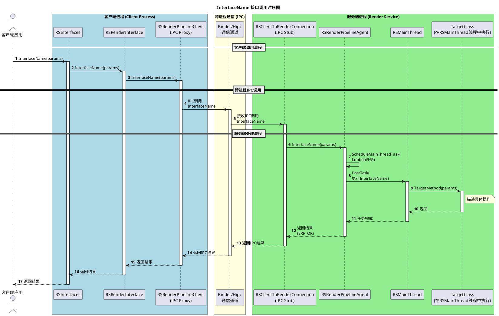
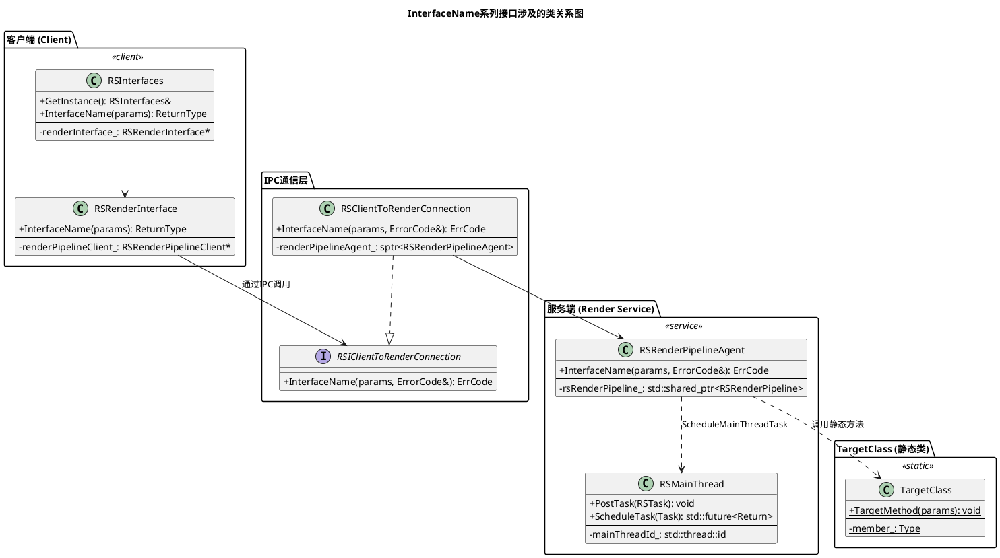

# Interface UML Generator

This skill helps generate PlantUML sequence diagrams and class diagrams for new interfaces, based on existing similar interfaces in the codebase.

## When to Use

User wants to create UML diagrams (sequence diagrams, class diagrams) for:
- New API interfaces
- New method implementations
- Interface call chains
- IPC communication flows

## Workflow

### Step 1: Gather Basic Information

Start with what the user provides (often just an interface name), then ask questions to collect:

**Essential Information:**
1. **Interface name(s)** - e.g., `AddGlocalBlackList`, `RemoveGlocalBlackList`
2. **Parameters** - What are the input parameters and their types?
3. **Return type** - What does the interface return?
4. **Reference interface** - Is there an existing similar interface to use as a template?

**Optional Information (ask if needed):**
5. **Output directory** - Where should the PlantUML files be saved?
6. **Diagram types** - Sequence diagram? Class diagram? Both?
7. **Call chain destination** - Which class/method does it ultimately call?

### Step 2: Analyze Reference Interface

Search the codebase for the reference interface to understand the call chain:

```bash
# Find the reference interface implementation
grep -r "SetFocusAppInfo" --include="*.h" --include="*.cpp"
```

**Key files to examine:**
- Client-side interfaces: `RSInterfaces`, `RSRenderInterface`
- IPC layer: `RSIClientToRenderConnection`, `RSClientToRenderConnection`
- Service-side: `RSRenderPipelineAgent`, `RSMainThread`
- Target class: Where the interface ultimately executes

### Step 3: Generate PlantUML Diagrams

#### Sequence Diagram Template



#### Class Diagram Template



### Step 4: Save PlantUML Files

Write the generated PlantUML files to the specified directory:
- Use descriptive filenames: `InterfaceName_sequence.puml`, `InterfaceName_ClassDiagram.puml`
- Include UTF-8 BOM for Chinese character support if needed
- Save to user-specified output directory

### Step 5: Optional - Create Comparison Diagram

If comparing with existing interfaces, create a comparison diagram showing:
- Parameter differences
- Call chain differences
- Target class differences

## Questions to Ask User

1. **Interface names**: What are the interface names you want to generate UML for?
2. **Reference interface**: Which existing interface should be used as a reference?
3. **Parameters**: What are the parameter types for the new interface(s)?
4. **Return type**: What should the interface return?
5. **Target class**: Which class does the interface ultimately call? (e.g., ScreenSpecialLayerInfo, RSMainThread)
6. **Thread requirement**: Does it need to execute in a specific thread? (e.g., RSMainThread thread)
7. **Output directory**: Where should the PlantUML files be saved?

## Example Usage

**User provides:**
```
Generate UML for AddGlocalBlackList, RemoveGlocalBlackList, SetGlocalBlackList
```

**Ask follow-up questions:**
1. "What should be the parameter type?" → `const std::vector<NodeId>&`
2. "Which existing interface is similar?" → `SetFocusAppInfo`
3. "Which class does it ultimately call?" → `ScreenSpecialLayerInfo`
4. "What's the output directory?" → Current code directory

**Generate output:**
- `AddGlocalBlackList_sequence.puml`
- `RemoveGlocalBlackList_sequence.puml`
- `SetGlocalBlackList_sequence.puml`
- `InterfaceName_ClassDiagram.puml`

## Tips

- Use Chinese for diagram titles and notes if the codebase uses Chinese
- Include `autonumber` for sequence diagrams
- Use color coding to distinguish client/service/static layers
- Add notes to explain key operations
- Group related steps with `== Section Name ==`
