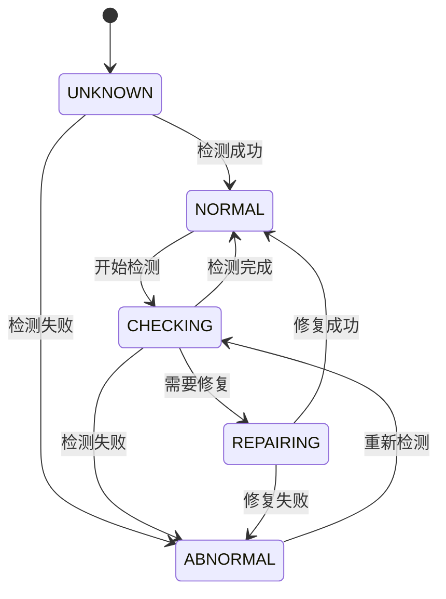
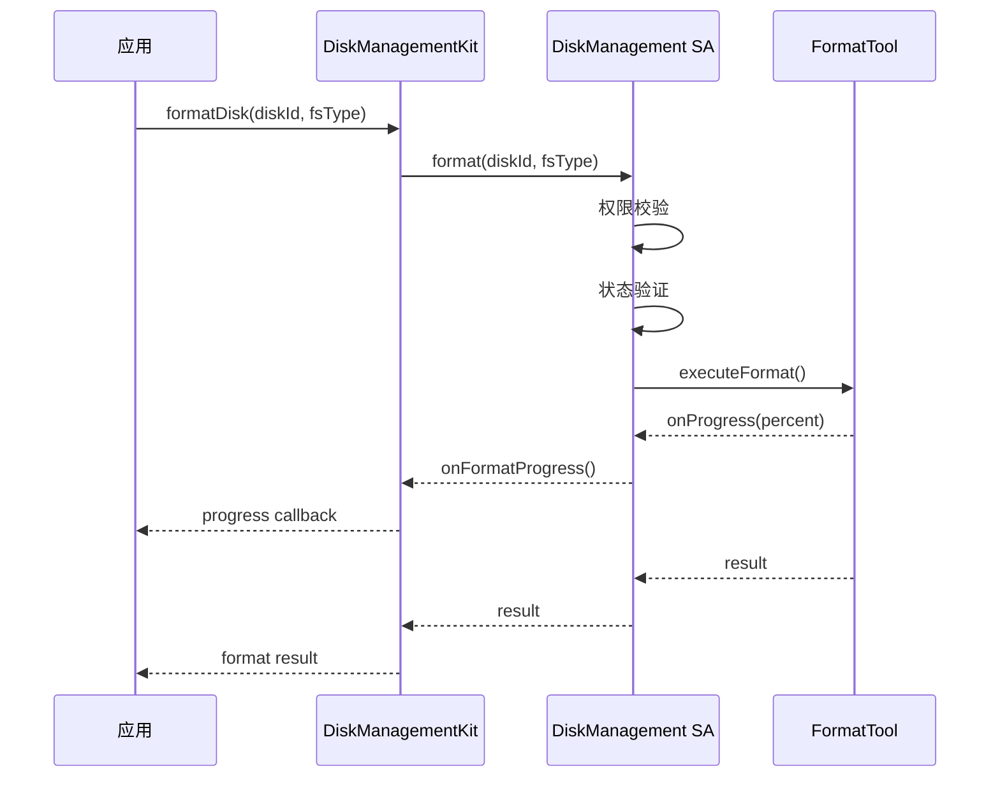

# 设计文档生成器

基于 PRD 文档自动生成鸿蒙系统（HarmonyOS/OpenHarmony）设计文档，包括架构设计文档和功能设计文档。

## 快速开始

提供 PRD 文档路径：

```
基于 {PRD文档} 生成设计文档
```

指定输出类型：

```
生成架构设计文档和功能设计文档，基于 {PRD文档路径}
```

## OpenHarmony 代码分析

在生成设计文档前，需要分析 OpenHarmony 存量代码结构，确保新设计与现有架构兼容。

### 分析步骤

#### 1. 发现代码结构

使用 Glob 工具快速发现目录结构和关键文件：

| 文件类型 | 搜索模式 | 说明 |
|----------|----------|------|
| 配置文件 | `**/bundle.json`, `**/BUILD.gn`, `**/config.json` | 部件定义、构建配置 |
| 文档文件 | `**/README.md`, `**/*.md` | 模块说明、使用指南 |
| 接口文件 | `**/*.idl`, `**/include/*.h` | IDL 接口、C++ 头文件 |
| 元数据文件 | `**/*.gn`, `**/*.gni` | GN 构建脚本 |
| SA 配置 | `**/sa_profile/*.json`, `**/etc/profile/*.json` | SA 配置文件 |

#### 2. 搜索关键信息

使用 Grep 工具搜索关键字提取组件信息：

| 搜索目标 | 搜索关键字 | 提取信息 |
|----------|------------|----------|
| SA ID | `"sa-id"` | 已分配的 SA ID |
| 子系统 | `subsystem_name` | 子系统组织 |
| 依赖关系 | `external_deps` | 组件依赖 |
| 接口定义 | `interface` | IDL 接口 |
| 服务类 | `class.*Service` | 服务实现类 |
| Provider | `.*Provider` | SA Provider 类 |

#### 3. 读取关键配置

使用 Read 工具读取关键配置文件：

- `bundle.json`: 部件定义和子系统归属
- `BUILD.gn`: 构建依赖和编译选项
- `sa_profile/*.json`: SA 配置和启动参数
- `README.md`: 模块说明和使用指南
- `*.idl`: 接口定义和数据结构

#### 4. 智能探索

使用 Task 工具启动 Explore 代理进行多轮探索：

- 发现相关模块的目录结构
- 查找相似功能的实现参考
- 提取接口设计和数据结构

### 命名模式推断

通过文件和目录命名推断功能：

| 命名模式 | 推断功能 | 示例 |
|----------|----------|------|
| `*_service.cpp` | 服务实现 | `disk_info_service.cpp` |
| `*_provider.h/cpp` | SA Provider 实现 | `disk_manager_provider.cpp` |
| `*_listener.idl` | 事件监听接口 | `IDiskChangeListener.idl` |
| `*_types.idl` | 数据类型定义 | `DiskInfoTypes.idl` |
| `*/kits/` | 对外 API 层 | `kits/js/`, `kits/native/` |
| `*/innerkits/` | 内部 API 层 | `innerkits/native/` |
| `*/sa_profile/` | SA 配置文件 | `sa_profile/5001.json` |
| `*/test/` | 测试代码 | `test/unittest/` |
| `*/mock/` | 测试 Mock | `test/mock/` |

### 分析输出

代码分析完成后生成：

1. **现有 SA 清单**: 已分配的 SA ID 和服务名称
2. **子系统组织**: 子系统和部件的层次结构
3. **依赖关系图**: 组件间的依赖关系
4. **接口参考**: 相似功能的接口设计参考
5. **代码风格参考**: 命名规范、目录结构等

## 竞品方案分析章节要求

架构设计文档 **第2章必须为竞品方案分析**，位于需求背景之后、鸿蒙系统架构分析之前。

### 章节结构

### 2. 竞品方案分析

#### 2.1 竞品识别
- 列出主要竞品（至少2-3个）
- 说明竞品选择理由
- 竞品类型：同类产品、技术方案、行业标准

#### 2.2 竞品技术方案分析
对每个竞品分析：
- 核心技术架构
- 关键技术组件
- 通信机制
- 数据流程
- 关键流程图、时序图

#### 2.3 技术对比表格

| 对比项 | 本方案 | 竞品A | 竞品B |
|--------|--------|-------|-------|
| 架构模式 | | | |
| 核心技术 | | | |
| 通信机制 | | | |
| 进程模型 | | | |
| 安全机制 | | | |
| 跨语言支持 | | | |

#### 2.4 差异化设计
- 本方案相对于竞品的创新点
- 解决的竞品痛点
- 技术优势说明
- 借鉴与改进

### 输出要求

- 使用4+1视图、流程图、时序图呈现竞品技术方案
- 至少包含2个竞品的详细分析
- 必须有技术对比表格
- 必须明确差异化设计点

## 章节顺序验证

生成架构设计文档时，验证章节顺序：

```
标准顺序：需求背景 → 竞品方案分析 → 鸿蒙系统架构分析 → 架构设计...
```

**验证规则**：
- ✅ 第1章必须是"需求背景"
- ✅ 第2章必须是"竞品方案分析"（**必需**）
- ✅ 竞品方案分析必须在需求背景之后
- ✅ 竞品方案分析必须在架构设计之前
- ❌ 如顺序错误，提示用户调整

**验证逻辑**：
1. 提取文档中所有一级标题（# 开头）
2. 验证第1章是否为"需求背景"
3. 验证第2章是否为"竞品方案分析"或"竞品分析"
4. 如缺失第2章或顺序错误，返回错误提示

## 生成内容

### 架构设计文档 (architecture_vX.md)

包含以下标准章节（按顺序）：

| 章节 | 内容 |
|------|------|
| 1. 需求背景 | 项目背景、业务需求、技术挑战 |
| **2. 竞品方案分析** | **竞品识别、技术方案对比、差异化设计（**必需**）** |
| 3. 鸿蒙系统架构分析 | 现有架构、可复用组件 |
| 4. 架构设计 | 整体架构、技术选型、模块划分 |
| 5. 数据模型 | 核心数据结构、数据库设计 |
| 6. 接口设计 | IDL接口、NAPI接口 |
| 7. 部署架构 | 进程模型、启动依赖 |
| 8. 安全韧性隐私可靠性分析 | 安全设计、韧性设计、隐私保护、可靠性 |
| 9. 需求分解与代码量评估 | 需求拆分、代码量估算 |
| 10. 附录 | 错误码、性能指标 |

### 功能设计文档 (functiondesign_vX.md)

包含以下标准章节：

| 章节 | 内容 |
|------|------|
| 1. 概述 | 文档目的、模块清单 |
| 2. 模块定义 | 各模块职责、输入输出、依赖关系 |
| 3. 接口定义 | IDL接口、回调接口 |
| 4. 状态机设计 | 状态枚举、转换表、转换图 |
| 5. 流程设计 | 主流程图、时序图、异常处理 |
| 6. 错误处理 | 错误码定义、处理策略 |

## 架构层次

```
┌─────────────────────────────────────────┐
│              应用层 (Application)         │
│         设置应用 | 文件管理 | 磁盘工具      │
└─────────────────────────────────────────┘
                    ↓ NAPI/IPC
┌─────────────────────────────────────────┐
│               服务层 (Service)            │
│      DiskManagement SA (5001)            │
│  DiskInfo | Format | Repair | Status     │
└─────────────────────────────────────────┘
                    ↓
┌─────────────────────────────────────────┐
│               工具层 (Tools)              │
│    FormatTool | FsckTool | PartedTool    │
└─────────────────────────────────────────┘
                    ↓
┌─────────────────────────────────────────┐
│              系统层 (System)              │
│  Storage SA | OsAccount SA | HiSysEvent   │
└─────────────────────────────────────────┘
```

## SA 划分规则

| SA 名称 | SA ID 范围 | 示例 |
|---------|-----------|------|
| 基础服务 | 1000-1999 | OsAccount (4101) |
| 数据存储 | 4000-4999 | |
| 文件管理 | 5000-5999 | DiskManagement (5001), StorageManager (5003) |

## 状态机设计

使用 V11.0 状态机规范：



## 时序图示例



## 参考文档

- **架构设计模板**: [references/architecture_template.md](references/architecture_template.md)
- **功能设计模板**: [references/functional_template.md](references/functional_template.md)
- **状态机规范**: [references/state_machine_spec.md](references/state_machine_spec.md)
- **接口设计指南**: [references/interface_guide.md](references/interface_guide.md)

## 与 PRD 的映射关系

| PRD 章节 | 设计文档章节 | 映射规则 |
|----------|--------------|----------|
| **第4章：竞品分析** | **第2章：竞品方案分析** | **PRD的竞品分析扩展为技术方案对比** |
| 第2章：需求背景 | 第1章：需求背景 | 直接映射 |
| 第5章：需求描述 | 第4章：架构设计 | 需求转换为架构设计 |
| KEP 定义 | 模块架构 + 接口设计 | 每个 KEP 对应至少一个服务模块 |
| 用户故事 | 功能规格 | 用户场景转换为功能流程 |
| 验收标准 | 接口返回值定义 | 验收条件转为接口契约 |
| 非功能需求 | 架构选型 + 性能指标 | 技术约束体现在架构设计中 |

## 依赖服务映射

| 设计文档中的服务 | 对应的 OpenHarmony SA | 说明 |
|------------------|---------------------|------|
| 权限校验服务 | OsAccount SA (4101) | 复用账户系统能力 |
| 存储服务 | StorageManager SA (5003) | 外接存储管理 |
| 加密服务 | Crypto SA | 磁盘加密能力 |

## 输出目录结构

```
output/
├── architecture_v1.md      # 架构设计文档
├── functiondesign_v1.md     # 功能设计文档
├── code_paths_v1.md        # 代码路径文档
└── diagrams/               # 生成的图表文件
    ├── architecture.png
    ├── state_machine.png
    └── sequence.png
```

## 使用示例

**生成完整设计文档**：
```
基于 {PRD文档} 生成架构和功能设计文档
```

**仅生成架构设计**：
```
只生成架构设计文档，基于 {PRD文档}
```

**指定 SA ID**：
```
生成设计文档，SA ID 使用 {SA_ID}，基于 {PRD文档}
```

**指定产品名称和版本**：
```
为 {产品名} {版本} 生成设计文档，版本 {文档版本}，基于 {PRD文档}
```

**指定输出目录**：
```
生成设计文档到 ./design_docs 目录，基于 {PRD文档}
```

## 命名规范

| 文档类型 | 命名格式 | 示例 |
|----------|----------|------|
| 架构设计 | `architecture_v{major}.md` | architecture_v1.md |
| 功能设计 | `functiondesign_v{major}.md` | functiondesign_v1.md |
| 代码路径 | `code_paths_v{major}.md` | code_paths_v1.md |
| PRD 引用 | `prd_v{version}.md` | prd_v17.md |

## 版本管理规则

| 版本变化 | 更新内容 |
|----------|----------|
| PRD 版本变更 | 设计文档版本同步递增 |
| 架构调整 | 增加 .1 子版本（V1.0 → V1.1） |
| 新增功能 | 增加次版本号（V1.0 → V2.0） |

## 图表格式

使用 Mermaid 语法绘制图表。支持的图表类型：

- **流程图**: `graph TD` 或 `flowchart TD`
- **状态图**: `stateDiagram-v2`
- **时序图**: `sequenceDiagram`
- **类图**: `classDiagram`
- **组件图**: `graph LR`

## 错误处理

| 错误类型 | 处理方式 |
|----------|----------|
| PRD 文件不存在 | 提示文件路径错误 |
| PRD 缺少竞品分析 | 提示补充PRD第4章竞品分析，或基于现有信息生成 |
| **架构文档缺少第2章竞品方案分析** | **返回错误：第2章必须为竞品方案分析** |
| **章节顺序错误** | **提示：第2章必须为竞品方案分析，位于需求背景之后** |
| KEP 解析失败 | 列出缺失的 KEP 定义 |
| 格式不符合规范 | 按默认模板生成 |
| 输出目录不可写 | 提示权限问题 |
