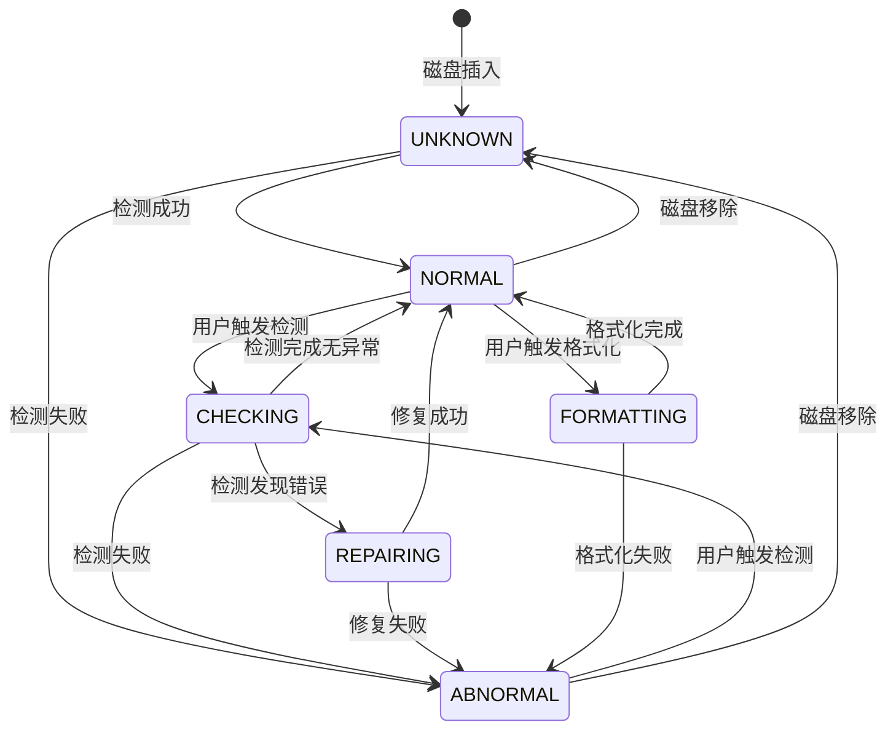
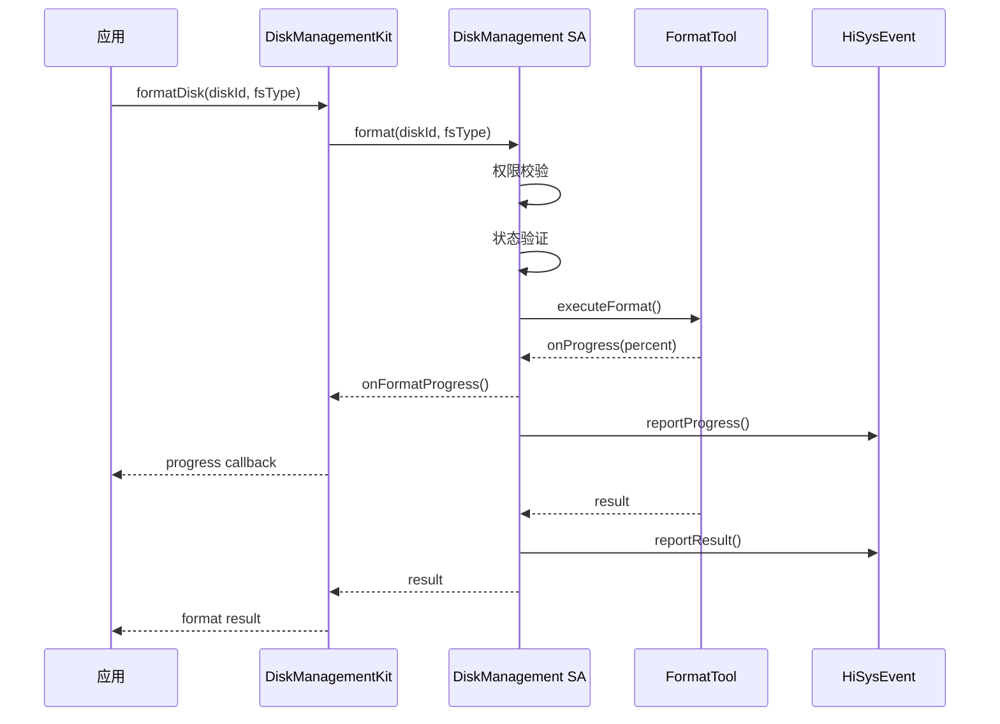

# 架构设计文档模板

本文档定义 HM Desktop 架构设计文档的标准格式和内容要求。

## 文档头部

```markdown
# {{产品名称}}系统架构设计文档

| 文档版本 | {{版本号}} |
|---------|----------|
| 创建日期 | {{日期}} |
| 文档作者 | {{作者}} |
```

## 必需章节

### 1. 概述

#### 1.1 文档目的
说明本文档的编写目的和适用范围

#### 1.2 适用范围
- 产品版本
- 系统版本
- 目标读者

#### 1.3 参考文档
- PRD 文档
- 相关标准
- 依赖文档

#### 1.4 术语定义

| 术语 | 全称 | 说明 |
|------|------|------|
| SA | System Ability | 系统能力 |
| DFX | Design for X | 面向X的设计 |

---

### 2. 4+1 视图设计

#### 2.1 逻辑视图

描述系统的逻辑组件划分和职责边界

```mermaid
graph TB
    subgraph 应用层
        A1[设置应用]
        A2[文件管理器]
    end

    subgraph 服务层
        S1[DiskInfoService]
        S2[FormatManagerService]
        S3[RepairManagerService]
    end

    subguide 工具层
        T1[FormatTool]
        T2[FsckTool]
    end

    A1 --> S1
    A1 --> S2
    S2 --> T1
    S3 --> T2
```

#### 2.2 进程视图

描述系统中的进程、线程和进程间通信

```
进程模型：
disk_management_service (SA 5001)
├── DiskInfoService 线程
├── FormatManagerService 线程
├── RepairManagerService 线程
└── 状态管理线程

IPC 通信：
- Binder IPC
- HiSyncEvent
- HiEvent
```

#### 2.3 部署视图

描述软件和硬件的物理部署架构

```
设备部署：
┌─────────────────────────────────┐
│        HM Desktop 设备            │
│                                  │
│  ┌────────────────────────┐     │
│  │  System partition       │     │
│  │  ├── SA (5001)          │     │
│  │  ├── 库文件              │     │
│  │  └── 配置文件            │     │
│  └────────────────────────┘     │
│                                  │
│  ┌────────────────────────┐     │
│  │  User partition        │     │
│  │  ├── 应用               │     │
│  │  └── 用户数据           │     │
│  └────────────────────────┘     │
└─────────────────────────────────┘
```

#### 2.4 开发视图

描述代码库的组织结构和依赖关系

```
代码目录结构：
foundation/filemanagement/disk_management/
├── services/           # 服务实现
├── interfaces/         # 接口定义
├── tests/             # 测试代码
└── bundle.json        # 部件配置

依赖关系：
disk_management_sa
  ├── disk_management_idl
  ├── hilog (external)
  └── ipc_core (external)
```

#### 2.5 场景视图

描述关键业务场景下的系统协作

| 场景 | 涉及组件 | 协作方式 |
|------|----------|----------|
| 磁盘格式化 | 应用、FormatManager、FormatTool | 同步调用 |
| 磁盘检测 | 应用、RepairManager、FsckTool | 异步回调 |
| 磁盘信息查询 | 应用、DiskInfoService | 查询模式 |

---

### 3. 模块架构

#### 3.1 整体架构图

```
┌─────────────────────────────────────────┐
│              应用层 (Application)         │
│    设置应用 | 文件管理器 | 系统对话框       │
└─────────────────────────────────────────┘
                    ↓ NAPI
┌─────────────────────────────────────────┐
│           框架层 (Framework)               │
│         NAPI接口 | 事件总线               │
└─────────────────────────────────────────┘
                    ↓ IPC
┌─────────────────────────────────────────┐
│            服务层 (Service)                │
│   DiskInfo | Format | Repair | Status   │
│   Service | Manager | Manager | Manager │
└─────────────────────────────────────────┘
                    ↓
┌─────────────────────────────────────────┐
│            工具层 (Tools)                  │
│   FormatTool | FsckTool | PartedTool     │
└─────────────────────────────────────────┘
                    ↓
┌─────────────────────────────────────────┐
│            系统层 (System)                 │
│   HiLog | HiSysEvent | HiTrace | OsAccount│
└─────────────────────────────────────────┘
```

#### 3.2 SA 划分

| SA 名称 | SA ID | 进程名 | 启动模式 | 职责 |
|---------|-------|--------|----------|------|
| DiskManagement | 5001 | disk_management_service | boot | 磁盘管理核心服务 |
| OsAccount | 4101 | account_service | boot | 账户与权限管理 |
| StorageManager | 5003 | storage_daemon | boot | 外接存储管理 |

#### 3.3 模块职责

| 模块 | 职责 | 边界 |
|------|------|------|
| DiskInfoService | 磁盘信息查询与缓存 | 不执行磁盘操作 |
| FormatManagerService | 格式化任务管理与调度 | 具体格式化由工具层执行 |
| RepairManagerService | 检测修复任务管理 | 具体修复由工具层执行 |
| StatusManagerService | 磁盘状态管理与通知 | 状态由其他服务上报 |

---

### 4. 架构设计

#### 4.1 整体架构设计

描述架构模式和设计原则

**架构模式**：
- 分层架构
- 事件驱动
- 状态机模式

**设计原则**：
- 单一职责
- 开闭原则
- 依赖倒置
- 接口隔离

#### 4.2 关键技术选型

| 技术点 | 选型 | 说明 |
|--------|------|------|
| IPC | Binder/HDF | OpenHarmony 标准 IPC |
| 状态管理 | 状态机 | V11.0 状态机规范 |
| 数据存储 | RDB | 关系型数据库 |
| 日志系统 | HiLog | 系统日志 |
| 事件上报 | HiSysEvent | 系统事件 |
| 链路追踪 | HiTrace | 调用链追踪 |
| 权限管理 | AccessToken | 访问令牌机制 |

#### 4.3 状态机设计

使用 Mermaid stateDiagram-v2 语法：



#### 4.4 时序图

使用 Mermaid sequenceDiagram 语法：



---

### 5. 数据模型

#### 5.1 核心数据结构

```cpp
// 磁盘信息
struct DiskInfo {
    std::string diskId;           // 磁盘ID
    std::string diskName;         // 磁盘名称
    uint64_t totalCapacity;      // 总容量(字节)
    uint64_t usedCapacity;       // 已用容量(字节)
    std::string fsType;           // 文件系统类型
    DiskState state;              // 磁盘状态
    bool isRemovable;            // 是否可移除
    bool isMounted;              // 是否已挂载
    std::string mountPath;        // 挂载路径
};

// 格式化参数
struct FormatOptions {
    std::string diskId;
    std::string fsType;           // ext4/f2fs/ntfs/exfat/vfat
    std::string label;            // 卷标名称
    bool quickFormat;             // 快速格式化
    uint32_t clusterSize;         // 簇大小
};
```

#### 5.2 数据库设计

| 表名 | 说明 | 关键字段 |
|------|------|----------|
| disk_info_table | 磁盘基本信息 | disk_id, disk_name, capacity, fs_type |
| disk_status_table | 磁盘状态历史 | disk_id, old_state, new_state, timestamp |
| format_task_table | 格式化任务记录 | task_id, disk_id, fs_type, status, progress |
| repair_task_table | 修复任务记录 | task_id, disk_id, error_code, result |
| operation_log_table | 操作日志表 | operation, disk_id, user_id, timestamp |

---

### 6. DFX 设计

#### 6.1 可靠性设计

| 设计项 | 说明 | 目标指标 |
|--------|------|----------|
| 服务重启恢复 | SA 异常退出后自动恢复 | 3秒内恢复 |
| 任务断点续传 | 格式化中断后支持恢复 | 支持 |
| 状态一致性 | 状态与实际磁盘状态同步 | 偏差<2秒 |
| 超时处理 | 所有操作设置超时时间 | 格式化<2小时 |
| 重试机制 | 网络异常自动重试 | 最多3次 |

#### 6.2 可用性设计

| 设计项 | 说明 | 目标指标 |
|--------|------|----------|
| 服务可用性 | SA 正常运行时间 | ≥99.9% |
| 故障恢复时间 | MTTR | <30分钟 |
| 容错机制 | 部分功能降级 | 信息查询降级可用 |
| 负载均衡 | 多磁盘并发操作 | 支持10个磁盘 |

#### 6.3 可维护性设计

| 设计项 | 说明 |
|--------|------|
| 日志分级 | Debug/Info/Warn/Error/Fatal |
| 配置外置 | 支持配置文件动态修改 |
| 模块化 | 高内聚低耦合 |
| 接口版本化 | IDL 接口版本管理 |

---

### 7. 安全与隐私设计

#### 7.1 安全设计

| 安全项 | 设计措施 |
|--------|----------|
| 权限控制 | 基于 AccessToken 的访问控制 |
| 权限校验 | 敏感操作需校验用户权限 |
| 数据加密 | 敏感数据加密存储 |
| 审计日志 | 所有敏感操作记录审计日志 |
| 输入验证 | 所有外部输入进行验证 |
| 拒绝服务防护 | 限流防止资源耗尽 |

#### 7.2 隐私设计

| 隐私项 | 设计措施 |
|--------|----------|
| 数据最小化 | 仅收集必要的数据 |
| 数据脱敏 | 日志中敏感信息脱敏 |
| 用户同意 | 敏感操作需用户明确同意 |
| 数据保留 | 用户数据删除后彻底清除 |
| 权限最小化 | 最小权限原则 |

#### 7.3 韧性设计

| 韧性项 | 设计措施 |
|--------|----------|
| 异常捕获 | 所有异常都被捕获处理 |
| 资源限制 | 内存、句柄数量限制 |
| 进程隔离 | 服务运行在独立进程 |
| 状态恢复 | 异常后可恢复到一致状态 |

---

### 8. 运营打点设计

#### 8.1 打点场景

| 场景 | 打点事件 | 参数 | 触发时机 |
|------|----------|------|----------|
| 磁盘插入 | DISK_INSERT | diskId, diskType | 检测到新磁盘 |
| 磁盘移除 | DISK_REMOVE | diskId | 磁盘移除确认 |
| 格式化开始 | FORMAT_START | diskId, fsType | 格式化任务创建 |
| 格式化完成 | FORMAT_COMPLETE | diskId, result | 格式化任务结束 |
| 格式化失败 | FORMAT_FAIL | diskId, errorCode | 格式化任务失败 |
| 检测开始 | CHECK_START | diskId | 检测任务创建 |
| 检测完成 | CHECK_COMPLETE | diskId, errorCount | 检测任务结束 |
| 服务启动 | SERVICE_START | saId, version | SA 启动时 |
| 服务崩溃 | SERVICE_CRASH | saId, reason | 进程异常时 |

#### 8.2 打点数据格式

```json
{
  "event": "FORMAT_START",
  "timestamp": 1706712345678,
  "sa_id": 5001,
  "params": {
    "diskId": "disk-sda",
    "fsType": "ext4",
    "capacity": "1073741824"
  },
  "context": {
    "userId": "user_001",
    "sessionId": "session_123"
  }
}
```

#### 8.3 打点上报

- **上报方式**：HiSysEvent
- **上报频率**：实时上报关键事件
- **批量策略**：非关键事件批量上报（每30秒或累积100条）

---

### 9. 故障打点设计

#### 9.1 故障打点场景

| 场景 | 打点事件 | 参数 | 触发条件 |
|------|----------|------|----------|
| 权限校验失败 | PERMISSION_DENIED | operation, userId | 权限校验返回 false |
| 磁盘不存在 | DISK_NOT_FOUND | diskId, operation | 查询磁盘返回空 |
| 磁盘状态异常 | DISK_STATE_INVALID | diskId, state | 状态不合法 |
| 格式化失败 | FORMAT_FAILED | diskId, errorCode | 格式化工具返回失败 |
| 检测失败 | CHECK_FAILED | diskId, errorCode | 检测工具返回失败 |
| 工具调用超时 | TOOL_TIMEOUT | toolName, timeout | 工具调用超时 |
| 服务内部错误 | SERVICE_ERROR | errorCode, errorMsg | 捕获未处理异常 |
| 内存使用过高 | HIGH_MEMORY_USAGE | usage, threshold | 内存使用率>80% |

#### 9.2 故障等级

| 等级 | 定义 | 示例 |
|------|------|------|
| CRITICAL | 系统不可用 | SA 崩溃、核心功能完全不可用 |
| MAJOR | 主要功能受影响 | 格式化完全失败、检测完全失败 |
| MINOR | 次要功能受影响 | 进度通知延迟、部分信息显示异常 |
| WARNING | 潜在问题 | 内存使用偏高、响应时间较长 |

#### 9.3 故障打点上报

```json
{
  "fault": {
    "level": "MAJOR",
    "type": "FORMAT_FAILED",
    "code": "ERR_FORMAT_001",
    "message": "磁盘格式化失败"
  },
  "context": {
    "diskId": "disk-sda",
    "fsType": "ext4",
    "errorCode": "EIO"
  },
  "stacktrace": "..."
}
```

---

### 10. 接口设计

#### 10.1 IDL 接口

引用功能设计文档中的详细接口定义

#### 10.2 NAPI 接口

描述 JavaScript 接口

---

### 11. 部署架构

#### 11.1 进程模型

描述进程结构和进程间通信

#### 11.2 启动依赖

| 服务 | 启动顺序 | 依赖 |
|------|----------|------|
| hilog_native_service | 1 | 无 |
| account_service | 2 | hilog_native_service |
| storage_daemon | 3 | hilog_native_service, account_service |
| disk_management_service | 4 | hilog_native_service, storage_daemon |

#### 11.3 资源配置

| 资源类型 | 配置值 | 说明 |
|----------|--------|------|
| 内存限制 | <100MB | 服务进程内存上限 |
| 线程数 | 5 | 最大工作线程数 |
| 任务队列长度 | 100 | 异步任务队列最大长度 |

---

### 12. 附录

#### 12.1 错误码定义

| 错误码 | 说明 | 处理建议 |
|--------|------|----------|
| 2010001 | 磁盘不存在 | 提示用户检查磁盘连接 |
| 2010002 | 磁盘状态异常 | 建议用户执行磁盘检测 |
| 2010003 | 权限不足 | 提示用户获取必要权限 |
| 2010004 | 格式化失败 | 建议用户执行磁盘修复 |
| 2010005 | 检测失败 | 建议用户尝试手动修复 |

#### 12.2 性能指标

| 指标 | 目标值 | 测量方法 |
|------|--------|----------|
| 获取磁盘列表响应时间 | <100ms (p95) | 埋点统计 |
| 格式化1TB磁盘时间 | <30s (快速格式) | 端到端测量 |
| 检测1TB磁盘时间 | <5min | 端到端测量 |
| 服务冷启动时间 | <3s | 进程启动到服务可用 |
| 服务内存占用 | <50MB | 长运行监控 |

#### 12.3 兼容性

| 平台 | 支持情况 |
|------|----------|
| HM Desktop 7.0+ | 完全支持 |
| HM Desktop 6.x | 部分功能降级 |
| x86_64 | 完全支持 |
| ARM64 | 完全支持 |
