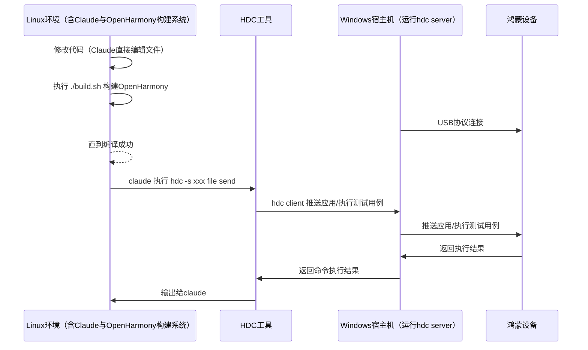

# OpenHarmony 构建环境

## 环境架构

## 关键路径

| 类型 | 路径 |
|------|------|
| 项目根目录 | `${OH_ROOT}` |
| 编译产物输出 | `${OH_OUTPUT}` |
| 设备测试路径 | `/data/test/` |

> **说明**: 具体路径值由初始化配置时设置，`${OH_ROOT}` 默认为 `/root/OpenHarmony`，`${OH_OUTPUT}` 默认为 `/root/OpenHarmony/out/rk3568/tests/`。

## 构建系统

1. **构建工具**: GN + Ninja
2. **执行环境**: Linux
3. **产品名称**: rk3568
