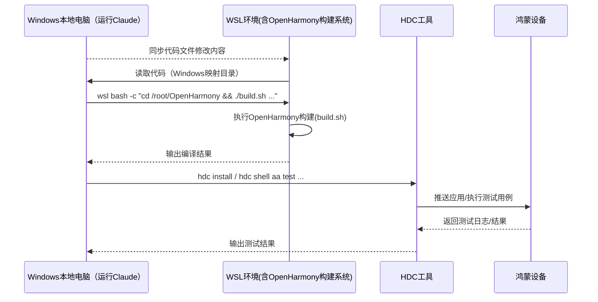

# OpenHarmony 构建环境

## 环境架构

## 关键路径

| 类型 | 路径 |
|------|------|
| WSL 源码根目录 | `/root/OpenHarmony/` |
| Windows 映射路径 | `\\wsl.localhost\Ubuntu-20.04\root\OpenHarmony` |
| 编译产物输出 | `/root/OpenHarmony/out/rk3568/tests/` |
| 设备测试路径 | `/data/test/` |

## 构建系统

- **构建工具**: GN + Ninja
- **执行环境**: 必须通过 WSL
- **产品名称**: rk3568
