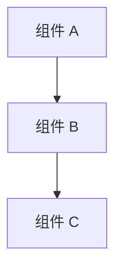
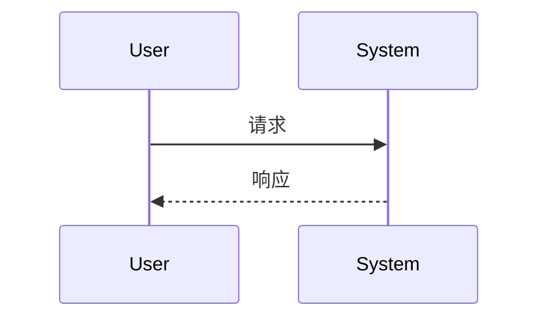

# 设计文档：<功能名称>

## 概述

<核心设计原则，3-5 条简明要点>

## 架构



## 组件与接口

### <组件名>

**职责：** <一句话描述>

**接口：**

```
function doSomething(input: InputType): OutputType
```

**伪代码：**

```
1. 接收输入
2. 验证参数
3. 执行核心逻辑
4. 返回结果
```

## 数据流



## 关键决策

| 决策 | 选择 | 理由 | 替代方案 |
| --- | --- | --- | --- |
| <决策 1> | <选择> | <理由> | <替代方案及不选原因> |
| <决策 2> | <选择> | <理由> | <替代方案及不选原因> |

## 兼容性与迁移

<描述对旧数据、旧配置、旧接口的兼容策略。如无兼容需求，写明"无需兼容"。>
