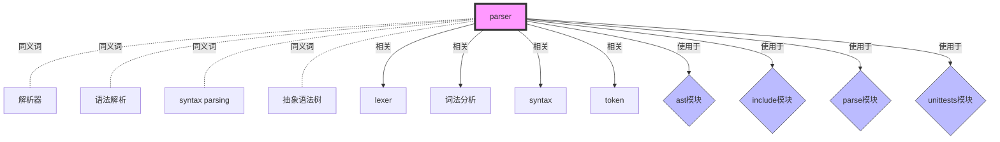

# 概念关系图谱

```mermaid
graph TD
    parser["parser"]
    style parser fill:#f9f,stroke:#333,stroke-width:4px
    解析器["解析器"]
    parser -.同义词.- 解析器
    语法解析["语法解析"]
    parser -.同义词.- 语法解析
    syntax_parsing["syntax parsing"]
    parser -.同义词.- syntax_parsing
    抽象语法树["抽象语法树"]
    parser -.同义词.- 抽象语法树
    lexer["lexer"]
    parser -->|相关| lexer
    词法分析["词法分析"]
    parser -->|相关| 词法分析
    syntax["syntax"]
    parser -->|相关| syntax
    token["token"]
    parser -->|相关| token
    ast{"ast模块"}
    parser -->|使用于| ast
    style ast fill:#bbf,stroke:#333
    include{"include模块"}
    parser -->|使用于| include
    style include fill:#bbf,stroke:#333
    parse{"parse模块"}
    parser -->|使用于| parse
    style parse fill:#bbf,stroke:#333
    unittests{"unittests模块"}
    parser -->|使用于| unittests
    style unittests fill:#bbf,stroke:#333
```

## 说明

- 粗边框节点：中心概念
- 虚线：同义词关系
- 实线箭头：相关概念或依赖关系
- 菱形节点：模块
