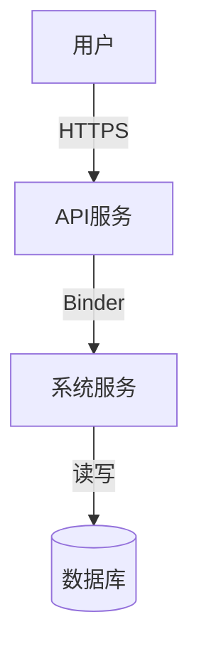

# ODK 安全检查指导

本文是 ODK 的安全专题操作指南，用于填写 `design.md` 的 `安全基础检查` 和高风险场景下的 `threat-model.md`。新需求的完整 ODK 使用流程见 [user-guide.md](user-guide.md)；快速入口见 [quick-start.md](quick-start.md)。

## 概述

ODK 提供两个层次的安全检查能力：

1. **普适轻量检查**：集成在设计阶段，自动触发，覆盖核心安全要点
2. **深度威胁分析**：针对高风险变更，按需触发，系统化威胁建模

---

## 一、普适轻量安全检查

### 触发条件

当 `proposal.md` 的 `安全/权限` 维度判定为「是」时，在 `design.md` 中展开「安全基础检查」章节。下列信号是 **propose 阶段判定 `安全/权限=是` 的依据**（不是 design 阶段的并列触发条件）：

- 跨进程、跨服务、跨网络边界的交互（IPC、Binder、共享内存、Socket）
- 跨安全层级的交互（用户态 ↔ 内核态、沙箱内外、不同 SELinux 域）
- 处理敏感数据（用户数据、凭证、密钥、生物特征）
- 使用加密、认证、授权机制
- 涉及权限或能力申请

### 检查清单

#### 1. 信任边界交叉检查

识别跨信任边界的交互，明确权限管控机制。

| 交互类型 | 边界示例 | 关键检查点 |
|---------|----------|-----------|
| **跨进程** | IPC、Binder、共享内存 | 双方身份验证、数据边界、接口权限 |
| **跨层级** | 用户态 ↔ 内核态 | 权限提升路径、系统调用保护 |
| **跨安全域** | 沙箱内外、不同 SELinux 域 | 隔离边界、权限传递规则 |
| **跨网络** | 本地 ↔ 远程、内网 ↔ 外网 | 认证加密、数据保护措施 |

#### 2. 基础安全要求检查

| 检查项 | 安全要求 | 常见违规 | 推荐做法 |
|--------|----------|----------|----------|
| **加密算法** | 强加密算法 | MD5、SHA1、DES、RC4 | AES-256、SHA-256、ECDSA P-256 |
| **密钥管理** | 安全存储 | 硬编码、明文存储 | TEE、Keychain、KeyMint |
| **随机数** | 密码学安全随机 | time/pid 作为种子 | /dev/urandom、arc4random、CSPRNG |
| **输入验证** | 验证所有外部输入 | 无边界检查、直接拼接 | 边界检查、格式验证、白名单 |
| **错误处理** | 不泄露敏感信息 | 打印堆栈、密钥 | 脱敏处理、安全日志 |
| **配置安全** | 默认安全配置 | 调试模式、弱密码 | 安全默认值、禁用调试 |

#### 3. 敏感数据处理检查

| 数据类型 | 处理场景 | 存储保护 | 传输保护 |
|---------|----------|----------|----------|
| PII（个人身份信息） | 用户资料、账户 | 加密存储 | TLS 传输 |
| 密钥/凭证 | 认证、授权 | TEE/Keychain | 加密传输 |
| 生物特征 | 指纹、人脸 | 安全硬件 | 本地处理 |
| 位置信息 | 定位服务 | 权限控制 | 按需授权 |
| 通讯录/通话记录 | 联系人功能 | 权限控制 | 加密存储 |

### 填写示例

```markdown
## 安全基础检查

### 信任边界交叉分析

| 交互类型 | 边界描述 | 通信双方 | 权限管控机制 | 关联 AC |
|---------|----------|----------|-------------|---------|
| 跨进程 | Binder IPC | 应用进程 ↔ 系统服务 | 权限检查 + 接口鉴权 | AC-2.1 |
| 跨网络 | HTTPS 请求 | 客户端 ↔ 云服务 | Token 认证 + TLS 1.3 | AC-3.2 |

### 基础安全要求检查

| 检查项 | 检查结果 | 说明/措施 |
|--------|----------|-----------|
| 加密算法合规 | ✅ | 使用 AES-256-GCM |
| 密钥管理安全 | ✅ | 通过 KeyMint 管理 |
| 输入验证完备 | ✅ | 边界检查 + 格式验证 |
```

---

## 二、深度威胁分析

### 触发条件

运行 `/odk-security-threat-model` 当：**`proposal.md`「安全/权限」=「是」 且 命中任一高风险判据**，或用户显式调用（绕过判定）。与 `odk-security-threat-model` skill 的触发条件一致。

高风险判据：

- 涉及敏感数据（PII、生物特征、位置、通讯录、支付信息）
- 新增网络接口、远程 API、云同步功能
- 修改认证、授权、权限模型
- 涉及法规合规要求（GDPR、个人信息保护法、数据安全法）
- 涉及关键安全组件（内核、安全框架）

> `安全/权限`=「是」但无高风险信号时，停留在 design 的 `安全基础检查` 层级，不升级到独立 `threat-model.md`。

### STRIDE 威胁建模

#### 1. 绘制数据流图 (DFD)

使用 Mermaid 图表绘制，包含以下元素：

- **ExternalEntity[外部实体]**: 用户、外部系统、服务
- **Process(处理进程)**: 组件、模块、服务
- **Store[(数据存储)]**: 数据库、文件、内存
- **Flow[数据流]**: IPC、网络、本地调用

使用 `subgraph` 标注信任边界。



#### 2. 应用 STRIDE

对每个 DFD 元素应用对应的威胁类型：

| DFD 元素 | 适用威胁 |
|---------|---------|
| External Entity | Spoofing, Repudiation |
| Process | 全部 6 种 |
| Data Store | Tampering, Information Disclosure, DoS |
| Data Flow | 除 Elevation 外的 5 种 |

对每个威胁，记录：
- 威胁场景（具体攻击描述）
- 影响（High/Medium/Low）
- 可能性（High/Medium/Low）
- 现有控制
- 建议控制
- 优先级（P0/P1/P2）

#### 3. 优先级定义

| 优先级 | 风险水平 | 处理要求 |
|--------|----------|----------|
| P0 | 高影响 + 高/中可能性 | 本次变更必须解决 |
| P1 | 中/高影响 + 中可能性 | 本次应解决或制定计划 |
| P2 | 低/中影响 + 低可能性 | 可后续优化或接受风险 |

### 法规合规检查

#### 个人信息保护法

| 检查项 | 要求 | 验证方式 |
|--------|------|----------|
| 最小必要 | 仅收集必需数据 | 数据字段清单审查 |
| 知情同意 | 明确告知并获得同意 | 隐私弹窗/协议审查 |
| 匿名化 | 提供去标识化方案 | 技术方案审查 |
| 用户权利 | 支持访问、更正、删除 | 功能测试 |

#### 数据安全法

| 检查项 | 要求 | 验证方式 |
|--------|------|----------|
| 数据分类分级 | 按敏感度分类 | 分类标准文档 |
| 数据出境安全 | 通过安全评估 | 评估报告 |

#### 网络安全法

| 检查项 | 要求 | 验证方式 |
|--------|------|----------|
| 等级保护 | 满足对应等级要求 | 等级证明 |
| 关键基础设施 | 特殊保护措施 | 安全方案审查 |

#### GDPR（如适用）

| 检查项 | 要求 |
|--------|------|
| Lawful Basis | 明确处理的法律依据 |
| Data Subject Rights | 支持用户权利请求 |
| DPIA | 高风险处理需做评估 |

### 输出文档

威胁分析生成 `threat-model.md`，包含：

1. 数据流图和信任边界说明
2. STRIDE 威胁分析表
3. 威胁汇总（按优先级）
4. 法规合规检查
5. 风险与缓解（关联到 Task）
6. 安全验证计划

---

## 三、安全最佳实践

### 1. 密码学

#### 推荐

- 对称加密: AES-256-GCM
- 哈希: SHA-256、SHA-3
- 签名: ECDSA P-256、Ed25519
- 密钥交换: ECDHE、X25519

#### 禁止

- MD5、SHA1、DES、RC4
- 自定义加密算法
- 硬编码密钥

### 2. 密钥管理

- 使用硬件安全模块（TEE、Keychain、KeyMint）
- 密钥轮换机制
- 最小权限原则

### 3. 输入验证

- 验证来源（身份、权限）
- 验证内容（格式、长度、范围）
- 使用白名单而非黑名单

### 4. 输出编码

- 对输出到不同上下文的数据正确编码
- 防止注入攻击（SQL、命令、XSS）

### 5. 错误处理

- 不在错误信息中暴露敏感数据
- 记录足够的安全审计信息
- 安全的默认错误响应

### 6. 并发安全

- 明确数据的访问模式
- 使用适当的同步机制
- 避免死锁和竞态条件

---

## 四、常见安全问题

### 1. 跨进程通信安全

| 问题 | 风险 | 缓解 |
|------|------|------|
| 未验证调用者身份 | 伪装攻击 | Binder 身份验证 |
| 数据边界不明确 | 信息泄露 | 明确数据范围和权限 |
| 接口过度暴露 | 权限提升 | 最小权限接口 |

### 2. 数据存储安全

| 问题 | 风险 | 缓解 |
|------|------|------|
| 明文存储敏感数据 | 数据泄露 | 加密存储 |
| 密钥硬编码 | 密钥泄露 | 安全硬件存储 |
| 缺乏访问控制 | 未授权访问 | 文件权限控制 |

### 3. 网络通信安全

| 问题 | 风险 | 缓解 |
|------|------|------|
| 未加密传输 | 中间人攻击 | TLS/HTTPS |
| 未验证服务端身份 | 服务器伪造 | 证书验证 |
| 弱认证机制 | 会话劫持 | 强认证 + Token |

---

## 五、安全验证方法

### 1. 静态分析

- 代码扫描工具（查找常见漏洞模式）
- 密钥硬编码检测
- 不安全算法检测

### 2. 动态分析

- 模糊测试
- 渗透测试
- 安全回归测试

### 3. 审计

- 安全设计审查
- 代码安全审查
- 合规审计

---

## 六、参考资源

### 标准/法规

- GB/T 22239-2019 信息安全技术 网络安全等级保护基本要求
- GB/T 35273-2020 信息安全技术 个人信息安全规范
- 个人信息保护法
- 数据安全法
- 网络安全法
- GDPR

### 工具/框架

- Microsoft Threat Modeling Tool
- OWASP Threat Modeling
- OWASP ASVS
- CWE/SANS Top 25

### 密码学

- NIST Cryptographic Standards
- FIPS 140-2/3
- RFC 5114 (Additional Diffie-Hellman Groups)

---

## 附录：快速参考

### 安全检查速查表

| 场景 | 必检查项 |
|------|----------|
| 跨进程交互 | 身份验证、权限检查、数据边界 |
| 处理用户数据 | 最小必要、知情同意、数据保护 |
| 使用加密 | 算法选择、密钥管理、随机数质量 |
| 网络通信 | TLS、认证、证书验证 |
| 权限申请 | 最小权限、使用说明 |
| 存储敏感信息 | 加密存储、访问控制、安全删除 |

### 算法选择速查表

| 用途 | 推荐 | 禁止 |
|------|------|------|
| 对称加密 | AES-256-GCM | DES、RC4 |
| 哈希 | SHA-256、SHA-3 | MD5、SHA1 |
| 签名 | ECDSA P-256、Ed25519 | RSA < 2048-bit |
| 密钥交换 | ECDHE、X25519 | 静态 RSA |
| 随机数 | CSPRNG | time/pid |

### 合规检查速查表

| 法规 | 核心要求 |
|------|----------|
| 个人信息保护法 | 最小必要、知情同意、用户权利 |
| 数据安全法 | 分类分级、出境安全 |
| 网络安全法 | 等级保护、关键基础设施 |
| GDPR | Lawful Basis、用户权利、DPIA |
