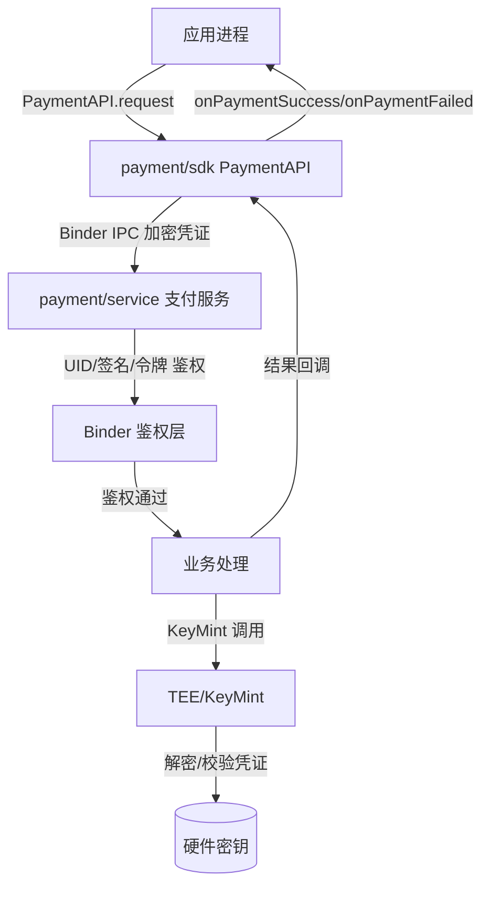
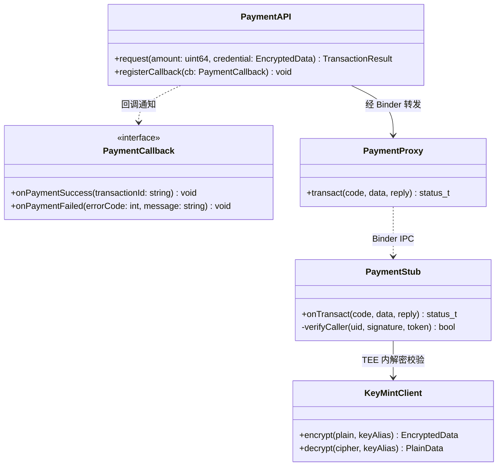
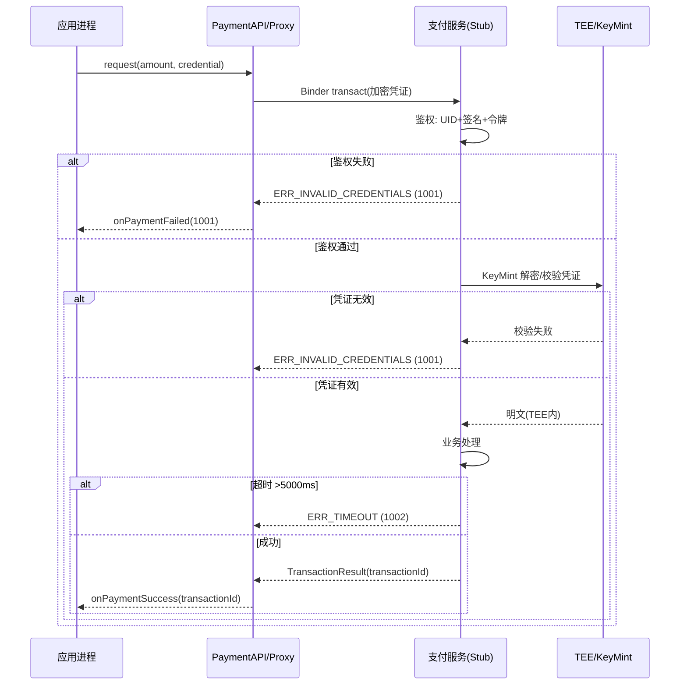

# Design

## 需求基线摘要

> 需求基线详见 proposal.md。以下仅列出设计阶段需额外强调的要点。

proposal.md 定义了 3 条成功标准：支付 API 可用、敏感数据保护（凭证加密传输）、跨进程通信安全（Binder 有权限检查）。`安全/权限` 维度判定为"是"，且涉及跨进程 Binder、TEE/KeyMint 与支付凭证，触发本设计的 `安全基础检查` 与独立 `threat-model.md`。

spec.md 定义了 2 个用户故事（US-1 发起支付请求, US-2 支付结果通知），5 条 AC，3 条业务规则（BR-001 KeyMint 保护凭证、BR-002 Binder 身份验证、BR-003 AES-256-GCM 加密传输），2 条异常规则（ERR-001 凭证无效、ERR-002 服务超时），3 条错误码（1001/1002/1003）。

## 代码事实基线

<!-- 当变更涉及已有模块的数据结构、接口或运行时时展开；纯新模块或纯文档变更不展开。列出设计引用的关键代码事实及其对设计决策的约束。 -->

| 事实项 | 代码引用（文件:行） | 对设计的约束 |
|--------|-------------------|-------------|
| 支付服务以 Binder IPC 服务形式存在，stub 已注册到 servicemanager | payment/service/binder/service.cpp:42 | 新增 PaymentAPI 走既有 Binder 通道，不引入第二套 IPC |
| KeyMint HAL 已暴露 key generation/import/finish 接口 | security/tee/keystore/keymint.h:88-104 | 凭证加解密复用 KeyMint，禁止自实现密钥存储 |
| 应用侧 IPC proxy 通过 IPCProxy 模板生成 | payment/sdk/ipc/proxy.h:23 | SDK 侧只需新增业务接口封装，Binder 协议由 proxy 生成 |

## 设计约束

1. 应用进程不得直接持有明文支付凭证，凭证必须经 KeyMint 加密后才能离开 TEE 边界（BR-001, AC-1.1）
2. 跨进程调用必须验证调用方 UID/签名，未授权调用直接拒绝（BR-002, AC-1.1）
3. 凭证在网络/IPC 传输中必须使用 AES-256-GCM 加密，禁止明文或弱算法（BR-003, AC-1.1）
4. 支付请求为同步语义，超过 5000ms 必须返回 ERR_TIMEOUT，不得无限阻塞调用方（AC-1.3）

## 非目标

- 不设计退款流程（由独立变更覆盖）
- 不设计支付方式绑定/管理（由独立变更覆盖）
- 不修改 KeyMint TA 或 TEE 固件（仅作为消费方）

## 方案概述

> 用 2-3 段描述整体技术路线，说明选择了什么架构模式、为什么。不要在此写写实现细节。

在 `payment/sdk/` 下新增 PaymentAPI SDK，作为应用进程访问支付能力的唯一入口；应用通过 PaymentAPI.request() 发起支付，SDK 内部组装请求经 Binder IPC 转发到支付服务进程。支付服务进程在 servicemanager 注册的既有 stub 上接收请求，首先做 Binder 调用方鉴权（UID + 签名 + 权限令牌），鉴权通过后进入业务处理。

凭证保护采用"TEE 内成型、信道加密传输"双层模型：支付凭证由 KeyMint 在 TEE 内生成/导入并以硬件密钥包裹，仅以 AES-256-GCM 密文形式跨 Binder 边界传输；支付服务在 TEE 侧完成解密与校验，明文凭证不进入普通世界（REE）内存。失败/超时统一走 spec.md 错误码（1001/1002/1003），通过回调链回传应用。

选择"服务端鉴权 + TEE 内解密"而非"应用端解密"：鉴权与解密均在更高信任等级执行，应用进程即使被攻破也无法获取明文凭证或绕过权限，将信任边界收敛到 Binder 入口与 TEE 出口两个可审计点。

## 架构图

## 类图

## 模块影响

> 基础影响范围见 proposal.md。以下仅列出设计阶段识别的新增/变更模块及对应的设计决策。

| 子系统 | 仓库 | 模块/路径 | 影响类型 | 相关设计决策 |
|--------|------|-----------|---------|-------------|
| Payment Framework | payment | sdk/payment_api.h, sdk/payment_api.cpp | 新增 SDK 入口与回调注册 | D-001 服务端鉴权 |
| Payment Service | payment | service/binder/service.cpp, service/binder/auth.cpp | 变更：新增 Binder 调用方鉴权层 | D-001 服务端鉴权, D-002 TEE 内解密 |
| Security Framework | security | tee/keystore（消费 KeyMint） | 依赖：调用既有 KeyMint 接口 | D-002 TEE 内解密 |

## 实现入口

> 给执行 Agent 的代码接入点。优先引用现有入口、调用链和测试入口；不要让 Agent 自行扩大搜索范围。

| Entry Point | 代码引用（文件:行） | 当前职责 | 调用方 | 被调用方 | 预期变更 |
|-------------|-------------------|----------|--------|----------|----------|
| Binder 服务入口 | payment/service/binder/service.cpp:42 | 接收 IPC 请求并分发 | 应用经 PaymentProxy | 业务处理函数 | 新增调用方鉴权前置检查 |
| IPC Proxy 模板 | payment/sdk/ipc/proxy.h:23 | 生成应用侧 Binder 客户端 | PaymentAPI | PaymentStub | 新增 request/onSuccess/onFailed 事务码 |
| KeyMint 客户端 | security/tee/keystore/keymint.h:88 | TEE 密钥操作 | 支付服务业务层 | KeyMint HAL | 支付服务消费既有 encrypt/decrypt |

## 既有模式复用

> 列出必须复用的项目内模式，避免 Agent 发明不一致的抽象或测试风格。

| Pattern | 参考代码（文件:行） | 复用方式 | 适用 Task |
|---------|-------------------|----------|-----------|
| Binder 鉴权模式 | security/binder/caller_auth.cpp:30-58 | 复用 UID + 签名 + 权限令牌三段校验，不发明新鉴权 | TASK-1 |
| IPCProxy/Stub 事务码声明 | payment/sdk/ipc/proxy.h:23 | 按既有枚举追加事务码，不改协议生成机制 | TASK-1 |
| KeyMint 加解密调用 | security/tee/keystore/keymint.h:88-104 | 直接调用 encrypt/decrypt，不自实现密钥派生 | TASK-2 |
| 错误码统一定义 | payment/sdk/payment_api.h:18 | 按 spec.md 错误码表回填，不新增语义重复码 | TASK-3, TASK-4 |

## 关键设计决策

> 每个决策需包含问题、选择、备选方案和理由。决策 ≤ 3 个时可用紧凑表格。

| 决策 ID | 问题 | 推荐方案 | 备选方案 | 选择理由 |
|---------|------|----------|----------|---------|
| D-001 | 调用方鉴权位置：服务端鉴权 vs 应用端自证 | 服务端在 Binder 入口鉴权 | 应用端自证身份后免鉴权 | 服务端鉴权为信任边界唯一可审计点；应用端自证可被绕过，无法满足 BR-002「跨进程通信必须验证调用者身份」。鉴权失败直接返回 ERR_INVALID_CREDENTIALS (AC-1.2)。 |
| D-002 | 凭证明文出现位置：TEE 内解密 vs REE 内解密 | TEE 内经 KeyMint 解密 | 支付服务进程（REE）内解密 | REE 内存可被转储/ptrace，明文凭证一旦进入 REE 即存在泄露面。TEE 内解密使明文不离开可信环境，满足 BR-001「凭证必须通过 KeyMint 保护」。 |
| D-003 | 传输加密算法：AES-256-GCM vs AES-CBC | AES-256-GCM | AES-CBC | GCM 提供认证加密（机密性 + 完整性），可检测信道篡改；CBC 仅机密性，需额外 MAC。满足 BR-003「使用 AES-256-GCM」与 threat-model 对 Tampering 的缓解。 |

## 状态归属与不变量

- **Ownership（交易上下文）:** owner = 支付服务业务层；key = transactionId；创建时机 = 鉴权通过后生成；清理触发 = 回调返回或超时；只读消费者 = PaymentProxy 回调；不变量 = 同一 transactionId 不可被两个并发请求复用；验证方法 = 集成测试并发请求 ID 唯一性；关联 AC/Task = AC-2.1/TASK-4。
- **Lifecycle（请求超时）:** 创建 = request 调用入队即启动 5000ms 定时器；清理 = 响应返回或定时器到期；异常恢复 = 超时返回 ERR_TIMEOUT 并释放上下文；回滚触发 = 定时器到期即回滚未完成业务；不变量 = 超时后不再向应用投递后续回调；验证方法 = 超时单测确认无迟到的 onSuccess；关联 AC/Task = AC-1.3/TASK-3。
- **Concurrency（Binder 请求并发）:** 同步模型 = 每请求独立上下文 + 服务端线程池；不变量 = 鉴权与解密互不阻塞跨请求；验证方法 = 并发压测无鉴权串行化；关联 AC/Task = AC-1.1/TASK-1。
- **Compatibility（凭证格式）:** 状态格式 = EncryptedData(密文+IV+tag)；API 兼容 = 新增 Public API 不变更既有接口；默认行为兼容 = 不影响非支付调用；不变量 = 旧版应用无支付 SDK 时走既有路径不受影响；验证方法 = 回归测试；关联 AC/Task = AC-1.1/TASK-1。

## 安全基础检查

> 本节对涉及安全边界的变更进行基础安全检查。如不涉及安全场景，填写"不涉及"并说明理由。

本变更 `安全/权限` 维度为"是"，涉及跨进程 Binder、TEE/KeyMint、支付凭证敏感数据，必须展开本节。

### 信任边界交叉分析

> 识别跨信任边界的交互，明确权限管控机制。

| 交互类型 | 边界描述 | 通信双方 | 权限管控机制 | 关联 AC |
|---------|----------|----------|-------------|---------|
| 跨进程 | Binder IPC 信任边界 | 应用进程 ↔ 支付服务 | 服务端 UID + 签名 + 权限令牌三段鉴权（D-001） | AC-1.1, AC-1.2 |
| 跨安全层级 | REE ↔ TEE 信任边界 | 支付服务（REE）↔ KeyMint（TEE） | TEE 侧 KeyMint 硬件密钥，明文不出 TEE（D-002） | AC-1.1 |
| 跨网络 | 支付服务 ↔ 支付网关 | 支付服务 ↔ 外部网关 | TLS 1.2+ 双向认证 + AES-256-GCM 应用层加密（D-003） | AC-1.1 |

### 基础安全要求检查

> 检查常见安全违规项。对不合规项需说明风险和缓解措施。

| 检查项 | 检查结果 | 说明/措施 |
|--------|----------|-----------|
| 加密算法合规 | ✅ | 凭证传输使用 AES-256-GCM（认证加密），签名使用 ECDSA P-256；禁止 MD5/SHA1/DES/RC4 |
| 密钥管理安全 | ✅ | 密钥由 KeyMint 在 TEE 内生成/存储，硬件包裹，禁止硬编码或落盘明文（BR-001） |
| 随机数安全 | ✅ | IV/Nonce 使用 KeyMint 提供的 CSPRNG，禁止用户态弱随机源 |
| 输入验证完备 | ✅ | 服务端校验 amount 范围、credential 长度/格式、调用方 UID/签名；失败返回 1001（AC-1.2） |
| 错误处理安全 | ✅ | 错误码不携带凭证片段；日志脱敏，禁止打印密文/明文凭证或交易全量字段 |
| 配置安全 | ✅ | 默认启用鉴权与加密，无 debug 后门；release 包关闭支付调试日志 |

> **安全参考**：推荐使用 AES-256/GCM、SHA-256、ECDSA P-256；禁止 MD5/SHA1/DES/RC4/硬编码密钥。

### 敏感数据处理（如适用）

> 识别敏感数据类型和处理场景，明确保护措施。

| 数据类型 | 处理场景 | 存储保护 | 传输保护 | 关联 AC |
|---------|----------|----------|----------|---------|
| 支付凭证（密钥/签名材料） | 应用发起支付时组装请求 | TEE/KeyMint 硬件密钥包裹，REE 不持久化 | Binder 信道 AES-256-GCM 加密（D-003） | AC-1.1 |
| 交易金额/商品信息 | 请求参数组装与对账 | 不持久化于应用侧，服务端按数据分级存储 | TLS 1.2+ 跨网关传输，应用层 GCM 加密 | AC-1.1, AC-2.1 |
| 交易 ID / 结果码 | 回调通知与对账 | 服务端持久化，应用侧仅临时持有 | Binder 回调信道加密 | AC-2.1, AC-2.2 |

> 不涉及敏感数据时填写：本次变更不涉及敏感数据处理。

### 深度威胁分析（如需）

> 仅当 `安全基础检查` 暴露高风险信号（敏感数据/网络暴露面/认证授权变更/合规要求）时，运行 `/odk-security-threat-model` 生成独立 `threat-model.md`，并将 P0/P1 风险的缓解措施回填到本节或关联 Task。

本变更同时命中敏感数据（支付凭证）、跨进程/跨网边界、认证授权变更三项高风险信号，已运行 `/odk-security-threat-model` 生成独立 `threat-model.md`。P0/P1 风险与缓解措施汇总：

- **TH-001（Spoofing, P0）** Binder 入口伪造调用方身份 → 缓解：服务端 UID+签名+令牌三段鉴权（D-001）→ TASK-1，关联 AC-1.1/AC-1.2。
- **TH-002（Info Disclosure, P0）** 凭证明文进入 REE 被转储 → 缓解：TEE 内 KeyMint 解密（D-002）→ TASK-2，关联 AC-1.1。
- **TH-003（Tampering, P1）** Binder 信道凭证被篡改 → 缓解：AES-256-GCM 认证加密（D-003）→ TASK-2，关联 AC-1.1。
- **TH-006（DoS, P1）** 支付服务被慢请求阻塞 → 缓解：5000ms 超时与并发隔离 → TASK-3，关联 AC-1.3。

完整 DFD、STRIDE 表与合规检查见 `threat-model.md`。

## 时序设计

## 风险与缓解

| 风险 | 可能性 | 影响 | 缓解措施 |
|------|--------|------|----------|
| Binder 鉴权被绕过导致越权支付 | 中 | 高 | 服务端三段鉴权（D-001），鉴权为强制前置，单元+模糊测试覆盖（TH-001, TASK-1） |
| 支付凭证在 REE 内存泄露 | 中 | 高 | TEE 内解密，明文不进 REE（D-002），内存转储测试无明文（TH-002, TASK-2） |
| Binder 信道凭证被篡改/重放 | 中 | 中 | AES-256-GCM 认证加密 + Nonce 防重放（D-003）（TH-003, TASK-2） |
| 支付服务被慢请求拖垮 | 中 | 中 | 5000ms 超时 + 并发隔离（AC-1.3, TASK-3） |
| 回调迟到与超时竞争 | 低 | 中 | 超时后丢弃后续回调，保证调用方幂等（TASK-3/TASK-4） |

## 验证思路

| 验证场景 | 方法 | 通过标准 |
|----------|------|----------|
| 调用方鉴权 | 安全测试：伪造 UID/签名/令牌调支付 Binder | 鉴权拒绝，返回 1001，无凭证泄露（AC-1.1, AC-1.2） |
| 凭证保护 | 内存转储测试：请求全流程抓 REE 内存 | 不出现明文凭证（AC-1.1, BR-001） |
| 信道完整性 | 篡改测试：中间人篡改 Binder 凭证密文 | GCM 校验失败，请求被拒（AC-1.1, BR-003） |
| 超时保护 | 超时测试：支付服务 >5s 无响应 | 返回 1002，不阻塞调用方（AC-1.3） |
| 结果回调 | 集成测试：成功/失败路径 | onPaymentSuccess 含 transactionId / onPaymentFailed 含 code+message（AC-2.1, AC-2.2） |
| 兼容性 | 回归测试：非支付调用既有路径 | 行为与变更前一致 |

> 兼容性验证详见 spec.md 兼容性声明章节。
