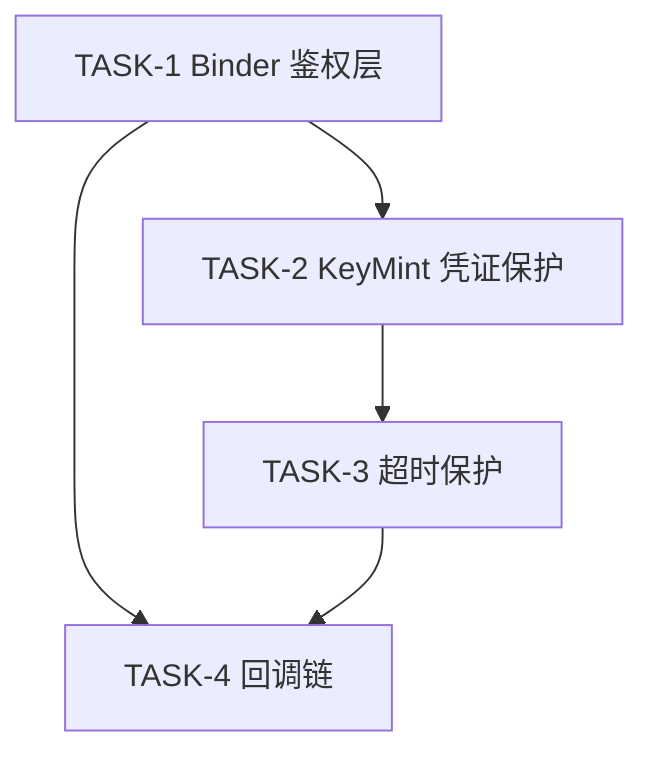

# Execution Plan

## 输入状态

| 输入 | 路径 | 要求状态 |
|------|------|----------|
| Proposal | proposal.md | Approved |
| Spec | spec.md | Approved |
| Design | design.md | Approved |

## 执行原则

<!-- SYNC: execution-principles -->
- **Spec 权威：** 若实现细节与 `spec.md` 的 AC、错误码或兼容性声明冲突，先更新 spec/design，再继续实现。
- **测试/证据先行：** 每个 Task 先写失败测试；无法单测的集成行为必须先写明可复现证据缺口。
- **任务小型化：** 一个 Task 只覆盖一个独立闭环。跨 API、事件链、状态缓存、渲染链、生命周期的需求必须拆成多个 Task。
- **文件边界：** Task 只能修改 `Files` 表列出的文件；若构建暴露额外声明或 fixture 需求，先更新本计划。
- **状态所有权唯一：** 新增状态必须明确 owner、key/index、创建时机、清理触发和只读消费者。
- **证据回填：** Task 完成后必须回填本计划「AC 到 Task 追溯」验证状态、「代码范围映射」实际文件、per-task `Actual Result`。
- **反伪完成：** 只补声明、只写存储结构、只覆盖 happy path、只跑非相关测试，都不能替代 AC 闭环。
- **可交接执行（Agent 执行契约）：** 本计划须能被新 Agent 在无历史对话上下文下逐 Task 执行；执行契约由各 Task 结构承载——`只读上下文`/`Files`/`禁止修改文件`（上下文打包）、`Steps` 的 RED→GREEN（测试优先）、`Verification` 的 Expected/Actual（期望输出）、`Review Handoff`（评审交接）；每 Step 为含命令或代码方向的 2–5 分钟动作。
<!-- /SYNC: execution-principles -->

## AC 到 Task 追溯

| AC | 来源 | Task | 验证方式 | 验证状态（Pass/Fail/Blocked） |
|----|------|------|----------|----------------------------------|
| AC-1.1 | spec.md US-1 | TASK-1 | Binder 鉴权+转发集成测试 | Blocked |
| AC-1.1 | spec.md US-1 | TASK-2 | KeyMint/AES-256-GCM 凭证保护测试 | Blocked |
| AC-1.2 | spec.md US-1 | TASK-2 | 凭证无效返回 1001 单元测试 | Blocked |
| AC-1.3 | spec.md US-1 | TASK-3 | 超时返回 1002 集成测试 | Blocked |
| AC-2.1 | spec.md US-2 | TASK-4 | onPaymentSuccess 携带 transactionId 集成测试 | Blocked |
| AC-2.2 | spec.md US-2 | TASK-4 | onPaymentFailed 携带 code+message 集成测试 | Blocked |

## 实现边界

**必须实现：** PaymentAPI SDK 入口（request/registerCallback）、Binder 鉴权层（UID+签名+令牌）、KeyMint 凭证加解密（AES-256-GCM）、5000ms 超时保护、成功/失败回调链。

**可后置：** 支付网关对账的离线脚本、支付失败重试策略（proposal.md 已列为开放问题）。

**不建议延后：** 鉴权与凭证保护是 P0 安全基线（threat-model TH-001/TH-002），延后会导致主链不闭合且存在安全漏洞。

## 禁止项

- 每个 AC 必须有明确的验证方式。
- Agent 不得自行寻找未列出的上下文文件作为修改依据；需要新增上下文时先更新 Task。
- 不得修改 Task 列出范围外的文件。
- 不得在未通过验证时标记 Task 完成。
- 不得使用 `TBD`、`TODO`、`适当处理`、`补充测试`、`参考上文` 等不可执行占位描述。
- 不得在 REE 内存中出现明文凭证，不得关闭或弱化 Binder 鉴权与 GCM 加密以"方便调试"。

## Task 依赖



## Task 列表

| TASK ID | 目标 | 文件范围 | AC 映射 | 前置依赖 | 完成判据 | 验证命令 | 状态 |
|---------|------|----------|---------|----------|----------|----------|------|
| TASK-1 | Binder 调用方鉴权层 | payment/sdk/ipc/proxy.h, payment/service/binder/service.cpp, payment/service/binder/auth.cpp, payment/sdk/payment_api_test.cpp | AC-1.1 | 无 | 伪造身份被拒、合法身份通过 | `ctest -R PaymentBinderAuth` | Pending |
| TASK-2 | KeyMint + AES-256-GCM 凭证保护 | payment/service/binder/service.cpp, security/tee/keystore/keymint_client.cpp, payment/sdk/payment_api_test.cpp | AC-1.1, AC-1.2 | TASK-1 | REE 无明文、篡改被拒、无效凭证返回 1001 | `ctest -R CredentialProtection` | Pending |
| TASK-3 | 5000ms 超时保护 | payment/sdk/payment_api.cpp, payment/sdk/payment_api_test.cpp | AC-1.3 | TASK-2 | >5s 返回 1002、超时后无迟到回调 | `ctest -R PaymentTimeout` | Pending |
| TASK-4 | 成功/失败回调链 | payment/sdk/payment_callback.cpp, payment/sdk/payment_callback_test.cpp | AC-2.1, AC-2.2 | TASK-1, TASK-3 | onSuccess 含 transactionId、onFailed 含 code+message | `ctest -R PaymentCallback` | Pending |

## Task 详情

### TASK-1: Binder 调用方鉴权层

**目标：** 在支付服务 Binder 入口建立调用方身份校验，未授权调用直接拒绝，授权调用转发到业务处理。

**AC 映射：** AC-1.1（BR-002 跨进程必须验证调用者身份）

**前置依赖：** 无（既有 Binder stub 已存在于 `payment/service/binder/service.cpp:42`）

**非目标：** 不实现凭证加解密（TASK-2）、不实现超时（TASK-3）、不实现回调（TASK-4）

**状态所有权：** 鉴权上下文 owner = auth.cpp；key = (uid, signature)；创建时机 = onTransact 入口；清理触发 = 鉴权完成；只读消费者 = 业务处理层（仅读鉴权结果）；不变量 = 同一请求鉴权结果不因并发而串。

**任务间接口：** Produces=auth.verifyCaller() 三段鉴权（UID/签名/令牌）、proxy.h 事务码枚举(request/onSuccess/onFailed)、ERR_INVALID_CREDENTIALS(1001)；Consumes=无（首个 Task；caller_auth.cpp 模式只读复用）

**只读上下文**

| 路径 | 读取目的 |
|------|----------|
| payment/service/binder/service.cpp:42 | 接入既有 Binder stub 的 onTransact 入口 |
| security/binder/caller_auth.cpp:30-58 | 复用既有 UID+签名+令牌三段鉴权模式 |

**Files**

| 操作 | 文件 | 说明 |
|------|------|------|
| 变更 | payment/sdk/ipc/proxy.h | 追加 request/onSuccess/onFailed 事务码枚举 |
| 变更 | payment/service/binder/service.cpp | onTransact 入口先调鉴权再分发 |
| 新增 | payment/service/binder/auth.cpp | 三段鉴权实现（UID/签名/权限令牌） |
| 新增 | payment/sdk/payment_api_test.cpp | 鉴权通过/拒绝测试 |

**禁止修改文件**

| 文件/路径 | 原因 |
|-----------|------|
| security/tee/keystore/* | KeyMint HAL 不在本 Task 范围（TASK-2 消费） |
| security/binder/caller_auth.cpp | 既有鉴权模式只读复用，不修改 |

**Steps**

- [ ] Step 1: 写失败测试。

```text
RequestForwardsToServiceWithAuth: 已授权应用调 request -> 支付服务收到鉴权后的请求
RequestRejectsForgedUid: 伪造 UID 调 Binder -> 返回 ERR_INVALID_CREDENTIALS(1001)
RequestRejectsForgedSignature: 合法 UID 但签名错误 -> 返回 1001
```

- [ ] Step 2: 运行验证，确认 RED。

```bash
ctest -R PaymentBinderAuth --extra-verbose
```

Expected: 三个用例编译失败/断言失败，因 auth.cpp 与事务码尚不存在。

- [ ] Step 3: 做最小实现。

```text
在 proxy.h 追加事务码；新增 auth.cpp 实现 UID+签名+令牌三段校验；service.cpp onTransact 入口先调 auth.verifyCaller()，失败返回 1001，通过则转发业务。
```

- [ ] Step 4: 运行聚焦验证，确认 GREEN。

```bash
ctest -R PaymentBinderAuth --extra-verbose
```

Expected: 三个用例全部通过，伪造身份均被拒。

- [ ] Step 5: 如有必要，在保持 GREEN 的前提下重构。
- [ ] 回填本计划「AC 到 Task 追溯」验证状态、「代码范围映射」实际文件、per-task Actual Result。
- [ ] 回填本 Task 的 `Actual Result`。

**Anti-Fake Completion**

| Check | Required Evidence |
|-------|-------------------|
| AC closed | AC-1.1 鉴权正向（合法转发）+ 异常（伪造 UID/签名拒绝）路径均覆盖 |
| Scope respected | 仅改 Files 表 4 个文件，未触碰 KeyMint/caller_auth.cpp |
| State lifecycle complete | 鉴权上下文创建于 onTransact、清理于鉴权完成，无残留 |

**Verification**

| Command / Evidence | Expected Result | Actual Result |
|--------------------|-----------------|---------------|
| `ctest -R PaymentBinderAuth` | 3 passed | TBD（执行后回填） |
| 安全测试报告：伪造身份拒绝 | 1001 返回，无凭证泄露 | TBD |

**Review Handoff**

| Reviewer | Input |
|----------|-------|
| Spec Compliance | AC-1.1 覆盖、文件范围、鉴权证据、无额外行为 |
| Code Quality | 三段鉴权实现摘要、复用 caller_auth 模式、测试结果 |

### TASK-2: KeyMint + AES-256-GCM 凭证保护

**目标：** 支付凭证经 KeyMint 在 TEE 内解密校验，跨 Binder 信道使用 AES-256-GCM 加密，明文不进 REE。

**AC 映射：** AC-1.1（BR-001 KeyMint、BR-003 AES-256-GCM）、AC-1.2（凭证无效返回 1001）

**前置依赖：** TASK-1（鉴权通过后才进入凭证处理）

**非目标：** 不实现超时（TASK-3）、不修改 KeyMint HAL 本身（仅消费）

**状态所有权：** 凭证上下文 owner = 支付服务业务层；key = transactionId；创建时机 = 鉴权通过；清理触发 = 解密完成或失败；只读消费者 = TEE 内校验逻辑；不变量 = 明文仅在 TEE 内存在。

**任务间接口：** Produces=keymint_client encrypt/decrypt 封装、EncryptedData(密文+IV+tag) 结构、鉴权后解密校验失败返回 1001；Consumes=TASK-1 鉴权通过分支与 1001 错误码、既有 keymint.h encrypt/decrypt HAL

**只读上下文**

| 路径 | 读取目的 |
|------|----------|
| security/tee/keystore/keymint.h:88-104 | 消费既有 encrypt/decrypt 接口，不自实现密钥派生 |
| payment/sdk/payment_api.h:18 | 错误码定义，回填 1001 |

**Files**

| 操作 | 文件 | 说明 |
|------|------|------|
| 变更 | payment/service/binder/service.cpp | 鉴权通过后调 KeyMint 解密校验凭证 |
| 新增 | security/tee/keystore/keymint_client.cpp | 支付服务侧 KeyMint 客户端封装（encrypt/decrypt） |
| 变更 | payment/sdk/payment_api_test.cpp | 追加凭证保护/篡改/无效凭证测试 |

**禁止修改文件**

| 文件/路径 | 原因 |
|-----------|------|
| security/tee/keystore/keymint.h | HAL 头文件契约，仅消费 |
| KeyMint TA / TEE 固件 | proposal.md Agent Scope Guard 禁止 |

**Steps**

- [ ] Step 1: 写失败测试。

```text
NoPlaintextCredentialInRee: 请求全流程后扫描 REE 内存 -> 无明文凭证
TamperedCipherRejected: 篡改 Binder 凭证密文 -> GCM tag 校验失败，返回 1001
InvalidCredentialReturns1001: 签名错误的凭证 -> 返回 ERR_INVALID_CREDENTIALS
```

- [ ] Step 2: 运行验证，确认 RED。

```bash
ctest -R CredentialProtection --extra-verbose
```

Expected: 用例失败，因 KeyMint 客户端封装与解密链路尚不存在。

- [ ] Step 3: 做最小实现。

```text
新增 keymint_client.cpp 封装 KeyMint encrypt/decrypt；service.cpp 鉴权通过后调 decrypt+校验，失败返回 1001；信道凭证组装为 EncryptedData(密文+IV+tag)。
```

- [ ] Step 4: 运行聚焦验证，确认 GREEN。

```bash
ctest -R CredentialProtection --extra-verbose
```

Expected: 三个用例通过，REE 无明文，篡改/无效均返回 1001。

- [ ] Step 5: 如有必要，在保持 GREEN 的前提下重构。
- [ ] 回填本计划「AC 到 Task 追溯」验证状态、「代码范围映射」实际文件。
- [ ] 回填本 Task 的 `Actual Result`。

**Anti-Fake Completion**

| Check | Required Evidence |
|-------|-------------------|
| AC closed | AC-1.1 凭证保护 + AC-1.2 无效凭证返回 1001 均覆盖（含篡改路径） |
| Scope respected | 仅改 Files 表 3 个文件，未改 KeyMint HAL/TA |
| State lifecycle complete | 凭证上下文创建于鉴权后、清理于解密完成，REE 无残留明文 |

**Verification**

| Command / Evidence | Expected Result | Actual Result |
|--------------------|-----------------|---------------|
| `ctest -R CredentialProtection` | 3 passed | TBD |
| 内存转储扫描 | 无明文凭证命中 | TBD |

**Review Handoff**

| Reviewer | Input |
|----------|-------|
| Spec Compliance | AC-1.1/AC-1.2 覆盖、文件范围、内存扫描证据 |
| Code Quality | KeyMint 客户端封装、GCM 用法、篡改测试结果 |

### TASK-3: 5000ms 超时保护

**目标：** 支付请求同步语义超过 5000ms 返回 ERR_TIMEOUT(1002)，且超时后不投递迟到的成功回调。

**AC 映射：** AC-1.3（BR 关联超时异常规则 ERR-002）

**前置依赖：** TASK-2（超时计时从鉴权+解密完成后的业务处理阶段起算）

**非目标：** 不实现重试策略（proposal.md 开放问题）

**状态所有权：** 超时定时器 owner = payment_api.cpp 请求上下文；key = transactionId；创建时机 = request 入队；清理触发 = 响应返回或定时器到期；只读消费者 = 回调投递器；不变量 = 超时后迟到回调被丢弃。

**任务间接口：** Produces=payment_api 5000ms 定时器、ERR_TIMEOUT(1002)、请求上下文已超时标志、迟到回调丢弃逻辑；Consumes=TASK-2 鉴权+解密完成后的业务阶段（超时起算点）

**只读上下文**

| 路径 | 读取目的 |
|------|----------|
| payment/sdk/payment_api.h:18 | 错误码 1002 定义 |

**Files**

| 操作 | 文件 | 说明 |
|------|------|------|
| 变更 | payment/sdk/payment_api.cpp | request 入队启动 5000ms 定时器，到期返回 1002 |
| 变更 | payment/sdk/payment_api_test.cpp | 追加超时与迟到回调丢弃测试 |

**禁止修改文件**

| 文件/路径 | 原因 |
|-----------|------|
| payment/service/binder/service.cpp | 服务端业务逻辑本 Task 不改（仅 SDK 侧超时） |

**Steps**

- [ ] Step 1: 写失败测试。

```text
RequestReturnsTimeoutOnSlowService: 支付服务 >5s 无响应 -> ERR_TIMEOUT(1002)
LateCallbackDroppedAfterTimeout: 超时后服务才返回成功 -> 不投递 onPaymentSuccess
```

- [ ] Step 2: 运行验证，确认 RED。

```bash
ctest -R PaymentTimeout --extra-verbose
```

Expected: 用例失败，因定时器与迟到丢弃逻辑尚不存在。

- [ ] Step 3: 做最小实现。

```text
payment_api.cpp request 入队即启动 5000ms 定时器；到期未收到响应则返回 1002 并标记上下文为已超时；回调投递前检查上下文状态，已超时则丢弃。
```

- [ ] Step 4: 运行聚焦验证，确认 GREEN。

```bash
ctest -R PaymentTimeout --extra-verbose
```

Expected: 两个用例通过，>5s 返回 1002，迟到回调被丢弃。

- [ ] Step 5: 如有必要，在保持 GREEN 的前提下重构。
- [ ] 回填本计划「AC 到 Task 追溯」验证状态、「代码范围映射」实际文件。
- [ ] 回填本 Task 的 `Actual Result`。

**Anti-Fake Completion**

| Check | Required Evidence |
|-------|-------------------|
| AC closed | AC-1.3 超时返回 1002 + 迟到回调丢弃路径覆盖 |
| Scope respected | 仅改 SDK 侧 2 个文件，未改服务端 |
| State lifecycle complete | 定时器创建于入队、清理于响应/到期，迟到回调丢弃有验证 |

**Verification**

| Command / Evidence | Expected Result | Actual Result |
|--------------------|-----------------|---------------|
| `ctest -R PaymentTimeout` | 2 passed | TBD |

**Review Handoff**

| Reviewer | Input |
|----------|-------|
| Spec Compliance | AC-1.3 覆盖、文件范围、超时+迟到回调证据 |
| Code Quality | 定时器实现、上下文状态机、测试结果 |

### TASK-4: 成功/失败回调链

**目标：** 支付成功/失败经 PaymentCallback 回传应用，成功携带 transactionId，失败携带错误码+描述。

**AC 映射：** AC-2.1（onPaymentSuccess 含 transactionId）、AC-2.2（onPaymentFailed 含 code+message）

**前置依赖：** TASK-1（鉴权结果）、TASK-3（超时结果，超时走失败回调）

**非目标：** 不实现 UI 侧状态更新（应用侧职责）

**状态所有权：** 回调上下文 owner = payment_callback.cpp；key = transactionId；创建时机 = 业务结果产生；清理触发 = 回调返回；只读消费者 = 应用注册的 PaymentCallback；不变量 = 同一 transactionId 仅投递一次成功或失败。

**任务间接口：** Produces=onPaymentSuccess(transactionId)、onPaymentFailed(code, message) 投递；Consumes=TASK-1 鉴权结果、TASK-3 超时结果(1002)、错误码表(1001/1002/1003)

**只读上下文**

| 路径 | 读取目的 |
|------|----------|
| payment/sdk/payment_api.h | PaymentCallback 接口与错误码定义 |

**Files**

| 操作 | 文件 | 说明 |
|------|------|------|
| 新增 | payment/sdk/payment_callback.cpp | onPaymentSuccess/onPaymentFailed 投递实现 |
| 新增 | payment/sdk/payment_callback_test.cpp | 成功/失败回调字段测试 |

**禁止修改文件**

| 文件/路径 | 原因 |
|-----------|------|
| payment/service/binder/service.cpp | 服务端本 Task 不改 |

**Steps**

- [ ] Step 1: 写失败测试。

```text
OnSuccessCarriesTransactionId: 支付成功 -> onPaymentSuccess(transactionId) 含非空交易 ID
OnFailedCarriesCodeAndMessage: 支付失败 -> onPaymentFailed(code, message) 含错误码与描述
OnFailedForTimeout: 超时失败 -> onPaymentFailed(1002, "timeout")
```

- [ ] Step 2: 运行验证，确认 RED。

```bash
ctest -R PaymentCallback --extra-verbose
```

Expected: 用例失败，因 payment_callback.cpp 尚不存在。

- [ ] Step 3: 做最小实现。

```text
新增 payment_callback.cpp：业务成功投递 onPaymentSuccess(transactionId)；失败按错误码表（1001/1002/1003）投递 onPaymentFailed(code, message)；message 不含凭证片段。
```

- [ ] Step 4: 运行聚焦验证，确认 GREEN。

```bash
ctest -R PaymentCallback --extra-verbose
```

Expected: 三个用例通过，字段完整且无凭证泄露。

- [ ] Step 5: 如有必要，在保持 GREEN 的前提下重构。
- [ ] 回填本计划「AC 到 Task 追溯」验证状态、「代码范围映射」实际文件。
- [ ] 回填本 Task 的 `Actual Result`。

**Anti-Fake Completion**

| Check | Required Evidence |
|-------|-------------------|
| AC closed | AC-2.1 成功回调 + AC-2.2 失败回调（含超时路径）覆盖 |
| Scope respected | 仅新增 2 个 SDK 文件，未改服务端 |
| State lifecycle complete | 回调上下文创建于业务结果、清理于投递，单次投递有验证 |

**Verification**

| Command / Evidence | Expected Result | Actual Result |
|--------------------|-----------------|---------------|
| `ctest -R PaymentCallback` | 3 passed | TBD |

**Review Handoff**

| Reviewer | Input |
|----------|-------|
| Spec Compliance | AC-2.1/AC-2.2 覆盖、文件范围、字段证据 |
| Code Quality | 回调投递实现、错误码映射、message 脱敏 |

## Review Gates

| Gate | When | Required Evidence | Blocks Next Step |
|------|------|-------------------|------------------|
| Gate-1（按需） | TASK-1（鉴权）/TASK-2（凭证）完成后 | 鉴权三段校验、KeyMint 用法、GCM tag、错误码 | 是，安全基线不过则阻断后续 |
| Gate-2（按需） | TASK-3（超时）/TASK-4（回调）完成后 | AC 覆盖、超时路径、回调字段、回归测试 | 是 |
| Gate-Final（必选） | 集成/最终验证后 | 端到端证据（鉴权+凭证保护+超时+回调）、「AC 到 Task 追溯」验证状态、「代码范围映射」实际文件、Actual Result 全部回填 | 是 |

## 代码范围映射

| TASK ID | 文件 | 操作 |
|--------|------|------|
| TASK-1 | payment/sdk/ipc/proxy.h | 变更 |
| TASK-1 | payment/service/binder/service.cpp | 变更 |
| TASK-1 | payment/service/binder/auth.cpp | 新增 |
| TASK-1 | payment/sdk/payment_api_test.cpp | 新增 |
| TASK-2 | payment/service/binder/service.cpp | 变更 |
| TASK-2 | security/tee/keystore/keymint_client.cpp | 新增 |
| TASK-2 | payment/sdk/payment_api_test.cpp | 变更 |
| TASK-3 | payment/sdk/payment_api.cpp | 变更 |
| TASK-3 | payment/sdk/payment_api_test.cpp | 变更 |
| TASK-4 | payment/sdk/payment_callback.cpp | 新增 |
| TASK-4 | payment/sdk/payment_callback_test.cpp | 新增 |
