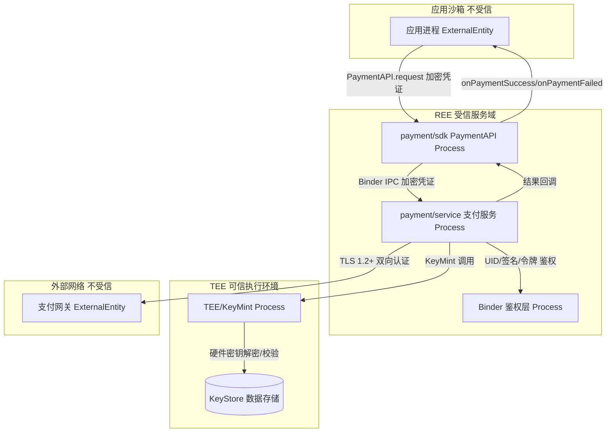

# 威胁模型分析

## 变更范围概述

> 来自 proposal.md 的变更摘要，说明安全相关背景。

本变更新增支付 SDK API，应用进程经 Binder IPC 调用支付服务，支付凭证经 TEE/KeyMint 保护、跨信道 AES-256-GCM 加密传输。`安全/权限` 维度判定为"是"，敏感数据为"是（支付凭证、交易数据）"，故生成独立威胁模型。

| 属性 | 值 |
|------|-----|
| 变更名称 | issue-002-payment-api 支付 SDK API |
| 复杂度 | 复杂（跨进程、敏感数据、网络交互） |
| 安全/权限维度 | 是 |
| 敏感数据处理 | 是（支付凭证、交易金额、交易 ID） |

## 数据流图

> 使用 Mermaid 图表绘制数据流图，标注信任边界。
>
> 图例说明：
> - ExternalEntity[外部实体]: 用户、外部系统、服务
> - Process(处理进程): 组件、模块、服务
> - Store[(数据存储)]: 数据库、文件、内存
> - Flow[数据流]: IPC、网络、本地调用
>
> 使用 subgraph 标注信任边界：用户空间、内核空间、沙箱、网络边界等。

### 信任边界说明

| 边界类型 | 边界描述 | 跨越的交互 |
|---------|----------|-----------|
| 应用沙箱 / REE 服务域 | 应用进程不可信，支付服务在独立服务域 | APP→SDK→SVC 的 Binder 调用 |
| REE / TEE | TEE 为最高信任等级，明文凭证仅存于 TEE | SVC→TEE 的 KeyMint 调用 |
| 本地 / 远程 | 支付网关位于外部不可信网络 | SVC→GW 的 TLS 通信 |
| 不同 SELinux 域 | 应用域与支付服务域 SELinux 标签不同 | APP→SVC 的 Binder 跨域调用 |

## STRIDE 威胁分析

> 对每个 DFD 元素应用 STRIDE，记录威胁场景和缓解措施。
>
> 优先级定义：
> - P0: 高影响 + 高/中可能性，必须在本次变更中解决
> - P1: 中/高影响 + 中可能性，应在本次变更中解决或制定计划
> - P2: 低/中影响 + 低可能性，可后续优化或接受风险

> 本变更的攻击面集中在 Binder 边界（应用沙箱 ↔ 支付服务），下表对 Binder 边界做完整 STRIDE 覆盖；其余边界仅列与本次变更强相关的威胁。

### ExternalEntity[应用进程]

| 威胁类型 | 威胁场景 | 影响 | 可能性 | 现有控制 | 建议控制 | 优先级 | 关联 AC/Task |
|---------|----------|------|--------|----------|----------|--------|-------------|
| Spoofing | 被攻破/恶意应用伪造身份调支付 Binder | High | Med | 无（变更前支付服务无鉴权） | 服务端 UID+签名+权限令牌三段鉴权（D-001） | P0 | AC-1.1 / TASK-1 |
| Repudiation | 应用否认发起过支付 | Med | Med | 无 | 鉴权通过后生成 transactionId 并记录审计日志 | P2 | AC-2.1 / TASK-4 |

### Process(支付服务 / Binder 鉴权层)

| 威胁类型 | 威胁场景 | 影响 | 可能性 | 现有控制 | 建议控制 | 优先级 | 关联 AC/Task |
|---------|----------|------|--------|----------|----------|--------|-------------|
| Spoofing | 攻击者冒充支付服务向应用投递伪回调 | High | Low | Binder 服务名由 servicemanager 注册 | servicemanager 服务名校验 + 回调携带可验证 transactionId | P2 | AC-2.1 / TASK-4 |
| Tampering | Binder 信道凭证密文被中间人篡改 | High | Med | 无 | AES-256-GCM 认证加密，tag 校验失败即拒（D-003） | P1 | AC-1.1 / TASK-2 |
| Repudiation | 支付服务否认处理过请求 | Med | Low | 无 | transactionId 审计日志 | P2 | AC-2.1 / TASK-4 |
| Info Disclosure | 凭证明文进入 REE 被内存转储 | High | Med | 无 | TEE 内 KeyMint 解密，明文不进 REE（D-002） | P0 | AC-1.1 / TASK-2 |
| DoS | 攻击者用大量请求或慢请求拖垮支付服务 | Med | Med | 无 | 5000ms 超时 + 并发隔离 + 限流 | P1 | AC-1.3 / TASK-3 |
| Elevation | 鉴权缺陷导致低权限应用越权支付 | High | Med | 无 | 强制前置三段鉴权，无旁路（D-001） | P0 | AC-1.1 / TASK-1 |

### Store[(KeyStore / 硬件密钥)]

| 威胁类型 | 威胁场景 | 影响 | 可能性 | 现有控制 | 建议控制 | 优先级 | 关联 AC/Task |
|---------|----------|------|--------|----------|----------|--------|-------------|
| Tampering | 密钥被非授权修改/替换 | High | Low | KeyMint 硬件保护 | 复用 KeyMint 既有保护，不自实现密钥存储（D-002） | P2 | AC-1.1 / TASK-2 |
| Info Disclosure | 密钥被读取 | High | Low | KeyMint 硬件包裹 | 凭证仅 TEE 内使用，密钥不出 TEE | P2 | AC-1.1 / TASK-2 |
| DoS | 密钥服务不可用导致支付失败 | Med | Low | 无 | KeyMint 不可用时返回明确错误码，不崩溃 | P2 | AC-1.2 / TASK-2 |

### Flow[Binder IPC / TLS 信道]

| 威胁类型 | 威胁场景 | 影响 | 可能性 | 现有控制 | 建议控制 | 优先级 | 关联 AC/Task |
|---------|----------|------|--------|----------|----------|--------|-------------|
| Spoofing | 伪造调用方经 Binder 接入 | High | Med | 无 | Binder 服务端三段鉴权（D-001） | P0 | AC-1.1 / TASK-1 |
| Tampering | Binder 信道凭证被篡改/重放 | High | Med | 无 | AES-256-GCM 认证加密 + Nonce 防重放（D-003） | P1 | AC-1.1 / TASK-2 |
| Repudiation | 否认发送过凭证 | Med | Low | 无 | transactionId + 审计日志 | P2 | AC-2.1 / TASK-4 |
| Info Disclosure | Binder 信道凭证被嗅探 | High | Med | 无 | GCM 加密使密文不可读（D-003） | P1 | AC-1.1 / TASK-2 |
| DoS | 慢请求耗尽连接 | Med | Med | 无 | 5000ms 超时 + 并发隔离（D-003 配套） | P1 | AC-1.3 / TASK-3 |

## 威胁汇总

| 优先级 | 威胁数量 | 威胁 ID 列表 | 处理要求 |
|--------|----------|-------------|----------|
| P0 | 3 | TH-001, TH-002, TH-003 | 本次变更必须解决 |
| P1 | 3 | TH-004, TH-005, TH-006 | 本次变更应解决或制定明确计划 |
| P2 | 6 | TH-007~TH-012 | 可后续优化或接受风险 |

> 威胁 ID 与上表 STRIDE 行的对应：TH-001=Binder Spoofing/Elevation，TH-002=REE Info Disclosure，TH-003=Binder Tampering，TH-004=Binder Info Disclosure（嗅探），TH-005=Tampering 重放，TH-006=DoS，TH-007~TH-012 为各 P2 项。

### 高优先级威胁详细说明

> 对 P0/P1 威胁进行详细说明，包括具体攻击场景和验证方法。

#### TH-001: Binder 边界调用方身份伪造（Spoofing/Elevation）

**威胁类型**: Spoofing + Elevation of Privilege
**目标元素**: Flow[Binder IPC] / ExternalEntity[应用进程]
**攻击场景**: 被攻破或恶意应用伪造 UID/签名/权限令牌，直接调用支付服务 Binder 发起未授权支付。
**影响**: 越权支付、资金损失、绕过权限模型。
**验证方法**: 安全测试以伪造 UID/签名/令牌调 Binder，断言返回 ERR_INVALID_CREDENTIALS(1001) 且无凭证泄露（spec-for-validation SC-1）。
**缓解措施**: 服务端 Binder 入口三段鉴权（D-001），强制前置无旁路 → TASK-1，关联 AC-1.1/AC-1.2。

#### TH-002: 支付凭证在 REE 内存泄露（Info Disclosure）

**威胁类型**: Information Disclosure
**目标元素**: Process[支付服务]
**攻击场景**: 凭证明文进入 REE 内存后，攻击者通过内存转储/ptrace 提取明文凭证。
**影响**: 支付凭证泄露、账户被接管。
**验证方法**: 请求全流程后扫描 REE 内存，断言无明文凭证命中（spec-for-validation SC-4）。
**缓解措施**: TEE 内 KeyMint 解密校验，明文不进 REE（D-002） → TASK-2，关联 AC-1.1/BR-001。

#### TH-003: Binder 信道凭证篡改（Tampering）

**威胁类型**: Tampering
**目标元素**: Flow[Binder IPC]
**攻击场景**: 中间人篡改 Binder 信道中的凭证密文（如改金额、改账号）。
**影响**: 支付被改向、资金损失。
**验证方法**: 篡改密文后调 Binder，断言 GCM tag 校验失败、返回 1001（spec-for-validation SC-2）。
**缓解措施**: AES-256-GCM 认证加密（D-003），tag 校验失败即拒 → TASK-2，关联 AC-1.1/BR-003。

#### TH-004: Binder 信道凭证嗅探（Info Disclosure）

**威胁类型**: Information Disclosure
**目标元素**: Flow[Binder IPC]
**攻击场景**: 攻击者嗅探 Binder 信道获取凭证密文。
**影响**: 密文泄露（无法直接还原，但增加离线破解面）。
**验证方法**: 抓包验证信道全程密文，无可读凭证字段。
**缓解措施**: GCM 加密使密文不可读（D-003） → TASK-2，关联 AC-1.1。

#### TH-005: Binder 凭证重放（Tampering）

**威胁类型**: Tampering
**目标元素**: Flow[Binder IPC]
**攻击场景**: 攻击者重放历史有效凭证密文触发重复支付。
**影响**: 重复扣款。
**验证方法**: 重放历史密文，断言被 Nonce/序列号检测拒绝。
**缓解措施**: GCM Nonce 防重放 + transactionId 唯一性（D-003） → TASK-2/TASK-4，关联 AC-1.1/AC-2.1。

#### TH-006: 支付服务 DoS（慢请求/洪水）

**威胁类型**: Denial of Service
**目标元素**: Process[支付服务] / Flow[Binder IPC]
**攻击场景**: 攻击者用大量或极慢请求耗尽支付服务连接，导致正常用户无法支付。
**影响**: 服务不可用、用户体验受损。
**验证方法**: 慢请求/高压测，断言 5000ms 返回 1002 且服务不崩溃（spec-for-validation SC-4 覆盖超时）。
**缓解措施**: 5000ms 超时 + 并发隔离 + 限流 → TASK-3，关联 AC-1.3。

---

## 法规合规检查

> 检查变更涉及的法律法规要求，记录合规状态和差距。

### 个人信息保护法

| 检查项 | 要求 | 状态 | 证据/措施 | 关联 AC/Task |
|--------|------|------|-----------|-------------|
| **最小必要原则** | 仅收集功能必需的数据 | ✅ | 仅采集支付必需凭证与金额，不采集无关信息 | AC-1.1 / TASK-2 |
| **知情同意** | 明确告知用户并获得同意 | ⚠️ | 需应用层在发起支付前弹窗确认（应用侧职责，本变更提供接口） | AC-1.1 |
| **匿名化/去标识化** | 提供技术方案 | ✅ | 凭证 TEE 内成型，REE 仅见密文（D-002） | AC-1.1 / TASK-2 |
| **用户权利** | 支持访问、更正、删除、撤回同意 | ⚠️ | 撤回需应用层与支付方式管理变更配合（独立变更） | AC-2.2 |
| **数据处理规则** | 公开处理规则 | ✅ | 隐私政策由应用层声明，本变更不持久化用户数据 | - |

### 数据安全法

| 检查项 | 要求 | 状态 | 证据/措施 | 关联 AC/Task |
|--------|------|------|-----------|-------------|
| **数据分类分级** | 按敏感度分类并实施保护 | ✅ | 支付凭证定为最高级，TEE+GCM 双层保护 | AC-1.1 / TASK-2 |
| **数据出境安全** | 评估并通过安全评估 | N/A | 本变更不涉及数据出境（仅本地+网关对账） | - |

### 网络安全法

| 检查项 | 要求 | 状态 | 证据/措施 | 关联 AC/Task |
|--------|------|------|-----------|-------------|
| **等级保护** | 满足对应等级保护要求 | ⚠️ | 支付模块应按等保三级要求部署，需运维侧确认 | - |
| **关键信息基础设施** | 特殊保护措施（如适用） | N/A | 本变更不直接构成关基 | - |

### GDPR（如适用）

| 检查项 | 要求 | 状态 | 证据/措施 | 关联 AC/Task |
|--------|------|------|-----------|-------------|
| **Lawful Basis** | 明确处理的法律依据 | N/A | 本变更面向国内场景，GDPR 不直接适用 | - |
| **Data Subject Rights** | 支持用户权利请求 | N/A | 同上 | - |
| **DPIA** | 高风险处理需做评估（如适用） | N/A | 同上 | - |

### 合规差距汇总

| 法规 | 差距项 | 影响 | 缓解计划 | 关联 Task |
|------|--------|------|----------|-----------|
| 个人信息保护法 | 知情同意弹窗在应用层，本变更未覆盖 | 用户可能在未充分知情下支付 | 由应用层在调用 PaymentAPI 前实现确认弹窗（独立变更） | TASK-1（接口就绪后接入） |
| 个人信息保护法 | 撤回同意需支付方式管理配合 | 用户撤回后仍可能被旧凭证触发 | 由支付方式管理变更实现凭证注销（独立变更） | TASK-2（凭证生命周期就绪） |
| 网络安全法 | 等保三级部署待运维确认 | 部署不达标可能不合规 | 提交运维侧等保评估（本变更外） | - |

## 风险与缓解

> 汇总所有识别的安全风险和对应的缓解措施，确保可追溯到执行计划。

| 风险/威胁 ID | 类型 | 可能性 | 影响 | 缓解措施 | 验证方法 | 关联 Task | 状态 |
|-------------|------|--------|------|----------|----------|-----------|------|
| TH-001 | Spoofing/Elevation | Med | High | 服务端三段鉴权（D-001） | 伪造身份被拒测试（SC-1） | TASK-1 | Open |
| TH-002 | Info Disclosure | Med | High | TEE 内解密（D-002） | REE 内存扫描无明文（SC-4） | TASK-2 | Open |
| TH-003 | Tampering | Med | High | AES-256-GCM 认证加密（D-003） | 篡改被拒测试（SC-2） | TASK-2 | Open |
| TH-004 | Info Disclosure | Med | High | GCM 加密信道 | 抓包全程密文 | TASK-2 | Open |
| TH-005 | Tampering | Med | Med | GCM Nonce 防重放 | 重放被拒测试 | TASK-2 | Open |
| TH-006 | DoS | Med | Med | 超时+并发隔离+限流 | 慢请求超时测试（SC-4） | TASK-3 | Open |
| COMP-001 | 合规差距 | Med | Med | 知情同意弹窗由应用层实现（独立变更） | 应用层弹窗用例 | TASK-1 | Open |
| COMP-002 | 合规差距 | Low | Med | 等保三级部署由运维确认 | 运维评估报告 | - | Open |

## 安全验证计划

> 定义如何验证威胁已被缓解和合规要求已满足。

| 验证项 | 验证方法 | 预期结果 | 关联 Task |
|--------|----------|----------|-----------|
| Binder 鉴权（TH-001） | 安全测试：伪造 UID/签名/令牌调 Binder | 返回 1001，无凭证泄露（SC-1） | TASK-1 |
| 凭证不出 REE（TH-002） | 内存转储扫描 | 无明文凭证（SC-4） | TASK-2 |
| 信道完整性（TH-003/004） | 篡改+抓包测试 | 篡改被拒、信道全程密文 | TASK-2 |
| 重放防护（TH-005） | 重放历史密文 | 被 Nonce 检测拒绝 | TASK-2 |
| 超时与可用性（TH-006） | 慢请求/压测 | 5000ms 返回 1002、服务不崩（SC-4） | TASK-3 |
| 合规（COMP-001/002） | 应用层弹窗用例 + 运维评估 | 弹窗就绪、等保达标 | TASK-1 / - |
| 安全回归 | 安全回归测试集 | 无新增漏洞 | TASK-1~TASK-4 |

## 安全建议

> 基于威胁分析，给出设计、实现、测试阶段的安全建议。

### 设计阶段建议

- 鉴权与解密集中在服务端与 TEE 两个高信任等级执行，应用进程不可信。
- 凭证保护采用 TEE 内成型 + 信道 GCM 加密双层模型，单点失效不致泄露。

### 实现阶段建议

- 鉴权为强制前置且无旁路；任何"为调试关闭鉴权"的改动须经评审。
- GCM Nonce 必须使用 KeyMint CSPRNG，禁止复用或弱随机。
- 错误日志禁止打印密文/明文凭证或交易全量字段。

### 测试阶段建议

- 必须包含伪造身份、内存转储、信道篡改、重放、超时五类安全用例（见 spec-for-validation SC-1/SC-2/SC-4）。
- 安全测试纳入回归集，每次支付相关变更必跑。

## 附录：威胁建模方法论

### STRIDE 方法论

STRIDE 是微软开发的威胁建模方法，涵盖六大威胁类型：

- **Spoofing（伪装）**: 攻击者冒充合法用户或组件
- **Tampering（篡改）**: 数据或代码被未授权修改
- **Repudiation（抵赖）**: 用户否认其操作
- **Information Disclosure（信息泄露）**: 敏感信息暴露给未授权方
- **Denial of Service（拒绝服务）**: 服务可用性被破坏
- **Elevation of Privilege（权限提升）**: 攻击者获得更高权限

### DFD 元素与威胁对应

| DFD 元素 | 适用威胁类型 |
|---------|-------------|
| External Entity | Spoofing, Repudiation |
| Process | Spoofing, Tampering, Repudiation, Information Disclosure, DoS, Elevation |
| Data Store | Tampering, Information Disclosure, DoS |
| Data Flow | Spoofing, Tampering, Repudiation, Information Disclosure, DoS |

### 参考资源

- Microsoft Threat Modeling Tool: https://www.microsoft.com/en-us/security/blog/threat-modeling-tool/
- OWASP Threat Modeling: https://owasp.org/www-community/Threat_Modeling
- STRIDE per Element: https://docs.microsoft.com/en-us/azure/security/develop/threat-modeling-threats
