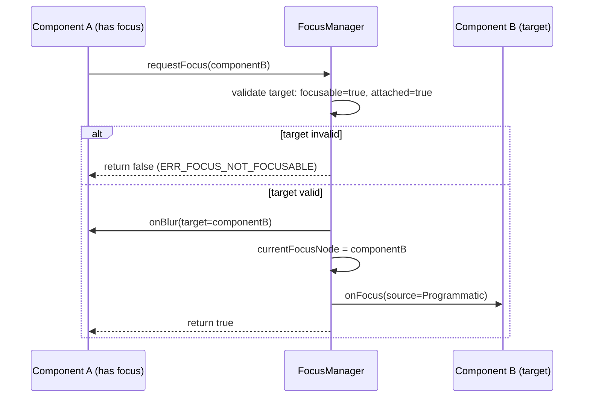

# Design

## 需求基线摘要

> 需求基线详见 proposal.md。以下仅列出设计阶段需额外强调的要点。

proposal.md 定义了 4 条成功标准：焦点注册、回调触发、编程式切换、向后兼容。
spec.md 定义了 3 个用户故事（US-1 焦点通知, US-2 编程式切换, US-3 生命周期管理），8 条 AC，4 条业务规则，4 条异常规则。

## 代码事实基线

<!-- 当变更涉及已有模块的数据结构、接口或运行时时展开；纯新模块或纯文档变更不展开。列出设计引用的关键代码事实及其对设计决策的约束。 -->

| 事实项 | 代码引用（文件:行） | 对设计的约束 |
|--------|-------------------|-------------|
| 组件树由 ComponentNode 双向链表维护 | frameworks/arkui/component/component_node.h:45 | 焦点树可复用双向链表结构，无需引入新数据结构 |
| 组件生命周期回调 onAppear/onDisappear 已定义 | interfaces/arkui/component/lifecycle.h:12-15 | 焦点注册/注销可挂载到现有生命周期钩子，无需新增回调 |
| ArkTS API 注册通过 `@ArkTSApi` 注解 + module.json 声明 | interfaces/arkui/component/module.json:3-8 | 新增 API 需同步更新 module.json |

## 设计约束

1. 焦点管理器必须在组件 onAppear 时注册、onDisappear 时注销，不可使用构造函数/析构函数（AC-1.1, BR-002）
2. 焦点切换必须检查目标组件的 focusable 属性和挂载状态（AC-2.2）
3. 回调执行期间焦点管理器必须保持可重入（防止 onBlur 中 requestFocus 导致死锁）
4. 焦点管理器使用单例模式，全局唯一实例

## 非目标

- 不实现焦点组（FocusGroup）——留待后续迭代
- 不实现方向键焦点导航算法
- 不改变现有组件的默认焦点行为

## 方案概述

> 用 2-3 段描述整体技术路线，说明选择了什么架构模式、为什么。不要在此写实现细节。

在 `frameworks/arkui/component/focus/` 下新增 `FocusManager` 单例模块，作为全局焦点状态的中转枢纽。

每个声明 `focusable(true)` 的组件在 onAppear 时向 FocusManager 注册一个 FocusNode（含组件 ID、focusable 标志、回调引用），在 onDisappear 时注销。FocusManager 内部维护双向链表组织的焦点链，currentFocusNode 指针指向当前持有焦点的节点。

焦点切换通过 FocusManager 中转：源组件调用 requestFocus() → FocusManager 校验目标节点 → 通知源节点 onBlur → 更新 currentFocusNode → 通知目标节点 onFocus。中转模式解耦组件间的直接依赖，便于后续扩展焦点组和自定义焦点遍历顺序。

采用双向链表而非树形结构：焦点遍历为线性（Tab 序），双向链表支持正反向遍历，插入/删除为 O(1)，匹配焦点切换的低频特征。

## 架构图

```mermaid
graph TD
    A[ArkUI Component] -->|focusable(true)| B[FocusManager Singleton]
    A -->|onFocus/onBlur callback| B
    B --> C[FocusNode Doubly-Linked List]
    C --> D[FocusNode: Component A]
    C --> E[FocusNode: Component B]
    C --> F[FocusNode: Component C]
    B -->|currentFocusNode| D
    G[ArkTS API Layer] -->|focusable/onFocus/onBlur/requestFocus| A
```

## 模块影响

> 基础影响范围见 proposal.md。以下仅列出设计阶段识别的新增/变更模块及对应的设计决策。

| 子系统 | 仓库 | 模块/路径 | 影响类型 | 相关设计决策 |
|--------|------|-----------|---------|-------------|
| arkui | frameworks/arkui | component/focus/ | 新增 focus_manager.h/cpp | D-001 双向链表, D-002 onAppear 注册 |
| arkui | interfaces/arkui | component/ | 新增 ArkTS API 声明 | D-003 中转模式 |

## 实现入口

> 给执行 Agent 的代码接入点。优先引用现有入口、调用链和测试入口；不要让 Agent 自行扩大搜索范围。

| Entry Point | 代码引用（文件:行） | 当前职责 | 调用方 | 被调用方 | 预期变更 |
|-------------|-------------------|----------|--------|----------|----------|
| Component lifecycle hook | interfaces/arkui/component/lifecycle.h:12 | 定义 onAppear/onDisappear 生命周期 | ArkUI 组件框架 | 组件生命周期处理 | 在 onAppear 注册焦点节点，在 onDisappear 注销 |
| Component node identity | frameworks/arkui/component/component_node.h:45 | 提供组件 ID 和节点关系 | FocusManager | ComponentNode | 使用 componentId 作为 FocusNode key |
| API module declaration | interfaces/arkui/component/module.json:3 | 声明 ArkTS 组件 API | ArkTS API 层 | 组件运行时 | 注册 focusable/onFocus/onBlur/requestFocus |

## 既有模式复用

> 列出必须复用的项目内模式，避免 Agent 发明不一致的抽象或测试风格。

| Pattern | 参考代码（文件:行） | 复用方式 | 适用 Task |
|---------|-------------------|----------|-----------|
| 生命周期注册模式 | interfaces/arkui/component/lifecycle.h:12-15 | 使用现有 onAppear/onDisappear 时机，不新增生命周期回调 | TASK-1, TASK-3 |
| module.json API 声明模式 | interfaces/arkui/component/module.json:3-8 | 按既有 JSON 声明新增公开 API | TASK-1 |
| 单元测试命名模式 | frameworks/arkui/component/focus/focus_manager_test.cpp | 测试名使用行为动词 + 条件，和 spec 测试设计提示一致 | TASK-1, TASK-2, TASK-3 |

## 关键设计决策

> 每个决策需包含问题、选择、备选方案和理由。决策 ≤ 3 个时可用紧凑表格。

| 决策 ID | 问题 | 推荐方案 | 备选方案 | 选择理由 |
|---------|------|----------|----------|---------|
| D-001 | 焦点节点组织方式：双向链表 vs 树形结构 | 双向链表 | 树形结构 | 焦点遍历为线性（Tab 序），双向链表正反向遍历 O(1)，插入/删除 O(1)；树形结构为焦点组预留但当前需求无需。AC-2.1/AC-3.1 均只需线性焦点链。 |
| D-002 | 焦点注册时机：onAppear vs 构造时 | onAppear 时注册 | 组件构造时注册 | onAppear 时机更准确：组件已挂载到组件树，保证 AC-1.1 的"挂载后注册"约束；构造时组件可能未挂载，requestFocus 可能作用于无效组件。 |
| D-003 | requestFocus 跨组件通信方式：FocusManager 中转 vs 组件间直接通信 | FocusManager 中转 | 组件间直接通信 | 中转模式解耦组件依赖，便于扩展焦点组和自定义遍历顺序；避免 N×N 通信复杂度。匹配 AC-2.1 的集中调度需求。 |

## 时序设计



## 风险与缓解

| 风险 | 可能性 | 影响 | 缓解措施 |
|------|--------|------|----------|
| 焦点切换触发意外的组件重绘 | 低 | 中 | FocusManager 在切换前后检查是否需要重绘，仅在焦点视觉效果变更时触发局部刷新 |
| onBlur 回调中 requestFocus 导致递归死循环 | 低 | 高 | FocusManager 维护 `isSwitching` 标志位，嵌套 requestFocus 调用被忽略（EX-002） |
| 组件卸载时焦点链断裂 | 中 | 中 | 在 onDisappear 时从双向链表中摘除节点；若为 currentFocusNode，自动转移焦点到下一个节点或置空（AC-3.1, EX-004） |

## 验证思路

| 验证场景 | 方法 | 通过标准 |
|----------|------|----------|
| 焦点注册/注销正确性 | 单元测试：模拟 onAppear/onDisappear，检查链表节点增删 | FocusNode 在注册表中出现/消失，无悬空引用 |
| 焦点切换回调触发 | 集成测试：两个 focusable 组件 A→B requestFocus | A 收到 onBlur(target=B)，B 收到 onFocus(source=Programmatic) |
| 不可焦点目标防护 | 单元测试：requestFocus 未声明 focusable 的组件 | 返回 false，ERR_FOCUS_NOT_FOCUSABLE |
| 卸载清理 | 集成测试：持有焦点的组件卸载 | 焦点转移或置空，组件注册表清理 |
| 焦点循环防护 | 单元测试：onBlur 回调中 requestFocus 自身 | 调用被忽略，WARN 日志输出 |
| 兼容性：默认行为不变 | 回归测试：现有组件焦点行为无变化 | 未声明 focusable 的组件行为与变更前一致 |

> 兼容性验证详见 spec.md 兼容性声明章节。
