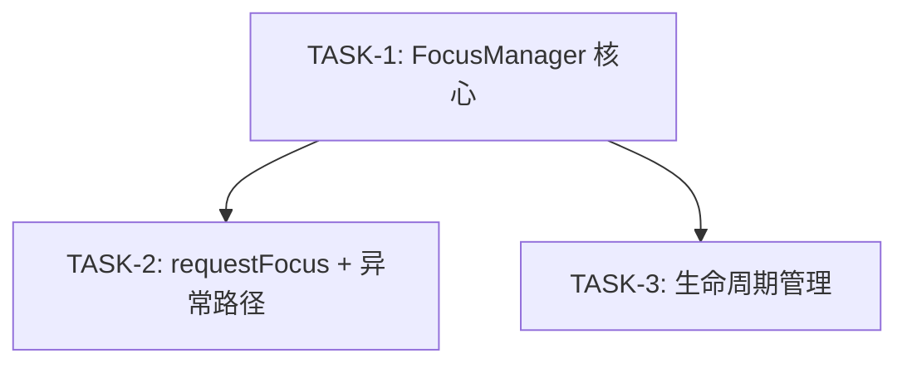

# Execution Plan

## 输入状态

| 输入 | 路径 | 要求状态 |
|------|------|----------|
| Proposal | proposal.md | Approved |
| Spec | spec.md | Approved |
| Design | design.md | Approved |

## 执行原则

<!-- SYNC: execution-principles -->
- **Spec 权威：** 若实现细节与 `spec.md` 的 AC、错误码或兼容性声明冲突，先更新 spec/design，再继续实现。
- **测试/证据先行：** 每个 Task 先写失败测试；无法单测的集成行为必须先写明可复现证据缺口。
- **任务小型化：** 一个 Task 只覆盖一个独立闭环。跨 API、事件链、状态缓存、渲染链、生命周期的需求必须拆成多个 Task。
- **文件边界：** Task 只能修改 `Files` 表列出的文件；若构建暴露额外声明或 fixture 需求，先更新本计划。
- **状态所有权唯一：** 新增状态必须明确 owner、key/index、创建时机、清理触发和只读消费者。
- **证据回填：** Task 完成后必须回填本计划「AC 到 Task 追溯」验证状态、「代码范围映射」实际文件、per-task `Actual Result`。
- **反伪完成：** 只补声明、只写存储结构、只覆盖 happy path、只跑非相关测试，都不能替代 AC 闭环。
- **可交接执行（Agent 执行契约）：** 本计划须能被新 Agent 在无历史对话上下文下逐 Task 执行；执行契约由各 Task 结构承载——`只读上下文`/`Files`/`禁止修改文件`（上下文打包）、`Steps` 的 RED→GREEN（测试优先）、`Verification` 的 Expected/Actual（期望输出）、`Review Handoff`（评审交接）；每 Step 为含命令或代码方向的 2–5 分钟动作。
<!-- /SYNC: execution-principles -->

## AC 到 Task 追溯

| AC | 来源 | Task | 验证方式 | 验证状态（Pass/Fail/Blocked） |
|----|------|------|----------|----------------------------------|
| AC-1.1 | US-1 焦点注册 | TASK-1 | 单元测试：focusable(true) 组件可获焦 + onFocus 触发 | Pass |
| AC-1.2 | US-1 onFocus 回调 | TASK-1 | 集成测试：onFocus 触发时机和 FocusSource 参数 | Pass |
| AC-1.3 | US-1 onBlur 回调 | TASK-1 | 集成测试：onBlur 触发时机和 target 参数 | Pass |
| AC-2.1 | US-2 requestFocus 正常路径 | TASK-2 | 集成测试：requestFocus → 焦点切换 → 双回调 | Pass |
| AC-2.2 | US-2 requestFocus 异常路径 | TASK-2 | 单元测试：不可焦点目标返回 false | Pass |
| AC-2.3 | US-2 空注册表 | TASK-2 | 单元测试：空注册表 requestFocus 返回 false | Pass |
| AC-3.1 | US-3 卸载清理 | TASK-3 | 集成测试：组件卸载 → 焦点转移 + onBlur/onFocus | Pass |
| AC-3.2 | US-3 焦点循环防护 | TASK-3 | 单元测试：onBlur 中 requestFocus 自身被忽略 | Pass |

## 实现边界

**必须实现：** FocusManager 核心逻辑（注册/注销/焦点切换）、ArkTS API 绑定（focusable/onFocus/onBlur/requestFocus）、错误码定义

**可后置：** 焦点动画效果、焦点组（FocusGroup）

**不建议延后：** FocusManager 的重入保护（onBlur 中 requestFocus 循环防护），延后会导致异常路径不闭合

## 禁止项

- 每个 AC 必须有明确的验证方式。
- Agent 不得自行寻找未列出的上下文文件作为修改依据；需要新增上下文时先更新 Task。
- 不得修改 Task 列出范围外的文件。
- 不得在未通过验证时标记 Task 完成。
- 不得使用 `TBD`、`TODO`、`适当处理`、`补充测试`、`参考上文` 等不可执行占位描述。

## Task 依赖



## Task 列表

| TASK ID | 目标 | 文件范围 | AC 映射 | 前置依赖 | 完成判据 | 验证命令 | 状态 |
|---------|------|----------|---------|----------|----------|----------|------|
| TASK-1 | FocusManager 核心：注册/注销/回调 | focus_manager.h, focus_manager.cpp, focus_node.h | AC-1.1, AC-1.2, AC-1.3 | 无 | 焦点注册/注销/回调单元测试 + 集成测试通过 | `npm test focus_manager` |  |
| TASK-2 | requestFocus 实现 + 异常路径 | focus_manager.h, focus_manager.cpp | AC-2.1, AC-2.2, AC-2.3 | TASK-1 | requestFocus 正常/异常路径测试通过 | `npm test focus_manager requestFocus` |  |
| TASK-3 | 生命周期管理：卸载清理 + 焦点循环防护 | focus_manager.h, focus_manager.cpp, lifecycle_hook.cpp | AC-3.1, AC-3.2 | TASK-1 | 卸载清理 + 循环防护测试通过 | `npm test focus_manager lifecycle` |  |

## Task 详情

### TASK-1: FocusManager 核心

**目标：** 实现 FocusManager 单例及 FocusNode 双向链表，支持组件注册/注销和焦点回调分发

**AC 映射：** AC-1.1, AC-1.2, AC-1.3

**前置依赖：** 无

**非目标：** 不实现 requestFocus 编程式切换（TASK-2），不实现卸载自动清理（TASK-3）

**状态所有权：** FocusManager 拥有 `focusNodes` 双向链表和 `currentFocusNode` 指针。key=componentId，创建时机=onAppear，清理时机=onDisappear，只读消费者=onFocus/onBlur 回调分发逻辑

**任务间接口：** Produces=FocusManager.register/unregister/notifyFocus/notifyBlur、FocusNode 结构（componentId/focusable/onFocus/onBlur/prev/next）、module.json 注册 focusable/onFocus/onBlur；Consumes=无（首个 Task）

**只读上下文**

| 路径 | 读取目的 |
|------|----------|
| interfaces/arkui/component/lifecycle.h | 了解 onAppear/onDisappear 回调签名 |
| frameworks/arkui/component/component_node.h | 了解 ComponentNode 结构和 getId() 方法 |

**Files**

| 操作 | 文件 | 说明 |
|------|------|------|
| create | frameworks/arkui/component/focus/focus_node.h | FocusNode 数据结构定义 |
| create | frameworks/arkui/component/focus/focus_manager.h | FocusManager 单例声明 |
| create | frameworks/arkui/component/focus/focus_manager.cpp | FocusManager 核心实现 |
| modify | interfaces/arkui/component/module.json | 注册新增 API |

**禁止修改文件**

| 文件/路径 | 原因 |
|-----------|------|
| frameworks/arkui/render/ | 本 Task 不涉及渲染流程 |
| frameworks/arkui/input/ | 输入事件转换不在本 Task 范围 |

**Steps**

- [ ] Step 1: 写失败测试或定义可复现证据缺口。

```text
RegisterFocusableNode: 创建 focusable(true) 组件并触发 onAppear，断言 FocusManager 注册表包含 componentId。
DispatchOnFocusCallback / DispatchOnBlurCallback: 模拟 A→B 焦点切换，断言回调参数。
```

- [ ] Step 2: 运行验证，确认 RED 或证据缺口存在。

```bash
npm test focus_manager -- --grep "RegisterFocusableNode|DispatchOnFocusCallback|DispatchOnBlurCallback"
```

Expected: FAIL because `frameworks/arkui/component/focus/focus_manager.h` and `focus_node.h` do not exist.

- [ ] Step 3: 做最小实现。

```text
Create FocusNode fields: componentId, focusable, onFocus, onBlur, prev, next.
Create FocusManager singleton with register/unregister/notifyFocus/notifyBlur.
Maintain a doubly-linked list keyed by componentId and dispatch callbacks from FocusManager only.
```

- [ ] Step 4: 运行聚焦验证，确认 GREEN。

```bash
npm test focus_manager -- --grep "RegisterFocusableNode|DispatchOnFocusCallback|DispatchOnBlurCallback"
```

Expected: PASS for registration and focus/blur callback assertions.

- [ ] Step 5: 如有必要，在保持 GREEN 的前提下重构。
- [ ] 回填本计划「AC 到 Task 追溯」验证状态、「代码范围映射」实际文件（AC-1.1, AC-1.2, AC-1.3）。
- [ ] 回填本 Task 的 `Actual Result`。

**Anti-Fake Completion**

简单文档、配置或单文件变更仍填写 AC 和范围证据；不适用的状态生命周期项写 `N/A`。

| Check | Required Evidence |
|-------|-------------------|
| AC closed | AC-1.1 注册测试通过, AC-1.2 onFocus 回调参数正确, AC-1.3 onBlur 回调参数正确 |
| Scope respected | 仅创建/修改 Files 表列出的 4 个文件 |
| State lifecycle complete | FocusNode 创建→插入链表→查询→从链表摘除，全路径覆盖 |

**Verification**

| Command / Evidence | Expected Result | Actual Result |
|--------------------|-----------------|---------------|
| `npm test focus_manager -- --grep "register"` | 注册后焦点表含目标节点 | |
| `npm test focus_manager -- --grep "onFocus"` | onFocus 回调参数 FocusSource=Programmatic | |
| `npm test focus_manager -- --grep "onBlur"` | onBlur 回调参数 target=目标组件ID | |

**Review Handoff**

| Reviewer | Input |
|----------|-------|
| Spec Compliance | AC-1.1/AC-1.2/AC-1.3 覆盖；仅修改 Files 表；验证命令输出作为证据；无额外行为 |
| Code Quality | 新增 FocusNode/FocusManager 核心；风险点为链表维护和回调参数；提供本 Task diff 范围 |

### TASK-2: requestFocus 实现 + 异常路径

**目标：** 实现 requestFocus() 编程式焦点切换，包含不可焦点目标、空注册表等异常路径

**AC 映射：** AC-2.1, AC-2.2, AC-2.3

**前置依赖：** TASK-1（依赖 FocusManager 核心注册/回调机制）

**非目标：** 不实现焦点组遍历策略（留待后续）

**状态所有权：** 无新增状态。修改 currentFocusNode 指针（owner=FocusManager），切换前校验目标节点状态。

**任务间接口：** Produces=FocusManager.requestFocus(target)→bool 及错误码 ERR_FOCUS_NOT_FOCUSABLE/ERR_FOCUS_ALREADY_DETACHED；Consumes=TASK-1 的 register/notifyFocus/notifyBlur 签名与 FocusNode 字段、currentFocusNode 指针

**只读上下文**

| 路径 | 读取目的 |
|------|----------|
| frameworks/arkui/component/focus/focus_manager.h | 确认 register/notifyFocus/notifyBlur 签名 |
| frameworks/arkui/component/focus/focus_node.h | 确认 FocusNode 字段 |

**Files**

| 操作 | 文件 | 说明 |
|------|------|------|
| modify | frameworks/arkui/component/focus/focus_manager.h | 新增 requestFocus 方法声明 |
| modify | frameworks/arkui/component/focus/focus_manager.cpp | requestFocus 实现 + 错误码 |
| create | frameworks/arkui/component/focus/focus_manager_test.cpp | requestFocus 单元测试 |

**禁止修改文件**

| 文件/路径 | 原因 |
|-----------|------|
| interfaces/arkui/component/module.json | TASK-1 已完成 API 注册，本 Task 只实现行为 |
| frameworks/arkui/component/lifecycle_hook.cpp | 生命周期清理属于 TASK-3 |

**Steps**

- [ ] Step 1: 写失败测试或定义可复现证据缺口。

```text
RequestFocusValidTarget: A 已持焦点，B focusable=true，调用 B.requestFocus()。
RequestFocusInvalidTarget: 目标未 focusable 或已卸载。
RequestFocusEmptyRegistry: 空注册表调用 requestFocus。
```

- [ ] Step 2: 运行验证，确认 RED 或证据缺口存在。

```bash
npm test focus_manager -- --grep "RequestFocusValidTarget|RequestFocusInvalidTarget|RequestFocusEmptyRegistry"
```

Expected: FAIL because `FocusManager::requestFocus` is not implemented.

- [ ] Step 3: 做最小实现。

```text
requestFocus validates target attached/focusable state, dispatches onBlur for old currentFocusNode, updates currentFocusNode, dispatches onFocus for target, and returns true.
Invalid target and empty registry return false without throwing.
```

- [ ] Step 4: 运行聚焦验证，确认 GREEN。

```bash
npm test focus_manager -- --grep "RequestFocusValidTarget|RequestFocusInvalidTarget|RequestFocusEmptyRegistry"
```

Expected: PASS for valid switch, invalid target, detached target, and empty registry.

- [ ] Step 5: 如有必要，在保持 GREEN 的前提下重构。
- [ ] 回填本计划「AC 到 Task 追溯」验证状态、「代码范围映射」实际文件（AC-2.1, AC-2.2, AC-2.3）。
- [ ] 回填本 Task 的 `Actual Result`。

**Anti-Fake Completion**

| Check | Required Evidence |
|-------|-------------------|
| AC closed | AC-2.1 正常切换双回调触发, AC-2.2 不可焦点返回 false+错误码, AC-2.3 空注册表返回 false |
| Scope respected | 仅修改/创建 Files 表列出的 3 个文件 |
| State lifecycle complete | currentFocusNode 旧值→校验→新值，全路径覆盖 |

**Verification**

| Command / Evidence | Expected Result | Actual Result |
|--------------------|-----------------|---------------|
| `npm test focus_manager -- --grep "requestFocus valid"` | 返回 true，A 收到 onBlur，B 收到 onFocus | |
| `npm test focus_manager -- --grep "requestFocus not focusable"` | 返回 false，ERR_FOCUS_NOT_FOCUSABLE | |
| `npm test focus_manager -- --grep "requestFocus detached"` | 返回 false，ERR_FOCUS_ALREADY_DETACHED | |
| `npm test focus_manager -- --grep "requestFocus empty registry"` | 返回 false，无异常抛出 | |

**Review Handoff**

| Reviewer | Input |
|----------|-------|
| Spec Compliance | AC-2.1/AC-2.2/AC-2.3 覆盖；验证正常、不可焦点、已卸载、空注册表路径 |
| Code Quality | requestFocus 状态切换逻辑；风险点为错误码一致性和 currentFocusNode 更新顺序 |

### TASK-3: 生命周期管理

**目标：** 实现组件卸载时的焦点自动清理和 onBlur 中 requestFocus 循环防护

**AC 映射：** AC-3.1, AC-3.2

**前置依赖：** TASK-1（依赖 FocusManager 核心 + requestFocus）

**非目标：** 不实现焦点动画或视觉反馈

**状态所有权：** 无新增状态。FocusManager 新增 isSwitching 重入保护标志（owner=FocusManager，创建=requestFocus 入口，清理=requestFocus 出口）。

**任务间接口：** Produces=FocusManager.onComponentDetached、isSwitching 重入保护标志、lifecycle_hook.onDisappear 钩子；Consumes=TASK-1 的链表操作、TASK-2 的 requestFocus

**只读上下文**

| 路径 | 读取目的 |
|------|----------|
| interfaces/arkui/component/lifecycle.h | onDisappear 回调时机和调用约定 |
| frameworks/arkui/component/focus/focus_manager.h | FocusManager 全部方法签名 |

**Files**

| 操作 | 文件 | 说明 |
|------|------|------|
| modify | frameworks/arkui/component/focus/focus_manager.h | 新增 onComponentDetached 声明, isSwitching 标志 |
| modify | frameworks/arkui/component/focus/focus_manager.cpp | 卸载清理 + 循环防护实现 |
| create | frameworks/arkui/component/focus/lifecycle_hook.cpp | onDisappear 钩子集成 |

**禁止修改文件**

| 文件/路径 | 原因 |
|-----------|------|
| interfaces/arkui/component/module.json | 不新增公开 API |
| frameworks/arkui/component/focus/focus_node.h | 不改变 FocusNode 数据结构 |

**Steps**

- [ ] Step 1: 写失败测试或定义可复现证据缺口。

```text
DetachCurrentFocusNode: 当前持焦点组件触发 onDisappear，断言注册表清理并转移或置空。
RejectReentrantRequestFocus: onBlur 回调中 requestFocus 自身，断言返回 false 且输出 WARN。
```

- [ ] Step 2: 运行验证，确认 RED 或证据缺口存在。

```bash
npm test focus_manager -- --grep "DetachCurrentFocusNode|RejectReentrantRequestFocus"
```

Expected: FAIL because lifecycle cleanup and reentrant guard are not implemented.

- [ ] Step 3: 做最小实现。

```text
onComponentDetached removes the node from the linked list and clears or transfers currentFocusNode.
isSwitching guards requestFocus entry; nested requestFocus during onBlur returns false and logs WARN.
lifecycle_hook.cpp calls FocusManager::onComponentDetached from onDisappear.
```

- [ ] Step 4: 运行聚焦验证，确认 GREEN。

```bash
npm test focus_manager -- --grep "DetachCurrentFocusNode|RejectReentrantRequestFocus"
```

Expected: PASS for detach cleanup and reentrant requestFocus guard.

- [ ] Step 5: 如有必要，在保持 GREEN 的前提下重构。
- [ ] 回填本计划「AC 到 Task 追溯」验证状态、「代码范围映射」实际文件（AC-3.1, AC-3.2）。
- [ ] 回填本 Task 的 `Actual Result`。

**Anti-Fake Completion**

| Check | Required Evidence |
|-------|-------------------|
| AC closed | AC-3.1 卸载后焦点转移/置空 + 注册清理, AC-3.2 循环调用被忽略 + WARN 日志 |
| Scope respected | 仅修改/创建 Files 表列出的 3 个文件 |
| State lifecycle complete | isSwitching: 创建(入口)→读取(校验)→清理(出口)，全路径覆盖 |

**Verification**

| Command / Evidence | Expected Result | Actual Result |
|--------------------|-----------------|---------------|
| `npm test focus_manager -- --grep "detach with focus"` | 焦点转移到下一个节点，注册表清理 | |
| `npm test focus_manager -- --grep "detach last focusable"` | currentFocusNode=nullptr，注册表清空 | |
| `npm test focus_manager -- --grep "reentrant requestFocus"` | 嵌套 requestFocus 返回 false，WARN 日志输出 | |

**Review Handoff**

| Reviewer | Input |
|----------|-------|
| Spec Compliance | AC-3.1/AC-3.2 覆盖；验证卸载清理、焦点置空/转移、重入防护 |
| Code Quality | 生命周期钩子和 isSwitching 状态；风险点为异常路径清理和 WARN 日志位置 |

## Review Gates

| Gate | When | Required Evidence | Blocks Next Step |
|------|------|-------------------|------------------|
| Gate-1（按需） | TASK-1 完成后 | FocusNode 命名一致性、FocusManager 单例线程安全、回调签名与 API 声明一致 | 否 |
| Gate-2（按需） | TASK-2 完成后 | 错误码覆盖 AC-2.2/AC-2.3、异常路径不抛异常 | 否 |
| Gate-Final（必选） | TASK-3 完成后 | 端到端证据（注册→切换→回调→卸载清理）、「AC 到 Task 追溯」验证状态、「代码范围映射」实际文件、Actual Result 全部回填 | 是 |

## 代码范围映射

| TASK ID | 文件 | 操作 |
|--------|------|------|
| TASK-1 | frameworks/arkui/component/focus/focus_node.h | create |
| TASK-1 | frameworks/arkui/component/focus/focus_manager.h | create |
| TASK-1 | frameworks/arkui/component/focus/focus_manager.cpp | create |
| TASK-1 | interfaces/arkui/component/module.json | modify |
| TASK-2 | frameworks/arkui/component/focus/focus_manager.h | modify |
| TASK-2 | frameworks/arkui/component/focus/focus_manager.cpp | modify |
| TASK-2 | frameworks/arkui/component/focus/focus_manager_test.cpp | create |
| TASK-3 | frameworks/arkui/component/focus/focus_manager.h | modify |
| TASK-3 | frameworks/arkui/component/focus/focus_manager.cpp | modify |
| TASK-3 | frameworks/arkui/component/focus/lifecycle_hook.cpp | create |
