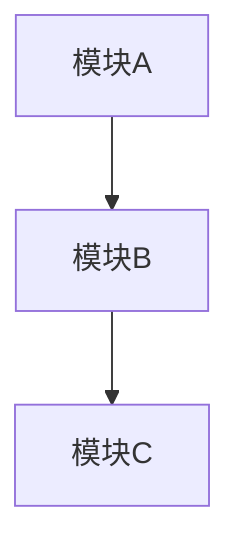
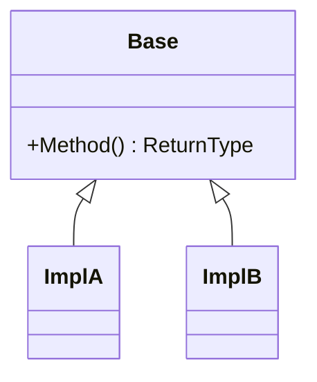
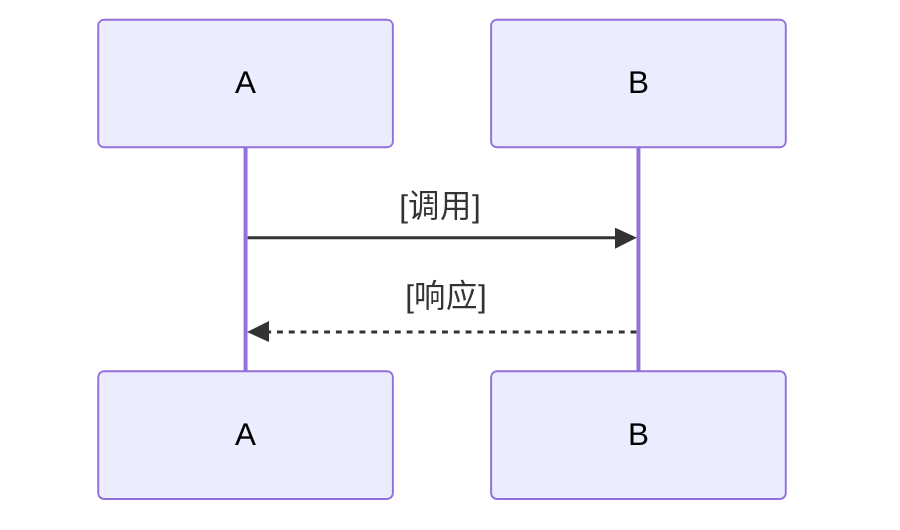

# Design

## 需求基线摘要

> 需求基线详见 proposal.md。以下仅列出设计阶段需额外强调的要点。

<!--
条件章节：当变更涉及已有模块的数据结构、接口或运行时行为时，在此处插入 `## 代码事实基线`。
纯新模块或纯文档变更不展开。列出设计引用的关键代码事实及其对设计决策的约束。

| 事实项 | 代码引用（文件:行） | 对设计的约束 |
|--------|-------------------|-------------|
| {数据结构/函数签名/运行时流程} | {path:line} | {该事实如何约束设计决策} |
-->

## 设计约束

1. [约束1]
2. [约束2]

## 非目标

- [明确不在本次设计范围内的内容]

## 方案概述

> 用 2-3 段描述整体技术路线，说明选择了什么架构模式、为什么。不要在此写实现细节。

## 架构图

<!--
条件章节：当变更涉及类/接口继承体系、接口实现层级（如 IPC interface→proxy→stub→impl）、或跨模块组合关系时，在此处插入 `## 类图`。
纯新增单一类、纯配置或纯文档变更不展开。使用 Mermaid classDiagram 表达静态结构（继承、实现、组合、关键方法签名），为下游实现钉死类骨架，避免 Agent 发明不一致的抽象。

## 类图

-->

## 模块影响

> 基础影响范围见 proposal.md。以下仅列出设计阶段识别的新增/变更模块及对应的设计决策关联。

| 子系统 | 仓库 | 模块/路径 | 影响类型 | 相关设计决策 |
|--------|------|-----------|---------|-------------|

## 实现入口

> 给执行 Agent 的代码接入点。优先引用现有入口、调用链和测试入口；不要让 Agent 自行扩大搜索范围。

| Entry Point | 代码引用（文件:行） | 当前职责 | 调用方 | 被调用方 | 预期变更 |
|-------------|-------------------|----------|--------|----------|----------|

<!--
条件章节：当变更需复用项目内既有模式（命名、调用链、错误处理、测试风格等）时，在此处插入 `## 既有模式复用`。
纯新模块无既有模式可复用时不展开。列出必须复用的模式，避免 Agent 发明不一致的抽象或测试风格。

| Pattern | 参考代码（文件:行） | 复用方式 | 适用 Task |
|---------|-------------------|----------|-----------|
-->

## 关键设计决策

> 每个决策需包含问题、选择、备选方案和理由。决策 ≤ 3 个时可用紧凑表格。

| 决策 ID | 问题 | 推荐方案 | 备选方案 | 选择理由 |
|---------|------|----------|----------|---------|

<!--
条件章节：当变更涉及 runtime state、缓存、生命周期清理、热路径、兼容性行为或跨模块 ownership 时，
在此处插入 `## 状态归属与不变量`。只填写适用维度；无关维度不要展开。

建议结构使用普通段落或列表，避免影响基础表格：
- Ownership: owner、key/index、创建时机、清理触发、只读消费者、不变量、验证方法、关联 AC/Task
- Lifecycle: 创建、清理、异常恢复、回滚触发、不变量、验证方法、关联 AC/Task
- Concurrency: lock/atomic/CAS/message passing 等同步模型、不变量、验证方法、关联 AC/Task
- Compatibility: 状态格式、API、配置、默认行为兼容约束、不变量、验证方法、关联 AC/Task
- Performance: 分配、日志、扫描、锁持有时间等热路径约束、不变量、验证方法、关联 AC/Task
- Capacity / Migration: 容量边界、限制行为、升级/降级兼容、不变量、验证方法、关联 AC/Task
-->

<!--
条件章节：当 `proposal.md` 的 `安全/权限` 维度 = 「是」时，在此处插入 `## 安全基础检查`。

下列是 propose 阶段判定 `安全/权限=是` 的依据（不是 design 阶段的并列触发条件）：
- 跨进程、跨服务、跨网络边界的交互（IPC、Binder、共享内存、Socket）
- 跨安全层级的交互（用户态 ↔ 内核态、沙箱内外、不同 SELinux 域）
- 处理敏感数据（用户数据、凭证、密钥、生物特征）
- 使用加密、认证、授权机制
- 涉及权限或能力申请

只填写适用维度；无关维度不要展开。
-->

## 安全基础检查

> 本节对涉及安全边界的变更进行基础安全检查。如不涉及安全场景，填写"不涉及"并说明理由。

### 信任边界交叉分析

> 识别跨信任边界的交互，明确权限管控机制。

| 交互类型 | 边界描述 | 通信双方 | 权限管控机制 | 关联 AC |
|---------|----------|----------|-------------|---------|
| [跨进程/跨层级/跨域/跨网络] | [具体边界] | [调用方/被调用方] | [权限检查/访问控制] | [AC-ID] |

> **不涉及**时填写：本次变更不涉及跨信任边界交互（[理由：如仅在单进程内/仅修改UI逻辑等]）。

### 基础安全要求检查

> 检查常见安全违规项。对不合规项需说明风险和缓解措施。

| 检查项 | 检查结果 | 说明/措施 |
|--------|----------|-----------|
| 加密算法合规 | ✅/❌/N/A | [使用算法及原因；❌时说明缓解措施] |
| 密钥管理安全 | ✅/❌/N/A | [密钥存储方式：TEE/Keychain/硬编码等] |
| 随机数安全 | ✅/❌/N/A | [随机源：/dev/urandom/arc4random等] |
| 输入验证完备 | ✅/❌/N/A | [验证策略：边界检查/格式验证/白名单等] |
| 错误处理安全 | ✅/❌/N/A | [敏感信息保护：不打印密钥/路径脱敏等] |
| 配置安全 | ✅/❌/N/A | [默认安全配置：禁用调试/强密码策略等] |

> **安全参考**：推荐使用 AES-256/GCM、SHA-256、ECDSA P-256；禁止 MD5/SHA1/DES/RC4/硬编码密钥。

### 敏感数据处理（如适用）

> 识别敏感数据类型和处理场景，明确保护措施。

| 数据类型 | 处理场景 | 存储保护 | 传输保护 | 关联 AC |
|---------|----------|----------|----------|---------|
| [PII/密钥/凭证/生物特征] | [具体场景] | [加密方式] | [传输保护] | [AC-ID] |

> 不涉及敏感数据时填写：本次变更不涉及敏感数据处理。

### 深度威胁分析（如需）

> 仅当 `安全基础检查` 暴露高风险信号（敏感数据/网络暴露面/认证授权变更/合规要求）时，运行 `/odk-security-threat-model` 生成独立 `threat-model.md`；本节仅以**摘要形式**列出 P0/P1 风险（每项一行：TH-ID → 缓解 → Task），完整 DFD/STRIDE/合规分析见 `threat-model.md`。
> 不涉及深度分析时填写：本次变更仅需上述基础检查，未触发深度威胁分析（理由：…）。

## 时序设计

## 风险与缓解

| 风险 | 可能性 | 影响 | 缓解措施 |
|------|--------|------|----------|

## 验证思路

| 验证场景 | 方法 | 通过标准 |
|----------|------|----------|

> 兼容性验证详见 spec.md 兼容性声明章节。
