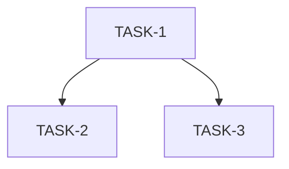

# Execution Plan

## 输入状态

| 输入 | 路径 | 要求状态 |
|------|------|----------|
| Proposal | proposal.md | Approved |
| Spec | spec.md | Approved |
| Design | design.md | Approved |

## 执行原则

<!-- SYNC: execution-principles -->
- **Spec 权威：** 若实现细节与 `spec.md` 的 AC、错误码或兼容性声明冲突，先更新 spec/design，再继续实现。
- **测试/证据先行：** 每个 Task 先写失败测试；无法单测的集成行为必须先写明可复现证据缺口。
- **任务小型化：** 一个 Task 只覆盖一个独立闭环。跨 API、事件链、状态缓存、渲染链、生命周期的需求必须拆成多个 Task。
- **文件边界：** Task 只能修改 `Files` 表列出的文件；若构建暴露额外声明或 fixture 需求，先更新本计划。
- **状态所有权唯一：** 新增状态必须明确 owner、key/index、创建时机、清理触发和只读消费者。
- **证据回填：** Task 完成后必须回填本计划「AC 到 Task 追溯」验证状态、「代码范围映射」实际文件、per-task `Actual Result`。
- **反伪完成：** 只补声明、只写存储结构、只覆盖 happy path、只跑非相关测试，都不能替代 AC 闭环。
- **可交接执行（Agent 执行契约）：** 本计划须能被新 Agent 在无历史对话上下文下逐 Task 执行；执行契约由各 Task 结构承载——`只读上下文`/`Files`/`禁止修改文件`（上下文打包）、`Steps` 的 RED→GREEN（测试优先）、`Verification` 的 Expected/Actual（期望输出）、`Review Handoff`（评审交接）；每 Step 为含命令或代码方向的 2–5 分钟动作。
<!-- /SYNC: execution-principles -->

## AC 到 Task 追溯

| AC | 来源 | Task | 验证方式 | 验证状态（Pass/Fail/Blocked） |
|----|------|------|----------|----------------------------------|

## 实现边界

**必须实现：** [不可妥协的交付项]

**可后置：** [可延至下一迭代的项]

**不建议延后：** [延后会导致主链不闭合的项]

## 禁止项

- 每个 AC 必须有明确的验证方式。
- Agent 不得自行寻找未列出的上下文文件作为修改依据；需要新增上下文时先更新 Task。
- 不得修改 Task 列出范围外的文件。
- 不得在未通过验证时标记 Task 完成。
- 不得使用 `TBD`、`TODO`、`适当处理`、`补充测试`、`参考上文` 等不可执行占位描述。

## Task 依赖



## Task 列表

| TASK ID | 目标 | 文件范围 | AC 映射 | 前置依赖 | 完成判据 | 验证命令 | 状态 |
|---------|------|----------|---------|----------|----------|----------|------|

## Task 详情

### TASK-1: [名称]

**目标：** [本 Task 必须交付的最小能力闭环]

**AC 映射：** [AC-1, AC-2]

**前置依赖：** [依赖的 Task/规则/上下文]

**非目标：** [本 Task 明确不做什么]

**状态所有权：** [若新增/修改状态，写明 owner、key/index、创建时机、清理触发和只读消费者；无状态变更写“无”]

**任务间接口：** [Produces=供后续 Task 依赖的接口签名/错误码/innerAPI/数据结构；Consumes=来自前置 Task 的契约。让只读单 Task 的执行者也能对齐命名与签名；无跨 Task 契约写“无”]

**只读上下文**

| 路径 | 读取目的 |
|------|----------|

**Files**

| 操作 | 文件 | 说明 |
|------|------|------|

**禁止修改文件**

| 文件/路径 | 原因 |
|-----------|------|

**Steps**

- [ ] Step 1: 写失败测试或定义可复现证据缺口。

```text
[填入测试名称、测试输入、断言重点；文档/配置类变更写明可复现证据缺口]
```

- [ ] Step 2: 运行验证，确认 RED 或证据缺口存在。

```bash
[填入精确验证命令]
```

Expected: [说明应失败的具体原因，或证据缺口如何复现]

- [ ] Step 3: 做最小实现。

```text
[填入关键函数/配置/文档改动方向；不要写泛化占位语]
```

- [ ] Step 4: 运行聚焦验证，确认 GREEN。

```bash
[填入精确验证命令]
```

Expected: [说明通过条件]

- [ ] Step 5: 如有必要，在保持 GREEN 的前提下重构。
- [ ] 回填本计划「AC 到 Task 追溯」验证状态、「代码范围映射」实际文件、per-task Actual Result。
- [ ] 回填本 Task 的 `Actual Result`。

**Anti-Fake Completion**

简单文档、配置或单文件变更仍填写 AC 和范围证据；不适用的状态生命周期项写 `N/A`。

| Check | Required Evidence |
|-------|-------------------|
| AC closed | [证明关联 AC 的正向、异常和兼容路径均覆盖] |
| Scope respected | [证明只修改 Files 表范围，或计划已更新] |
| State lifecycle complete | [涉及状态时证明创建、读取、更新、清理均覆盖] |

**Verification**

| Command / Evidence | Expected Result | Actual Result |
|--------------------|-----------------|---------------|

**Review Handoff**

| Reviewer | Input |
|----------|-------|
| Spec Compliance | [AC 覆盖、文件范围、验证证据、是否存在额外行为] |
| Code Quality | [变更摘要、风险点、测试结果、Base/Head SHA 或文件 diff 范围] |

## Review Gates

| Gate | When | Required Evidence | Blocks Next Step |
|------|------|-------------------|------------------|
| Gate-1（按需） | API/数据模型 Task 完成后 | 命名一致性、权限/边界、状态 owner、错误码 | |
| Gate-2（按需） | 共享路径/核心逻辑 Task 完成后 | AC 覆盖、异常路径、兼容性、回归测试 | |
| Gate-Final（必选） | 集成/最终验证后 | 端到端证据、「AC 到 Task 追溯」验证状态、「代码范围映射」实际文件、Actual Result 全部回填 | |

## 代码范围映射

| TASK ID | 文件 | 操作 |
|--------|------|------|
