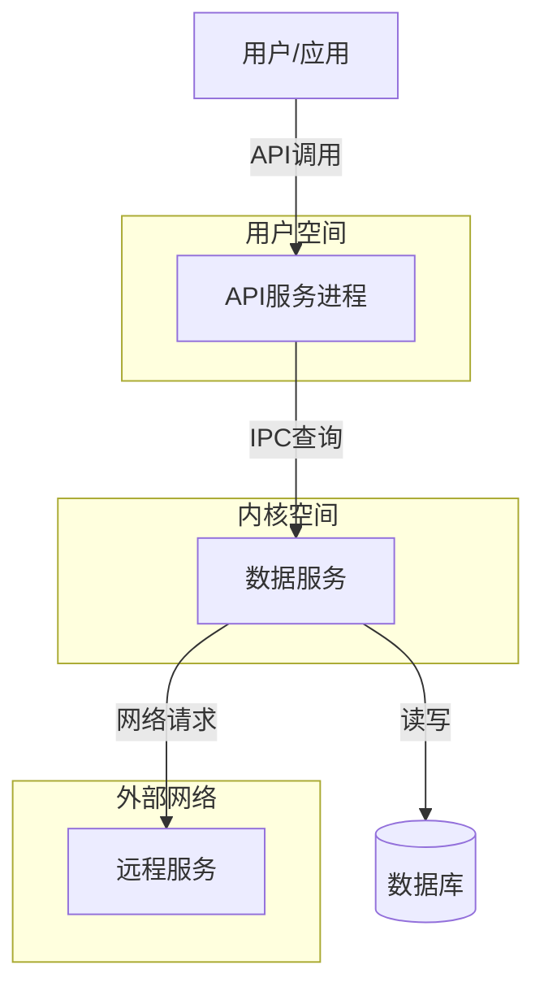

# 威胁模型分析

## 变更范围概述

> 来自 proposal.md 的变更摘要，说明安全相关背景。

| 属性 | 值 |
|------|-----|
| 变更名称 | |
| 复杂度 | |
| 安全/权限维度 | 是/否 |
| 敏感数据处理 | 是/否（如有，说明类型） |

## 数据流图

> 使用 Mermaid 图表绘制数据流图，标注信任边界。
>
> 图例说明：
> - ExternalEntity[外部实体]: 用户、外部系统、服务
> - Process(处理进程): 组件、模块、服务
> - Store[(数据存储)]: 数据库、文件、内存
> - Flow[数据流]: IPC、网络、本地调用
>
> 使用 subgraph 标注信任边界：用户空间、内核空间、沙箱、网络边界等。

### 信任边界说明

| 边界类型 | 边界描述 | 跨越的交互 |
|---------|----------|-----------|
| [用户空间/内核空间] | [描述] | [交互列表] |
| [沙箱内外] | [描述] | [交互列表] |
| [本地/远程] | [描述] | [交互列表] |
| [不同SELinux域] | [描述] | [交互列表] |

## STRIDE 威胁分析

> 对每个 DFD 元素应用 STRIDE，记录威胁场景和缓解措施。
>
> 优先级定义：
> - P0: 高影响 + 高/中可能性，必须在本次变更中解决
> - P1: 中/高影响 + 中可能性，应在本次变更中解决或制定计划
> - P2: 低/中影响 + 低可能性，可后续优化或接受风险

### ExternalEntity[外部实体]

| 威胁类型 | 威胁场景 | 影响 | 可能性 | 现有控制 | 建议控制 | 优先级 | 关联 AC/Task |
|---------|----------|------|--------|----------|----------|--------|-------------|
| Spoofing | [场景描述] | High/Med/Low | High/Med/Low | [现有措施] | [建议措施] | P0/P1/P2 | [AC-ID] |
| Repudiation | [场景描述] | High/Med/Low | High/Med/Low | [现有措施] | [建议措施] | P0/P1/P2 | [AC-ID] |

### Process(处理进程)

| 威胁类型 | 威胁场景 | 影响 | 可能性 | 现有控制 | 建议控制 | 优先级 | 关联 AC/Task |
|---------|----------|------|--------|----------|----------|--------|-------------|
| Spoofing | | | | | | | |
| Tampering | | | | | | | |
| Repudiation | | | | | | | |
| Info Disclosure | | | | | | | |
| DoS | | | | | | | |
| Elevation | | | | | | | |

### Store[(数据存储)]

| 威胁类型 | 威胁场景 | 影响 | 可能性 | 现有控制 | 建议控制 | 优先级 | 关联 AC/Task |
|---------|----------|------|--------|----------|----------|--------|-------------|
| Tampering | | | | | | | |
| Info Disclosure | | | | | | | |
| DoS | | | | | | | |

### Flow[数据流]

| 威胁类型 | 威胁场景 | 影响 | 可能性 | 现有控制 | 建议控制 | 优先级 | 关联 AC/Task |
|---------|----------|------|--------|----------|----------|--------|-------------|
| Spoofing | | | | | | | |
| Tampering | | | | | | | |
| Repudiation | | | | | | | |
| Info Disclosure | | | | | | | |
| DoS | | | | | | | |

## 威胁汇总

| 优先级 | 威胁数量 | 威胁 ID 列表 | 处理要求 |
|--------|----------|-------------|----------|
| P0 | | | 本次变更必须解决 |
| P1 | | | 本次变更应解决或制定明确计划 |
| P2 | | | 可后续优化或接受风险 |

### 高优先级威胁详细说明

> 对 P0/P1 威胁进行详细说明，包括具体攻击场景和验证方法。

#### TH-001: [威胁标题]

**威胁类型**: [STRIDE类型]
**目标元素**: [DFD元素]
**攻击场景**: [详细描述攻击者如何利用此威胁]
**影响**: [系统/数据/用户受到的具体影响]
**验证方法**: [如何验证此威胁已被缓解]
**缓解措施**: [具体的实现措施，关联到 Task]

---

## 法规合规检查

> 检查变更涉及的法律法规要求，记录合规状态和差距。

### 个人信息保护法

| 检查项 | 要求 | 状态 | 证据/措施 | 关联 AC/Task |
|--------|------|------|-----------|-------------|
| **最小必要原则** | 仅收集功能必需的数据 | ✅/⚠️/❌ | [具体说明] | [AC-ID] |
| **知情同意** | 明确告知用户并获得同意 | ✅/⚠️/❌ | [隐私弹窗/协议] | [AC-ID] |
| **匿名化/去标识化** | 提供技术方案 | ✅/⚠️/❌ | [具体措施] | [AC-ID] |
| **用户权利** | 支持访问、更正、删除、撤回同意 | ✅/⚠️/❌ | [功能支持] | [AC-ID] |
| **数据处理规则** | 公开处理规则 | ✅/⚠️/❌ | [隐私政策] | [AC-ID] |

### 数据安全法

| 检查项 | 要求 | 状态 | 证据/措施 | 关联 AC/Task |
|--------|------|------|-----------|-------------|
| **数据分类分级** | 按敏感度分类并实施保护 | ✅/⚠️/❌ | [分类标准] | [AC-ID] |
| **数据出境安全** | 评估并通过安全评估 | ✅/⚠️/❌/N/A | [评估报告] | [AC-ID] |

### 网络安全法

| 检查项 | 要求 | 状态 | 证据/措施 | 关联 AC/Task |
|--------|------|------|-----------|-------------|
| **等级保护** | 满足对应等级保护要求 | ✅/⚠️/❌ | [等级证明] | [AC-ID] |
| **关键信息基础设施** | 特殊保护措施（如适用） | ✅/⚠️/❌/N/A | [具体措施] | [AC-ID] |

### GDPR（如适用）

| 检查项 | 要求 | 状态 | 证据/措施 | 关联 AC/Task |
|--------|------|------|-----------|-------------|
| **Lawful Basis** | 明确处理的法律依据 | ✅/⚠️/❌ | [依据说明] | [AC-ID] |
| **Data Subject Rights** | 支持用户权利请求 | ✅/⚠️/❌ | [功能支持] | [AC-ID] |
| **DPIA** | 高风险处理需做评估（如适用） | ✅/⚠️/❌/N/A | [评估报告] | [AC-ID] |

### 合规差距汇总

| 法规 | 差距项 | 影响 | 缓解计划 | 关联 Task |
|------|--------|------|----------|-----------|
| [法规名] | [具体差距] | [影响说明] | [具体措施和时间表] | [Task-ID] |

## 风险与缓解

> 汇总所有识别的安全风险和对应的缓解措施，确保可追溯到执行计划。

| 风险/威胁 ID | 类型 | 可能性 | 影响 | 缓解措施 | 验证方法 | 关联 Task | 状态 |
|-------------|------|--------|------|----------|----------|-----------|------|
| TH-001 | [STRIDE类型] | High/Med/Low | High/Med/Low | [具体措施] | [测试方法] | [Task-ID] | Open/Done |
| COMP-001 | [合规差距] | High/Med/Low | High/Med/Low | [具体措施] | [验证方法] | [Task-ID] | Open/Done |

## 安全验证计划

> 定义如何验证威胁已被缓解和合规要求已满足。

| 验证项 | 验证方法 | 预期结果 | 关联 Task |
|--------|----------|----------|-----------|
| [威胁缓解验证] | [渗透测试/安全扫描/代码审计] | [通过标准] | [Task-ID] |
| [合规验证] | [合规审计/文档审查] | [通过标准] | [Task-ID] |
| [回归验证] | [安全回归测试] | [无新增漏洞] | [Task-ID] |

## 安全建议

> 基于威胁分析，给出设计、实现、测试阶段的安全建议。

### 设计阶段建议

- [建议1]
- [建议2]

### 实现阶段建议

- [建议1]
- [建议2]

### 测试阶段建议

- [建议1]
- [建议2]

## 附录：威胁建模方法论

### STRIDE 方法论

STRIDE 是微软开发的威胁建模方法，涵盖六大威胁类型：

- **Spoofing（伪装）**: 攻击者冒充合法用户或组件
- **Tampering（篡改）**: 数据或代码被未授权修改
- **Repudiation（抵赖）**: 用户否认其操作
- **Information Disclosure（信息泄露）**: 敏感信息暴露给未授权方
- **Denial of Service（拒绝服务）**: 服务可用性被破坏
- **Elevation of Privilege（权限提升）**: 攻击者获得更高权限

### DFD 元素与威胁对应

| DFD 元素 | 适用威胁类型 |
|---------|-------------|
| External Entity | Spoofing, Repudiation |
| Process | Spoofing, Tampering, Repudiation, Information Disclosure, DoS, Elevation |
| Data Store | Tampering, Information Disclosure, DoS |
| Data Flow | Spoofing, Tampering, Repudiation, Information Disclosure, DoS |

### 参考资源

- Microsoft Threat Modeling Tool: https://www.microsoft.com/en-us/security/blog/threat-modeling-tool/
- OWASP Threat Modeling: https://owasp.org/www-community/Threat_Modeling
- STRIDE per Element: https://docs.microsoft.com/en-us/azure/security/develop/threat-modeling-threats
