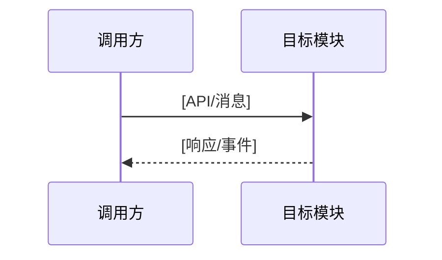
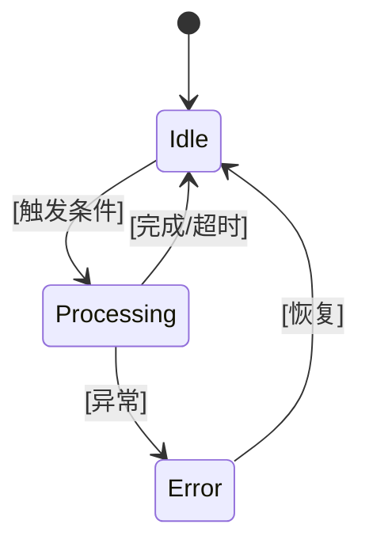
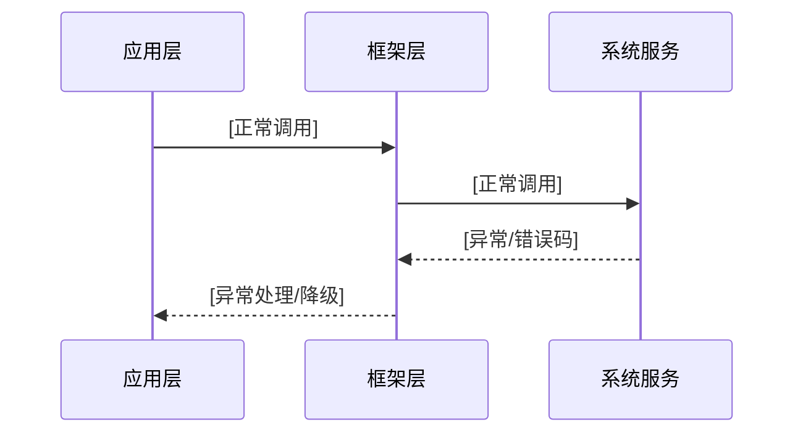

# 架构设计

> 确认目标仓和模块的架构约束、关键设计决策、Spec 拆分方向。简单变更（单仓小修、无新 API）可跳过本文档。

## 设计元数据

| 字段 | 内容 |
|------|------|
| Design ID | [DESIGN-XXXX] |
| 关联需求 | `[proposal.md]` |
| 关联 Epic | `[epic.md]`（如适用） |
| 目标 Feature | [FEAT-XXXX] |
| 复杂度 | 简单/标准/复杂/关键 |
| 目标版本 | [引用 proposal.target_release] |
| Owner | [负责人] |
| 状态 | Draft/Reviewing/Approved/Superseded |

## 需求基线

> 需求基线详见 proposal.md。以下仅列出设计阶段需要额外强调的要点。

| 项 | 补充说明（如需） |
|----|------------------|
| [对设计有直接约束的基线项] | [补充说明] |

## 上下文和现状

### 涉及仓和模块

> 仓、模块、当前职责、影响类型详见 proposal.md"影响范围"。本节补充设计层面的架构现状。

| 仓库 | 补充架构说明 |
|------|-------------|
| [repo] | [该仓的架构约束、依赖关系、设计注意事项] |

### 调用链层级分析

> 从最上层到最底层逐层扫描调用链路。遗漏层意味着设计深度不足，实现阶段可能被迫返工。此处关注**层和模块**的职责边界，具体文件清单在 execution-plan.md 中展开。

| 层 | 模块 | 职责 | 修改类型 |
|----|------|------|----------|
| [NAPI/框架/服务/内核/胶水/CEF Host] | [模块名] | [该层承担什么职责] | 新增/修改/删除 |

**检查项：**
- [ ] 调用链每一层都已覆盖（从最上层到最底层）
- [ ] 每层职责边界清晰，无跨层违规调用
- [ ] 每层修改类型明确

### 适用架构规则

| Rule ID | 适用原因 | 设计结论 | 验证方式 |
|---------|----------|----------|----------|
| OH-ARCH-LAYERING | [涉及层级调用] | [调用方向和边界结论] | 架构评审/依赖检查 |
| OH-ARCH-SUBSYSTEM | [涉及跨子系统] | [允许/禁止调用] | 代码评审/依赖检查 |
| OH-ARCH-IPC-SAF | [涉及跨进程/SA] | [IPC/SAF 结论] | 集成测试 |
| OH-ARCH-API-LEVEL | [涉及 API 变更] | [级别/权限/SysCap 结论] | API 评审/XTS |
| OH-ARCH-COMPONENT-BUILD | [涉及构建/部件] | [BUILD.gn/bundle.json 影响] | 构建验证 |
| OH-ARCH-ERROR-LOG | [涉及错误码/日志] | [错误码/日志结论] | 单测/hilog |

## 不涉及项承接

> proposal.md 已完成 N/A 判定。本节仅对 proposal 中标记为"涉及"且需展开设计的维度给出结论。

| 维度 | 设计结论 |
|------|----------|
| [proposal 中标记"涉及"的维度] | [展开设计方案 / 结论] |

## 关键设计决策

> 标准及以上复杂度：每个关键决策至少记录 2-3 个探索过的替代方案及取舍理由。简单变更可只填推荐方案。

| 决策 ID | 问题 | 推荐方案 | 探索过的替代方案 | 取舍理由 | 影响 |
|---------|------|----------|-----------------|------|------|
| ADR-1 | [设计问题] | [方案] | [备选1（简述+为何放弃）、备选2（简述+为何放弃）] | [核心权衡：为什么选此方案而非备选] | [影响] |

## 设计骨架

### 骨架范围

| 骨架项 | 目标 | 不包含 | 验证方式 |
|--------|------|--------|----------|
| API/接口骨架 | [签名/数据模型] | [完整业务逻辑] | [编译/API 快照] |
| 模块骨架 | [目录/类/target] | [复杂策略] | [构建通过] |
| 测试骨架 | [测试入口/fixture] | [全场景] | [最小用例通过] |

### 骨架 Spec 拆分

| Task ID | 目标 | 受影响文件 | AC |
|---------|------|------------|-----|
| TASK-SKELETON-1 | [建立接口/模块骨架] | [文件] | WHEN [条件] THEN [骨架可验证结果] |

## 后续 Task 拆分

> design.md 以 proposal.md 和已批准的 spec.md 为上游输入。本节描述 design 输出到 Plan 阶段的衔接信息。

| Task ID | 目标 | 受影响文件 | 依赖 |
|---------|------|------------|------|
| TASK-1 | [骨架/核心实现] | [文件] | design.md + spec.md Approved |
| TASK-2 | [行为补齐/集成] | [文件] | TASK-1 完成 |

## API 签名、Kit 与权限

> 本节承接 spec.md"API 变更分析"中识别的 API，给出签名、权限和 d.ts 位置等实现细节。

### 新增 API

| API 签名 | 类型 | Kit | d.ts 位置 | 权限要求 | SysCap |
|----------|------|-----|-----------|----------|--------|
| `[签名]` | Public/System/InnerApi | [Kit名称] | `[路径]` | [权限名/-] | [SysCap/-] |

### 变更/废弃 API

| 原有 API | 变更类型 | 新 API | 迁移说明 |
|----------|----------|--------|----------|
| `[原有签名]` | 变更/废弃 | `[新签名]` | [迁移方式] |

## 构建系统影响

### BUILD.gn 变更

```
文件路径: [路径]
变更说明: [新增源文件/新增依赖]
```

### bundle.json 变更

[新增 component / 修改依赖关系]

---

## 可选设计扩展

> 复杂变更时按需展开以下章节。各子章节引用块标注了必填条件，满足条件时必填，不满足时可跳过。

### 架构图

> 复杂跨模块/跨仓依赖时必填。简单变更无跨模块依赖时可跳过。

```
[模块A] → [接口/IPC/SA] → [模块B] → [存储/外部依赖]
```

### 数据流/控制流

> 涉及主流程/异常流程/重试降级时必填。简单变更无复杂调用链时可跳过。

| 步骤 | 调用方 | 被调用方 | 数据/接口 | 说明 |
|------|--------|----------|-----------|------|

### 时序设计

> 涉及 API/IPC/SA/异步调用链时必填。简单变更无异步调用时可跳过。



### 数据模型设计

> 涉及数据结构/持久化/迁移时必填。简单变更无数据模型变更时可跳过。

```typescript
// ArkTS 数据结构
interface DataModel {
  field1: string;
  field2: number;
}
```

**存储方案：**

| 数据类型 | 存储方式 | 位置 | 生命周期 |
|----------|----------|------|----------|
| [类型] | [Preferences/RDB/分布式] | [路径] | [持久化/会话级] |

### 算法与状态机

> 涉及算法/状态机/并发控制时必填。简单变更无复杂逻辑时可跳过。



### 测试性设计

> 涉及 Mock/XTS/故障注入时必填。简单变更无特殊测试策略时可跳过。

| 测试层级 | 测试目标 | Mock 策略 | 验证方式 |
|----------|----------|-----------|----------|
| 单元测试 | [目标] | [Mock/Stub] | `[命令]` |
| 集成测试 | [目标] | [真实依赖] | `[命令]` |
| XTS | [目标] | N/A | `[命令]` |

### 异常传播时序图

> 涉及跨层/跨进程 API 调用时必填。简单变更无跨层调用时可跳过。

> 覆盖所有异常/恢复规则（EX/RC）的反向传播链路。



| 异常场景 | 触发层 | 传播路径 | 最终处理 |
|----------|--------|----------|----------|
| [场景] | [层级] | [传播链路] | [用户可见行为] |

### 资源所有权矩阵

> 涉及动态资源创建/跨模块传递/异步释放时必填。简单变更无资源传递时可跳过。

> 明确资源的完整生命周期：谁创建、谁持有、谁触发销毁、谁实际释放、异常时谁回收。

| 资源 | 创建方 | 持有方 | 销毁触发 | 实际释放 | 异常回收 |
|------|--------|--------|----------|----------|----------|
| [资源名] | [模块/类] | [模块/类] | [条件/事件] | [模块/方法] | [超时/兜底策略] |

### 接口参数规约

> 涉及 Public/System API 变更时必填。简单变更无 API 变更时可跳过。

| 接口 | 参数 | 类型 | 合法范围 | 非法处理 | 边界说明 |
|------|------|------|----------|----------|----------|
| [API] | [参数名] | [类型] | [范围/枚举] | [抛异常/默认值/忽略] | [边界值行为] |

### 线程与并发模型

> 涉及异步回调/跨进程/并发访问时必填。简单变更无并发场景时可跳过。

| 操作 | 发起线程 | 回调线程 | 跨进程边界 | 线程安全 | 重入约束 |
|------|----------|----------|------------|----------|----------|
| [操作名] | [主/子/Binder] | [主/子/Binder] | [是/否] | [锁/原子/CAS] | [允许/禁止] |

**并发场景：**

| 场景 | 竞争对象 | 保护机制 | 预期行为 |
|------|----------|----------|----------|
| [场景] | [对象] | [机制] | [行为] |

### 安全基础检查

> proposal「不涉及项确认」的「安全与权限」= 是 时必填(单一触发源)。= 否/N/A 时整节省略,不留空占位。

#### 信任边界交叉分析

| 边界类型 | 跨越的交互 | 风险 | 约束 |
|---|---|---|---|
| 用户态/内核态 | | | |
| 沙箱内外 | | | |
| 本地/远程 | | | |
| 不同 SELinux 域 | | | |

#### 基础安全要求

| 检查项 | 结论 | 说明/措施 |
|---|---|---|
| 加密算法(OH 推荐) | | |
| 密钥管理 | | |
| 随机数 | | |
| 输入验证 | | |
| 错误处理 | | |
| 配置 | | |
| 敏感数据处理(传输/存储/日志) | | |

详细清单见 `{{ASSET_ROOT}}/analysis/security-playbook.md`。

### 深度威胁分析(如需)

> 命中高风险判据(敏感数据/网络暴露/认证授权/合规/关键基础设施)时,产出独立 `threat-model.md`(STRIDE + 合规),由 `ohos-security-threat-model` skill 生成。本节只记录「为什么产/未产」并链到 `.codespec/changes/<id>/threat-model.md`,不重复其内容。

## 风险和开放问题

| 项 | 类型 | 影响 | 处理方式 | Owner |
|----|------|------|----------|-------|
| [风险/问题] | 架构/API/构建/测试 | 高/中/低 | [处理] | [Owner] |

## 设计审批

- [ ] 需求基线已确认，设计覆盖 P0/P1 AC
- [ ] 不涉及项已承接，N/A 和展开项都有结论
- [ ] 涉及仓和模块职责清楚
- [ ] 调用链层级分析完整，每层覆盖到位
- [ ] 适用架构规则已识别并形成设计结论
- [ ] 分层和子系统边界合规
- [ ] API 变更有签名、权限、错误码和兼容性说明
- [ ] BUILD.gn/bundle.json 影响明确
- [ ] 设计输出和后续 Task 拆分明确
- [ ] 关键设计决策有理由和影响说明
- [ ] 风险和开放问题有 Owner

**结论:** 通过 / 条件通过 / 不通过
